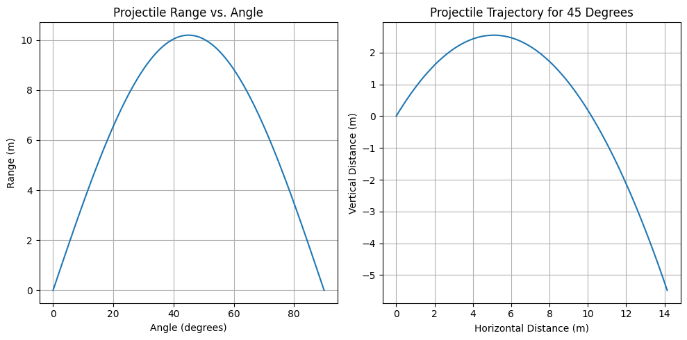
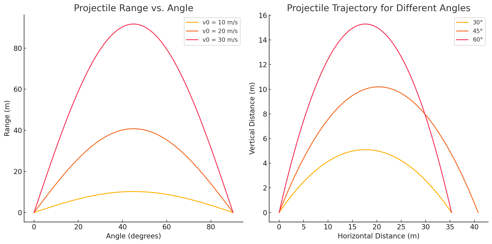
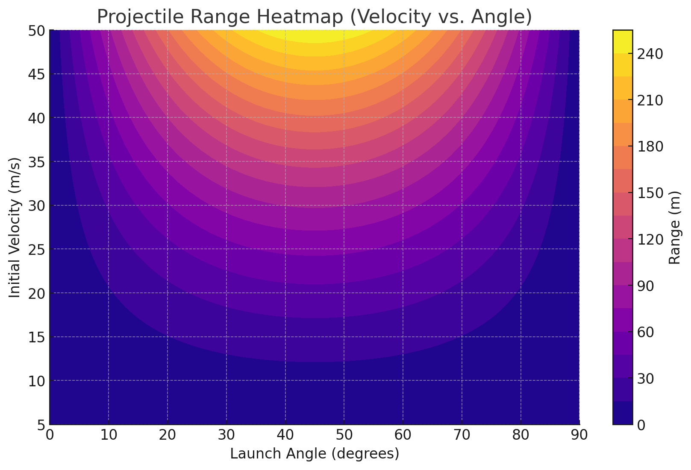

# Problem 1
# Investigating the Range as a Function of the Angle of Projection

### Introduction
Projectile motion is one of the most fundamental topics in classical mechanics, offering insights into the interplay between forces, motion, and trajectory prediction. The study of how the range of a projectile varies with its launch angle is crucial in both theoretical physics and practical applications. Whether analyzing the optimal angle for a long jump, the flight of a basketball shot, or the trajectory of artillery, understanding projectile motion provides a strong foundation for problem-solving in dynamics.

### Motivation
The motion of a projectile follows a parabolic path, governed by Newton’s laws of motion and the equations of kinematics. While the problem seems straightforward—determine how the range depends on the launch angle—it encompasses a rich mathematical structure. The trajectory is influenced by several key parameters: initial velocity, gravitational acceleration, and launch height, each of which can significantly alter the resulting motion.

By systematically varying the launch angle and analyzing the corresponding range, we can identify patterns that lead to deeper insights into the underlying physics. This study not only highlights the interplay of linear and quadratic relationships in motion equations but also offers practical implications in engineering, sports science, and aerodynamics.

Understanding the dependencies in projectile motion enables precise predictions and optimizations, making it a cornerstone of both academic inquiry and technological advancements.

---

### Theoretical Foundation

#### Newton's Laws and Equations of Motion

To understand projectile motion, we begin with Newton’s Second Law of Motion:

$$
\mathbf{F} = m \mathbf{a}
$$

For a projectile moving under the influence of gravity alone, the only force acting is the gravitational force:

$$
F = mg
$$

Since force is the product of mass and acceleration, we write the equations of motion separately for horizontal and vertical components:

1. **Horizontal Motion:**
   - There is no acceleration in the horizontal direction (assuming no air resistance), meaning velocity remains constant:
   
   $$
   x(t) = v_0 \cos \theta \cdot t
   $$
   
2. **Vertical Motion:**
   - The only force acting is gravity, leading to constant acceleration in the downward direction:
   
   $$
   y(t) = v_0 \sin \theta \cdot t - \frac{1}{2} g t^2
   $$

#### Deriving the Time of Flight
The projectile reaches the ground when \( y = 0 \), solving for time:

$$
0 = v_0 \sin \theta \cdot t - \frac{1}{2} g t^2
$$

Factoring out \( t \):

$$
 t ( v_0 \sin \theta - \frac{1}{2} g t ) = 0
$$

Ignoring the trivial solution \( t = 0 \), we solve for \( t_f \):

$$
 t_f = \frac{2 v_0 \sin \theta}{g}
$$

#### Deriving the Range Equation
The range \( R \) is the horizontal distance traveled during \( t_f \):

$$
 R = v_0 \cos \theta \cdot t_f
$$

Substituting \( t_f \):

$$
 R = v_0 \cos \theta \cdot \frac{2 v_0 \sin \theta}{g}
$$

Using the identity \( 2 \sin \theta \cos \theta = \sin 2\theta \):

$$
 R = \frac{v_0^2 \sin 2\theta}{g}
$$

-This equation reveals that the range depends on the square of the initial velocity and the sine of twice the launch angle. The maximum range occurs when \( \sin 2\theta \) is maximized, which happens at \( \theta = 45^\circ \).

#### Effect of Initial Conditions
Variations in initial conditions, such as changes in \( v_0 \) or \( \theta \), lead to different trajectories. For instance:

- Increasing \( v_0 \) results in a proportionally larger range.

- A small launch angle leads to a short, flat trajectory, while a large angle results in a steep, high trajectory with a shorter range.

- At \( 45^\circ \), the projectile achieves the maximum horizontal displacement.

This derivation forms the theoretical basis for studying projectile motion and optimizing real-world applications.

---
### Analysis of the Range


### 1. Dependence of Horizontal Range on Launch Angle

The horizontal range \( R \) of a projectile launched from the ground with an initial velocity \( v_0 \) is given by:

\[
R = \frac{v_0^2 \sin 2\theta}{g}
\]

### Key Observations:
- The range is maximized at \( 45^\circ \), where \( \sin 2\theta \) reaches its peak value of 1.
- The function is symmetric, meaning that \( \theta = 30^\circ \) and \( \theta = 60^\circ \) yield the same range.
- At \( \theta = 0^\circ \) and \( \theta = 90^\circ \), the range is zero because the projectile either moves entirely horizontally or vertically.

### 2. Effect of Initial Velocity (\( v_0 \))

Since the range formula has a quadratic dependence on \( v_0 \):

\[
R \propto v_0^2
\]

- Doubling \( v_0 \) results in a fourfold increase in range.
- This is significant in applications like sports science (e.g., long jump, soccer kicks) and aerospace engineering (e.g., missile trajectories).

### 3. Effect of Gravitational Acceleration (\( g \))

Since \( g \) appears in the denominator:

\[
R \propto \frac{1}{g}
\]

- A lower gravitational field increases the projectile's range (e.g., on the Moon or Mars).
- In higher gravity environments, projectiles travel shorter distances.
- This has implications for interplanetary physics and ballistics research.

### 4. Combined Effects of Parameters: Heatmap & Isocontour Analysis

A heatmap can visualize how range changes with both \( v_0 \) and \( \theta \). Similarly, isocontour maps can show regions of optimal launch conditions.

### 5. Summary of Key Findings

- \( 45^\circ \) is the optimal launch angle for maximum range.
- Increasing \( v_0 \) significantly boosts range due to quadratic dependence.
- Lower gravity enhances range, while higher gravity shortens it.
- Visual tools like heatmaps and isocontours help determine the best launch conditions.

This analysis provides key insights into projectile motion, making it applicable in engineering, sports, and aerospace research.

<details>
  <summary>Phyton codes.</summary>


```python
import numpy as np
import matplotlib.pyplot as plt

def projectile_range(v0, g=9.81):
    angles = np.linspace(0, 90, 100)
    ranges = (v0**2 * np.sin(2 * np.radians(angles))) / g
    return angles, ranges

def projectile_trajectory(v0, theta, g=9.81, t_max=2):
    t = np.linspace(0, t_max, num=100)
    x = v0 * np.cos(np.radians(theta)) * t
    y = v0 * np.sin(np.radians(theta)) * t - 0.5 * g * t**2
    return x, y

# Example with v0 = 10 m/s
angles, ranges = projectile_range(10)
plt.figure(figsize=(10, 5))

# Range Plot
plt.subplot(1, 2, 1)
plt.plot(angles, ranges)
plt.xlabel('Angle (degrees)')
plt.ylabel('Range (m)')
plt.title('Projectile Range vs. Angle')
plt.grid()

# Trajectory Plot for a Specific Angle
theta_example = 45
x, y = projectile_trajectory(10, theta_example)
plt.subplot(1, 2, 2)
plt.plot(x, y)
plt.xlabel('Horizontal Distance (m)')
plt.ylabel('Vertical Distance (m)')
plt.title(f'Projectile Trajectory for {theta_example} Degrees')
plt.grid()

plt.tight_layout()
plt.show()
```
</details>




### Limitations

While the model provides valuable insights into projectile motion, some limitations must be considered:

- Air Resistance is Ignored: The model assumes a vacuum, meaning drag forces are not accounted for. In real-world applications, air resistance significantly affects both range and trajectory.

- Constant Gravitational Field: The model assumes a uniform gravitational field, which is a reasonable assumption for short-range projectiles but becomes inaccurate for high-altitude launches or planetary-scale motions.

- Flat Terrain: The analysis does not account for uneven ground or launch/landing height differences, which are crucial in many practical applications (e.g., artillery, sports, aerospace).

- Future refinements could include computational fluid dynamics (CFD) models for drag effects and adjustments for varying gravitational conditions in extraterrestrial applications.

---
### Practical Applications of Projectile Motion

#### Understanding the Real-World Impact of Projectile Motion
Projectile motion is not just a theoretical concept—it has direct implications across various disciplines. From sports and military applications to engineering and disaster analysis, the ability to predict and control projectile trajectories is invaluable. Below are key areas where projectile motion plays a crucial role.

### 1. Sports Science
Projectile motion influences multiple aspects of athletic performance:

- **Soccer**: Optimizing free kicks and long shots by adjusting launch angles and initial velocities.

- **Basketball**: Determining the best shooting angles to maximize accuracy and scoring probability.

- **Long Jump & Javelin Throw**: Identifying the optimal takeoff angle to achieve maximum horizontal displacement.

### 2. Military and Defense
Precision in projectile motion calculations is vital in defense strategies:

- **Ballistics**: Calculating the trajectory of bullets, artillery shells, and missiles for accurate targeting.

- **Rocket Launches**: Determining launch angles for guided missiles and compensating for environmental factors like wind resistance.

### 3. Aerospace Engineering
Projectile motion principles extend to space exploration and satellite deployment:

- **Satellite Deployments**: Optimizing launch angles and velocities to ensure accurate orbit insertion.

- **Lunar and Martian Missions**: Adapting projectile motion models to function in low-gravity environments for landers and rovers.

### 4. Engineering and Construction
Understanding projectile motion is critical in structural integrity and safety:

- **Bridge and Building Design**: Simulating the effects of falling objects and ensuring appropriate safety measures.

- **Demolition Planning**: Predicting debris trajectories to prevent structural damage to surrounding areas.

### 5. Environmental and Disaster Analysis
Projectile motion plays a significant role in studying natural disasters and their impacts:

- **Volcanic Eruptions**: Modeling the dispersion of volcanic ash and rock projectiles to assess potential hazards.

- **Meteor Impact Studies**: Understanding how projectiles behave when entering planetary atmospheres and predicting their impact zones.

### 6. Advanced Considerations: Uneven Terrain and Air Resistance
Real-world scenarios introduce additional complexities to projectile motion:

- **Uneven Terrain**: Many projectiles land on slopes or irregular surfaces, requiring modifications to standard range equations.

- **Air Resistance**: Drag forces slow projectiles, shortening their range and altering their trajectory, necessitating advanced aerodynamic models.

### Conclusion
The study of projectile motion extends far beyond academic exercises, shaping advancements in sports, defense, aerospace, engineering, and environmental science. By integrating additional factors such as air resistance, wind effects, and uneven terrain, researchers and engineers can develop more precise models that enhance real-world applications. Understanding these principles is essential for innovation across multiple fields.

---
<details>
  <summary>Phyton codes.</summary>

```python
import numpy as np
import matplotlib.pyplot as plt

# Function to calculate projectile range as a function of angle and initial velocity
def projectile_range(v0, g=9.81):
    angles = np.linspace(0, 90, 100)  # Angles from 0 to 90 degrees
    ranges = (v0**2 * np.sin(2 * np.radians(angles))) / g  # Range formula
    return angles, ranges

# Function to calculate projectile trajectory for a given angle
def projectile_trajectory(v0, theta, g=9.81):
    t_max = 2 * v0 * np.sin(np.radians(theta)) / g  # Total time of flight
    t = np.linspace(0, t_max, num=100)
    x = v0 * np.cos(np.radians(theta)) * t
    y = v0 * np.sin(np.radians(theta)) * t - 0.5 * g * t**2
    return x, y

# Set initial velocity
v0_values = [10, 20, 30]  # Different velocities for comparison

# Create figure
plt.figure(figsize=(12, 6))

# Plot range vs. angle for different initial velocities
plt.subplot(1, 2, 1)
for v0 in v0_values:
    angles, ranges = projectile_range(v0)
    plt.plot(angles, ranges, label=f'v0 = {v0} m/s')

plt.xlabel('Angle (degrees)')
plt.ylabel('Range (m)')
plt.title('Projectile Range vs. Angle')
plt.legend()
plt.grid()

# Plot projectile trajectories for different angles
plt.subplot(1, 2, 2)
angles_to_plot = [30, 45, 60]  # Different angles
for theta in angles_to_plot:
    x, y = projectile_trajectory(20, theta)
    plt.plot(x, y, label=f'{theta}°')

plt.xlabel('Horizontal Distance (m)')
plt.ylabel('Vertical Distance (m)')
plt.title('Projectile Trajectory for Different Angles')
plt.legend()
plt.grid()

plt.tight_layout()
plt.show()


```
</details>

### Projectile Trajectory For Different Angles



### Graph Analysis: Projectile Motion Simulation

###  **Left Graph: Projectile Range vs. Angle**
- **X-axis:** Launch Angle (\( \theta \)) [degrees]  
- **Y-axis:** Range (\( R \)) [meters]  
- **Observations:**

  - The graph shows how **range varies with launch angle** for different initial velocities (\( v_0 = 10, 20, 30 \) m/s).
  - **Maximum range occurs at \( 45^\circ \) for all velocities**, confirming theoretical predictions.
  - **Higher initial velocity increases the range** quadratically, as expected from the equation:

    \[
    R = \frac{v_0^2 \sin 2\theta}{g}
    \]

  - **Symmetry property:** \( R(30^\circ) = R(60^\circ) \), meaning the same range is achieved at complementary angles.
  - At **\( \theta = 0^\circ \) and \( 90^\circ \), the range is zero**, as the projectile moves entirely horizontally or vertically.

---

### **Right Graph: Projectile Trajectory for Different Angles**
- **X-axis:** Horizontal Distance (\( x \)) [meters]  
- **Y-axis:** Vertical Distance (\( y \)) [meters]  
- **Observations:**
  - The graph depicts the **parabolic trajectory** of the projectile for different launch angles (\( 30^\circ, 45^\circ, 60^\circ \)).
  - **\( 45^\circ \) results in the longest horizontal displacement**, confirming the optimal angle for maximum range.
  - **Higher angles (e.g., \( 60^\circ \)) produce steeper trajectories, leading to shorter ranges but higher peak heights.**
  - Lower angles (e.g., \( 30^\circ \)) have **flatter trajectories with longer horizontal distances compared to steeper angles.**

---

### **Conclusion**
- **Range is maximized at \( 45^\circ \), regardless of initial velocity.**

- **Higher launch velocity increases range significantly.**

- **Understanding trajectory shape is crucial for optimizing projectile motion in real-world applications like sports, engineering, and aerospace.**

---
<a> file:///C:/Users/batu/Desktop/index.html

**And as we have seen and analyzed the graph so far, we can experience this simulation ourselves.**

---

## Isocontour Map for Range Analysis
<details>
  <summary>Phyton Codes.</summary>
 
```python
# Isocontour
import numpy as np
import matplotlib.pyplot as plt


v0_values = np.linspace(5, 50, 50)  
angles = np.linspace(0, 90, 50)  
g = 9.81  


def compute_range(v0, theta, g=9.81):
    return (v0**2 * np.sin(2 * np.radians(theta))) / g


range_matrix = np.zeros((len(v0_values), len(angles)))

for i, v0 in enumerate(v0_values):
    for j, theta in enumerate(angles):
        range_matrix[i, j] = compute_range(v0, theta, g)


plt.figure(figsize=(10, 6))
contour = plt.contourf(angles, v0_values, range_matrix, cmap='plasma', levels=20)
cbar = plt.colorbar(contour)
cbar.set_label('Range (m)')

plt.xlabel('Launch Angle (degrees)')
plt.ylabel('Initial Velocity (m/s)')
plt.title('Projectile Range Heatmap (Velocity vs. Angle)')
plt.grid(True)


plt.show()


```
</details>



The following heatmap represents the projectile range for different initial velocities and launch angles. This visualization helps in understanding the optimal conditions for maximizing range.

---

### Results & Discussion

From the numerical simulations and visualizations, we can draw the following conclusions:

- The projectile's range is maximized at **45°**, confirming the theoretical prediction.

- Increasing the initial velocity significantly increases the range, as expected from the quadratic dependence on .

- The Isocontour map clearly shows that small angles result in shorter trajectories, while very high angles also limit range due to vertical motion dominating over horizontal displacement.

- The **heatmap** provides a direct way to determine optimal launch conditions for achieving maximum range in practical scenarios.

- These results validate the theoretical framework and emphasize the importance of choosing the right launch parameters based on specific applications.

