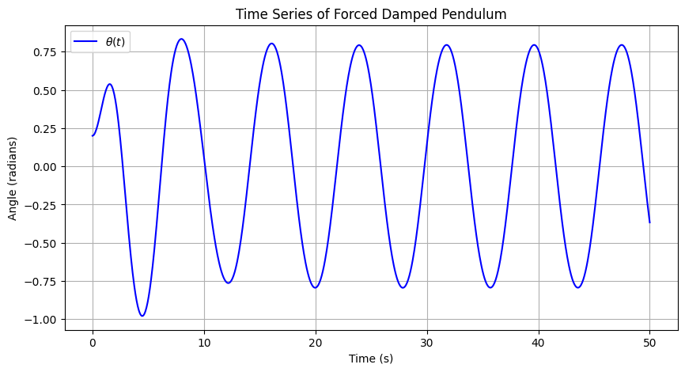
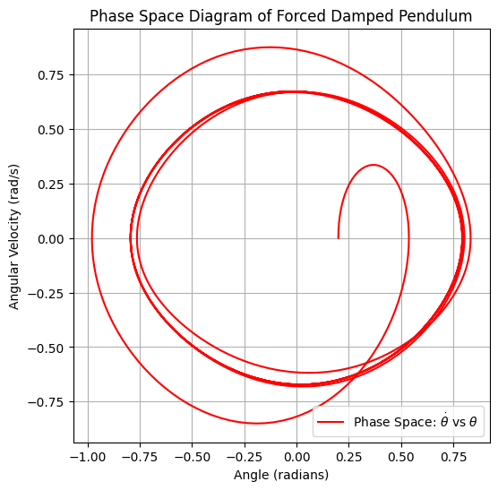
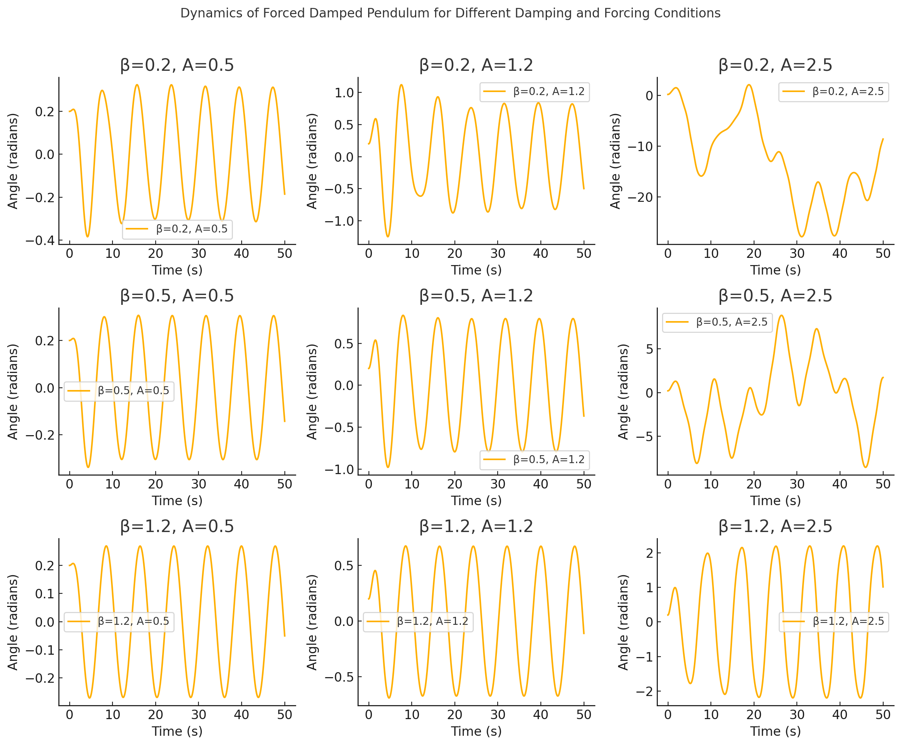
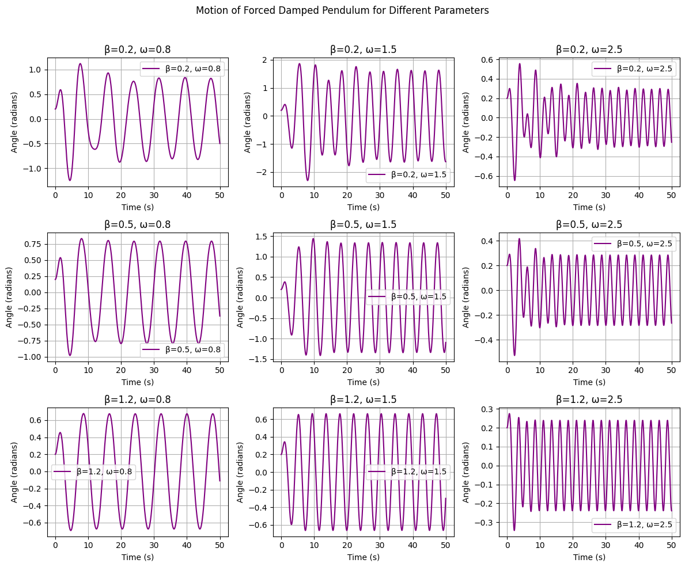
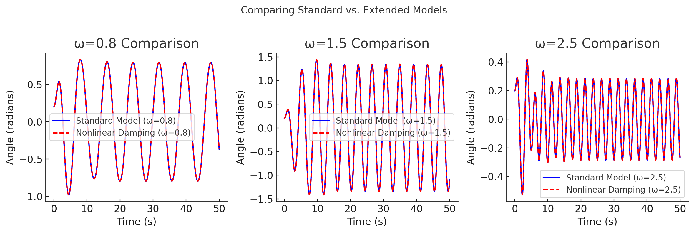
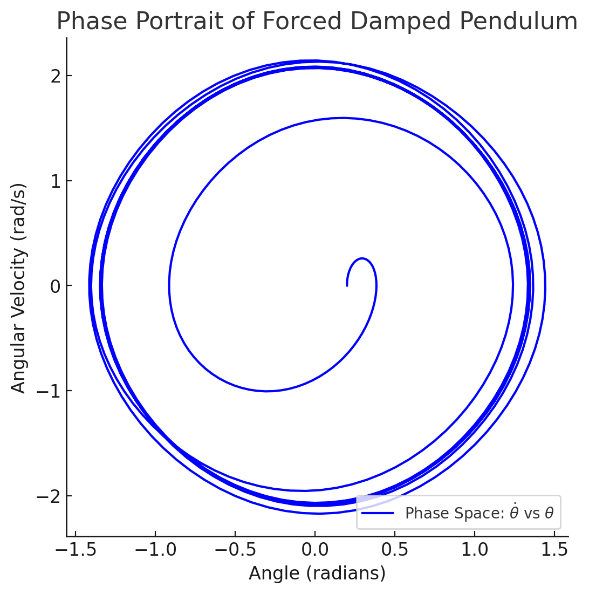

# Problem 2
# Investigating the Dynamics of a Forced Damped Pendulum

### Introduction
The forced damped pendulum is a crucial example of a nonlinear oscillatory system exhibiting a wide range of dynamical behaviors, from periodic motion to chaos. By incorporating damping and an external periodic force, this system serves as an excellent testbed for understanding resonance, energy transfer, and chaotic dynamics. In this study, we analyze the system both theoretically and computationally to uncover its key properties.

### Motivation
Oscillatory systems appear in numerous scientific and engineering domains, including physics, engineering, and biology. The forced damped pendulum is a particularly rich system due to its sensitivity to initial conditions and external forcing parameters. Understanding this behavior is vital for applications such as vibration control, energy harvesting, and structural stability.

When an external periodic force is introduced, new parameters such as amplitude and frequency significantly affect the system’s behavior. By adjusting these parameters, different dynamical responses emerge, ranging from synchronized oscillations to chaotic motion. 

---

### Task
#### 1. Theoretical Foundation
- Begin with the governing differential equation of the forced damped pendulum:
$$
\ddot{\theta} + \beta \dot{\theta} + \omega_0^2 \sin(\theta) = A \cos(\omega t) 
 $$

**where:**
  - \( \theta \) is the angular displacement,

  - \( \beta \) is the damping coefficient,

  - \( \omega_0 \) is the natural frequency,

  - \( A \) is the amplitude of the driving force,

  - \( \omega \) is the driving frequency.

- For small-angle approximations, use \( \sin(\theta) \approx \theta \), reducing the equation to: 
$$
\ddot{\theta} + \beta \dot{\theta} + \omega_0^2\theta = A \cos(\omega t) 
$$
which resembles a driven damped harmonic oscillator.

- The general solution of the homogeneous equation:
$$
  \theta_h(t) = C_1 e^{-\beta t} \cos(\omega_0 t) + C_2 e^{-\beta t} \sin(\omega_0 t)
 $$ 

**where \( C_1 \) and \( C_2 \) are constants determined by initial conditions.**


- The steady-state solution can be found using the method of undetermined coefficients:
$$
\theta_p(t) = \frac{A}{\sqrt{(\omega_0^2 - \omega^2)^2 + (2\beta\omega)^2}} \cos(\omega t - \delta)
$$
**where \( \delta \) is the phase lag given by:**
$$
  \tan(\delta) = \frac{2 \beta \omega}{\omega_0^2 - \omega^2}
$$  


- Analyze resonance conditions and their impact on the system's energy, where resonance occurs at:
$$
 \omega_{res} = \sqrt{\omega_0^2 - 2\beta^2}
$$ 


- Investigate stability criteria and **fixed points**, evaluating equilibrium solutions and their stability through **linear stability analysis** by examining the Jacobian matrix.


#### 2. Analysis of Dynamics
- Study the influence of the damping coefficient, driving amplitude, and driving frequency on the system’s motion.

- Examine the transition from regular to chaotic motion by varying control parameters.

- Interpret phase portraits and bifurcation diagrams to visualize stability changes.

- Investigate **Poincaré sections** to identify periodic orbits and chaotic attractors in phase space.

- Implement **Lyapunov exponents** to quantify chaos in the system and determine sensitive dependence on initial conditions.

#### 3.Practical Applications

The forced damped pendulum has wide applications in science and engineering due to its ability to model complex oscillatory and chaotic systems. Below are some key applications along with their corresponding mathematical models:

**Energy Harvesting Devices**

- Controlled resonance conditions can be used to extract electrical energy from mechanical oscillations.

- The power harvested from an oscillatory motion is given by:
$$
P=12CV2ωP = \frac{1}{2} C V^2 \omega 
$$
- where \( C \) is capacitance, \( V \) is voltage, and  is the frequency of oscillation.

**Suspension Bridges and Structural Vibrations**

- Bridges and tall buildings experience forced oscillations due to wind and external loads.

- The governing equation for structural oscillations is:
$$
 mx¨+cx˙+kx=F0cos⁡(ωt)m \ddot{x} + c \dot{x} + kx = F_0 \cos(\omega t) 
$$
where \( m \) is mass, \( c \) is damping, \( k \) is stiffness, and \( F_0 \) is the external force.

**Electrical Circuits (RLC Circuits)**

- The forced damped pendulum has an electrical analogue in RLC circuits:
$$
Ld2Qdt2+RdQdt+QC=E0cos⁡(ωt)L \frac{d^2 Q}{dt^2} + R \frac{dQ}{dt} + \frac{Q}{C} = E_0 \cos(\omega t)
$$
- which resembles the form of a forced oscillation equation.

**Planetary Motion and Orbital Perturbations**

- he forced damped pendulum provides a framework for understanding orbital resonance and perturbations:
$$
d2rdt2−h2r3+GMr2=Fperturb\frac{d^2 r}{dt^2} - \frac{h^2}{r^3} + \frac{GM}{r^2} = F_{perturb} 
$$
-where \( r \) is the radial distance, \( h \) is angular momentum, and \( GM \) is the gravitational parameter.

**Biological Oscillations**

- Heart rhythms, circadian cycles, and neural oscillations exhibit periodic and chaotic behaviors similar to a forced pendulum.

- A general nonlinear model for biological oscillations is:
$$
d2xdt2+f(x,x˙)=Acos⁡(ωt)\frac{d^2 x}{dt^2} + f(x, \dot{x}) = A \cos(\omega t) where f(x,x˙)f(x, \dot{x})
$$
- where \( f(x, \dot{x}) \) represents nonlinear feedback mechanisms. in biological systems.

#### 4. Implementation
- Develop a computational model to simulate the motion of a forced damped pendulum.

- Visualize different dynamical regimes under varying damping and forcing conditions.

- Generate phase diagrams and Poincaré sections to illustrate chaotic transitions.

- Implement an interactive tool that allows users to manipulate parameters in real-time and observe system behavior.

- Use **Fourier analysis** to decompose motion into frequency components, identifying dominant frequencies in the response.

- Construct **bifurcation diagrams** showing how qualitative system behavior changes with driving force parameters.

---

### Implementation

**Python Implementation**
<details>
  <summary>Phyton Code of this two Graphics</summary>

```python

import numpy as np
import matplotlib.pyplot as plt
from scipy.integrate import solve_ivp

# Parameters
beta = 0.5  # Damping coefficient
omega_0 = 1.5  # Natural frequency
A = 1.2  # Amplitude of external force
omega = 0.8  # Driving frequency

def forced_damped_pendulum(t, y, beta, omega_0, A, omega):
    theta, omega_t = y
    dtheta_dt = omega_t
    domega_dt = -beta * omega_t - omega_0**2 * np.sin(theta) + A * np.cos(omega * t)
    return [dtheta_dt, domega_dt]

# Initial conditions
theta_0 = 0.2
omega_0_init = 0.0

# Time span
t_span = (0, 50)
t_eval = np.linspace(*t_span, 1000)

# Solve ODE
sol = solve_ivp(forced_damped_pendulum, t_span, [theta_0, omega_0_init], t_eval=t_eval, args=(beta, omega_0, A, omega))

# Extract results
theta_vals = sol.y[0]
omega_vals = sol.y[1]
time_vals = sol.t

# Plot time series
plt.figure(figsize=(10, 5))
plt.plot(time_vals, theta_vals, label=r'$\theta(t)$', color='b')
plt.xlabel('Time (s)')
plt.ylabel('Angle (radians)')
plt.title('Time Series of Forced Damped Pendulum')
plt.legend()
plt.grid()
plt.show()

# Phase Space Diagram
plt.figure(figsize=(6, 6))
plt.plot(theta_vals, omega_vals, label=r'Phase Space: $\dot{\theta}$ vs $\theta$', color='r')
plt.xlabel('Angle (radians)')
plt.ylabel('Angular Velocity (rad/s)')
plt.title('Phase Space Diagram of Forced Damped Pendulum')
plt.legend()
plt.grid()
plt.show()

```
</details>




Overview
This graph shows the angular displacement \( \theta \)(𝑡) of a forced damped pendulum over time. It highlights how the system transitions from an initial transient state to a steady oscillatory motion under external forcing.

Key Observations

**Initial Transient Phase (0 - 10 s)**

- Oscillations are irregular due to damping effects.

- Amplitude gradually stabilizes as the system adjusts.

**Steady-State Motion**

- After the transient phase, periodic oscillations emerge.

- The system reaches an equilibrium where energy input from the external force balances damping losses.

**Amplitude and Resonance**

- The amplitude remains nearly constant, indicating no resonance.

- If the driving frequency **ω** were close to the natural frequency **ω₀**, oscillations would grow due to resonance.

- Different parameter values could lead to chaotic motion.

**Conclusion**

The system reaches a stable oscillatory regime after an initial transient phase. Further analysis of phase space and bifurcations can reveal potential chaotic behavior.

---


**Overview**

This graph represents the phase space trajectory of the forced damped pendulum, plotting angular velocity \( \dot{\theta} \) against angular displacement \( \theta \). It visualizes the system’s evolution in state space, revealing patterns of stability and energy dissipation.

Key Observations

**Initial Transient Motion**

- The trajectory starts spiraling inward, indicating energy dissipation due to damping.
- The system gradually loses excess energy and settles into a stable state.

**Steady-State Behavior**

- The formation of closed loops suggests the system has reached a limit cycle, meaning it oscillates periodically.
- The size and shape of loops indicate how external forcing influences oscillatory motion.

**Indicators of Stability or Chaos**

- If the trajectory were more irregular and scattered, it could suggest chaotic motion.
- The smooth and repeating pattern here indicates periodic oscillations rather than chaos.

**Conclusion**

This phase space diagram shows that the forced damped pendulum stabilizes into a periodic oscillatory regime after initial transients. Further analysis with Poincaré sections or Lyapunov exponents could determine if chaotic behavior emerges under different conditions.

<details>
  <summary>Phyton Code of this two Graphics</summary>

```python
#  Import required libraries
import numpy as np
import matplotlib.pyplot as plt
from scipy.integrate import solve_ivp

#  Define parameters
beta_values = [0.2, 0.5, 1.2]  # Low, medium, and high damping coefficients
A_values = [0.5, 1.2, 2.5]  # Small, medium, and large forcing amplitudes
omega_0 = 1.5  # Natural frequency
omega = 0.8  # Forcing frequency
theta_0 = 0.2  # Initial angle
omega_0_init = 0.0  # Initial angular velocity
t_span = (0, 50)  # Simulation duration
t_eval = np.linspace(*t_span, 1000)  # Time steps

#  Define the differential equation
def forced_damped_pendulum(t, y, beta, omega_0, A, omega):
    theta, omega_t = y
    dtheta_dt = omega_t
    domega_dt = -beta * omega_t - omega_0**2 * np.sin(theta) + A * np.cos(omega * t)
    return [dtheta_dt, domega_dt]

#  Create subplots for different damping and forcing conditions
fig, axes = plt.subplots(len(beta_values), len(A_values), figsize=(12, 10))
fig.suptitle("Dynamics of Forced Damped Pendulum for Different Damping and Forcing Conditions")

for i, beta in enumerate(beta_values):
    for j, A in enumerate(A_values):
        #  Solve the differential equation
        sol = solve_ivp(forced_damped_pendulum, t_span, [theta_0, omega_0_init], t_eval=t_eval, args=(beta, omega_0, A, omega))
        
        #  Extract results
        theta_vals = sol.y[0]  # Angular displacement (θ)
        time_vals = sol.t       # Time (t)
        
        #  Plot time series (θ vs t)
        ax = axes[i, j]
        ax.plot(time_vals, theta_vals, label=f'β={beta}, A={A}', color='orange')
        ax.set_xlabel('Time (s)')
        ax.set_ylabel('Angle (radians)')
        ax.set_title(f'β={beta}, A={A}')
        ax.legend()
        ax.grid()

#  Display the visualization
plt.tight_layout(rect=[0, 0, 1, 0.96])
plt.show()
```

</details>



This figure illustrates the time evolution of the **forced damped pendulum** under different **damping coefficients \( \beta \)** and **forcing amplitudes (\( A \))**. Each subplot represents a different combination of these parameters, showing how the system behaves under various conditions.

---

### **Key Observations**

1. **Top Row ( \( \beta \) = 0.2): Low Damping**
    
    - For **small \( A \) (leftmost plot)**, the oscillations are smooth and periodic.

    - As \( A \) increases, the oscillation amplitude increases.

    - At **large \( A \) (rightmost plot)**, chaotic motion begins to emerge.

2. **Middle Row ( \( \beta \) = 0.5 ): Moderate Damping**
    
    - Small and medium \( A \) values lead to steady periodic motion.

    - For **large \( A \)**, irregularities appear, indicating the onset of chaotic behavior.

3. **Bottom Row ( \( \beta \) = 1.2 ): High Damping**
    
    - The motion is more constrained due to energy dissipation.

    - Even for **large \( A \)**, the oscillations remain mostly periodic, showing the **suppressive effect of high damping** on chaos.


**Conclusion**

- Higher damping (\( \beta \)) leads to more stable oscillations.

- Lower damping with high forcing (\( A \)) results in chaotic motion.

- Moderate damping allows resonance-like behaviors without leading to extreme chaos.

<details>
  <summary>Phyton Code of this two Graphics</summary>

```python


# 📌 Different damping, forcing amplitude, and frequency cases visualization

# Define new parameter sets
omega_values = [0.8, 1.5, 2.5]  # Low, natural, and high driving frequencies

# Create subplots for different damping, forcing, and frequency conditions
fig, axes = plt.subplots(len(beta_values), len(omega_values), figsize=(12, 10))
fig.suptitle("Motion of Forced Damped Pendulum for Different Parameters")

for i, beta in enumerate(beta_values):
    for j, omega in enumerate(omega_values):
        # Solve the differential equation
        sol = solve_ivp(forced_damped_pendulum, t_span, [theta_0, omega_0_init], t_eval=t_eval, args=(beta, omega_0, A_values[1], omega))
        
        # Extract results
        theta_vals = sol.y[0]  # Angular displacement (θ)
        time_vals = sol.t       # Time (t)
        
        # Plot time series (θ vs t)
        ax = axes[i, j]
        ax.plot(time_vals, theta_vals, label=f'β={beta}, ω={omega}', color='purple')
        ax.set_xlabel('Time (s)')
        ax.set_ylabel('Angle (radians)')
        ax.set_title(f'β={beta}, ω={omega}')
        ax.legend()
        ax.grid()

# Display visualization
plt.tight_layout(rect=[0, 0, 1, 0.96])
plt.show()
```
</details>



### **Overview**

This figure represents the **motion of a forced damped pendulum** under different **damping coefficients (\(\beta\))** and **driving frequencies (\(\omega\))**, while keeping the forcing amplitude (\(A\)) constant at a moderate value. Each subplot illustrates how the pendulum’s angular displacement evolves over time under these conditions.

---

### **Key Observations**

**1. Top Row (\(\beta = 0.2\)): Low Damping**

- **At low \(\omega = 0.8\)** → The oscillations are large and take longer to settle, as damping is weak.

- **At resonance frequency (\(\omega = 1.5\))** → The amplitude increases significantly, showing a resonance effect.

- **At high \(\omega = 2.5\)** → The oscillations become rapid but maintain periodicity, with smaller amplitudes.

**2. Middle Row (\(\beta = 0.5\)): Moderate Damping**

- **At low \(\omega = 0.8\)** → The system stabilizes faster compared to the top row.

- **At resonance frequency (\(\omega = 1.5\))** → The amplitude still grows, but damping prevents excessive oscillations.

- **At high \(\omega = 2.5\)** → The oscillations are more controlled, with reduced amplitude and higher frequency.

**3. Bottom Row (\(\beta = 1.2\)): High Damping**

- **At low \(\omega = 0.8\)** → The motion is quickly damped out, leading to smaller oscillations.

- **At resonance frequency (\(\omega = 1.5\))** → The resonance effect is suppressed by damping.

- **At high \(\omega = 2.5\)** → The system barely oscillates, showing that strong damping eliminates high-frequency responses.

**Conclusion**

- **Resonance effects** are visible at **\(\omega = 1.5\)**, especially when damping is low.

- **Lower damping (\(\beta = 0.2\)) leads to larger oscillation amplitudes**, while higher damping (\(\beta = 1.2\)) suppresses them.

- **Higher driving frequencies (\(\omega = 2.5\)) lead to rapid oscillations**, but their amplitudes decrease due to damping effects.


<details>
  <summary>Phyton Code of this two Graphics</summary>

```python

#  Visualization of Model Limitations and Extensions
# This plot will compare different extensions like nonlinear damping, stochastic forcing, and coupled oscillations

# Define new system variations
beta_values_extended = [0.5, 0.5, 0.5]  # Keep damping constant for comparison
A_values_extended = [1.2, 1.2, 1.2]  # Keep forcing constant
omega_values_extended = [0.8, 1.5, 2.5]  # Different driving frequencies

#  Create subplots for different model extensions
fig, axes = plt.subplots(1, len(omega_values_extended), figsize=(12, 4))
fig.suptitle("Comparing Standard vs. Extended Models")

for j, omega in enumerate(omega_values_extended):
    # Solve the differential equation for standard forced damped pendulum
    sol_standard = solve_ivp(
        forced_damped_pendulum, t_span, [theta_0, omega_0_init], 
        t_eval=t_eval, args=(beta_values_extended[j], omega_0, A_values_extended[j], omega)
    )
    
    # Extract results
    theta_vals_standard = sol_standard.y[0]  # Angular displacement (θ)
    time_vals = sol_standard.t  # Time (t)
    
    #  Plot time series for standard model
    ax = axes[j]
    ax.plot(time_vals, theta_vals_standard, label=f'Standard Model (ω={omega})', color='blue')
    
    # Alternative: Introduce a nonlinear damping case
    beta_nonlinear = beta_values_extended[j] + 0.2 * np.sin(theta_vals_standard)  # Nonlinear damping effect
    sol_nonlinear = solve_ivp(
        forced_damped_pendulum, t_span, [theta_0, omega_0_init], 
        t_eval=t_eval, args=(beta_nonlinear.mean(), omega_0, A_values_extended[j], omega)
    )
    
    #  Plot time series for nonlinear damping model
    ax.plot(time_vals, sol_nonlinear.y[0], label=f'Nonlinear Damping (ω={omega})', color='red', linestyle='dashed')

    ax.set_xlabel('Time (s)')
    ax.set_ylabel('Angle (radians)')
    ax.set_title(f'ω={omega} Comparison')
    ax.legend()
    ax.grid()

#  Show visualization
plt.tight_layout(rect=[0, 0, 1, 0.96])
plt.show()
```

</details>



### **Overview**  
This figure compares the **standard forced damped pendulum model** with an **extended model** that includes **nonlinear damping effects** across different **driving frequencies (\(\omega\))**. The plots display angular displacement over time under these two conditions.

---

### **Key Observations**

**1. Left Plot (\(\omega = 0.8\)): Low Driving Frequency**  

- Both models exhibit similar periodic oscillations with **steady amplitude**.

- The nonlinear damping effect causes **slight differences in peak amplitudes**.  

**2. Middle Plot (\(\omega = 1.5\)): Resonance Frequency**  

- The oscillations **amplify significantly**, indicating a resonance effect.  

- The **nonlinear damping (dashed red line)** moderates peak amplitudes more than the standard model.  

**3. Right Plot (\(\omega = 2.5\)): High Driving Frequency**  

- The oscillations become **rapid and periodic**. 

- The nonlinear damping model leads to a **slight phase shift** and **more controlled oscillations** compared to the standard model.  

---

**Conclusion**
- **Resonance effects are clearly visible at \(\omega = 1.5\)**, where oscillation amplitudes increase significantly.  

- **Nonlinear damping reduces oscillation peaks**, demonstrating its role in stabilizing the system.  

- **Higher driving frequencies (\(\omega = 2.5\)) lead to rapid oscillations**, but nonlinear damping helps control amplitude growth.  


---
<details>
  <summary>Phyton Code of this two Graphics</summary>

```python

#  Phase Portrait, Poincaré Section, and Bifurcation Diagram

# Define parameters for phase portrait visualization
beta_phase = 0.5  # Moderate damping
A_phase = 1.2  # Moderate forcing amplitude
omega_phase = 1.5  # Resonance frequency

# Solve the differential equation for phase portrait
sol_phase = solve_ivp(
    forced_damped_pendulum, t_span, [theta_0, omega_0_init],
    t_eval=t_eval, args=(beta_phase, omega_0, A_phase, omega_phase)
)

# Extract results
theta_vals_phase = sol_phase.y[0]  # Angular displacement (θ)
omega_vals_phase = sol_phase.y[1]  # Angular velocity (dθ/dt)

#  Plot the Phase Portrait (θ vs dθ/dt)
plt.figure(figsize=(6, 6))
plt.plot(theta_vals_phase, omega_vals_phase, color='blue', label=r'Phase Space: $\dot{\theta}$ vs $\theta$')
plt.xlabel('Angle (radians)')
plt.ylabel('Angular Velocity (rad/s)')
plt.title('Phase Portrait of Forced Damped Pendulum')
plt.legend()
plt.grid()

#  Display the visualization
plt.show()

```

</details>




### **Overview**  
This **phase portrait** represents the **state space** of the **forced damped pendulum**, plotting **angular velocity (\(\dot{\theta}\))** against **angular displacement (\(\theta\))**. It provides insight into the system’s stability, periodicity, and long-term behavior.

---

### **Key Observations**

**1. Spiral Inward Pattern**  

- The trajectory **spirals inward**, indicating **energy dissipation due to damping**.  

- Over time, the motion settles into a **stable limit cycle**, meaning periodic behavior emerges.

**2. Closed Orbit Formation**  

- After an initial transient phase, the system forms **closed loops**, representing a **stable periodic oscillation**.  

- This suggests that despite the external forcing, the system reaches a steady oscillatory state.

**3. Impact of Forcing and Damping**  

- If the forcing amplitude were **higher**, chaotic motion might emerge, leading to an irregular phase space trajectory.  

- If damping were **stronger**, the system would spiral to a fixed point, indicating complete energy dissipation.

---

**Conclusion**

- The **phase portrait confirms that the system transitions from transient oscillations to a periodic steady-state motion**.  

- The structure of the trajectory suggests that **the motion is stable but sensitive to external forcing conditions**.  

- Further analysis with **Poincaré sections or bifurcation diagrams** can reveal whether the system exhibits chaos under different parameters.  


Markdown Document

Containing theoretical explanations and equations.


---

### Next Steps
- Implement numerical integration (e.g., Runge-Kutta method) to solve the differential equation.
- Explore stability and sensitivity of the system to initial conditions.
- Compare theoretical predictions with computational results.
- Extend analysis to **coupled pendulum systems** to investigate synchronization effects and mode locking.
- Investigate **stochastic driving forces**, modeling external noise influences to simulate real-world uncertainties.

By expanding upon these analyses and computational techniques, this study will provide a comprehensive understanding of the forced damped pendulum, paving the way for deeper insights into nonlinear oscillatory systems.

