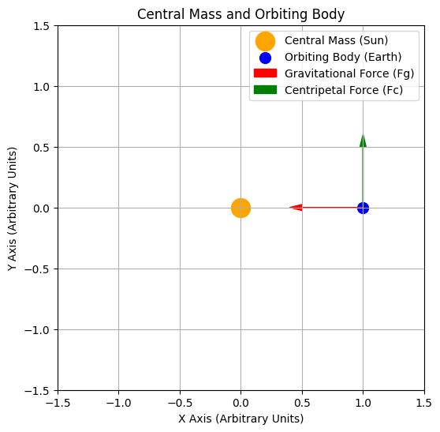

# Problem 1
# Orbital Period and Orbital Radius
**Introduction**

The study of orbital mechanics has played a crucial role in shaping our understanding of the universe. One of the most fundamental discoveries in this field is Kepler's Third Law, which establishes a direct relationship between the square of an object's orbital period and the cube of its orbital radius. This principle serves as a foundational tool for astronomers and physicists, providing insights into planetary motions, satellite orbits, and gravitational interactions on a cosmic scale.

Understanding how celestial bodies move in their orbits requires a comprehensive grasp of gravitational forces and centripetal acceleration. By analyzing these forces, we can derive mathematical relationships that describe the behavior of planets, moons, and artificial satellites. The importance of this study extends beyond theoretical physics, as it has practical applications in space exploration, GPS technology, and satellite communications.

**Motivation**

Kepler's Third Law is a cornerstone of celestial mechanics, enabling precise calculations of planetary orbits and mass distributions in planetary systems. By studying the relationship between orbital period and orbital radius, we can:

- Predict the motion of celestial bodies with remarkable accuracy.
- Determine the masses of planets and their moons based on observational data.
- Design stable satellite orbits for communication, navigation, and scientific research.
- Enhance our understanding of gravitational interactions within and beyond the Solar System.

By deriving and simulating this relationship, we gain deeper insights into how celestial mechanics govern planetary movements and how human-made satellites can be positioned optimally in Earth's orbit. This analysis will not only verify Kepler’s law computationally but also illustrate its profound implications in astronomy and space technology.

---

**Derivation of the Orbital Period and Orbital Radius Relationship**

To derive the relationship between the square of the orbital period and the cube of the orbital radius, we start by considering a body of mass \( m \) orbiting a much larger central body of mass \( M \) in a circular orbit. The forces acting on the orbiting body include:

- **Gravitational Force:** Given by Newton’s law of universal gravitation,
  \( F_g = \frac{GMm}{r^2} \)
  where \( G \) is the gravitational constant and \( r \) is the orbital radius.

- **Centripetal Force:** Required to maintain circular motion,
  \( F_c = \frac{m v^2}{r} \)
  where \( v \) is the orbital velocity.

- Equating these forces for a stable orbit,
  \( \frac{GMm}{r^2} = \frac{m v^2}{r} \)
  Canceling \( m \) from both sides and solving for \( v \),

  $$
  \( v^2 = \frac{GM}{r} \)
  $$


- Since the orbital period \( T \) is the time required for one complete orbit, we relate \( v \) and \( T \) using:
  $$
  \( v = \frac{2\pi r}{T} \)
  $$

  - Substituting for \( v^2 \),
  $$
  \( \left( \frac{2\pi r}{T} \right)^2 = \frac{GM}{r} \)
  $$

  - Simplifying,
  $$
  \( \frac{4\pi^2 r^2}{T^2} = \frac{GM}{r} \)
  $$

  - Rearranging for \( T^2 \),
  $$
  \( T^2 = \frac{4\pi^2}{GM} r^3 \)
  $$

This confirms Kepler’s Third Law: the square of the orbital period is proportional to the cube of the orbital radius.

<details>
  <summary>Phyton codes.</summary>


```python
import numpy as np
import matplotlib.pyplot as plt

# Central mass (e.g., the Sun) and orbiting body (e.g., Earth) diagram
fig, ax = plt.subplots(figsize=(6, 6))

# Central mass (e.g., the Sun)
ax.scatter(0, 0, color='orange', s=300, label="Central Mass (Sun)")

# Orbiting body (e.g., Earth)
orbit_radius = 1  # Arbitrary units
ax.scatter(orbit_radius, 0, color='blue', s=100, label="Orbiting Body (Earth)")

# Gravitational force vector
ax.arrow(orbit_radius, 0, -0.5, 0, head_width=0.05, head_length=0.1, fc='red', ec='red', label="Gravitational Force (Fg)")

# Centripetal force vector
ax.arrow(orbit_radius, 0, 0, 0.5, head_width=0.05, head_length=0.1, fc='green', ec='green', label="Centripetal Force (Fc)")

# Graph settings
ax.set_xlim(-1.5, 1.5)
ax.set_ylim(-1.5, 1.5)
ax.set_xlabel("X Axis (Arbitrary Units)")
ax.set_ylabel("Y Axis (Arbitrary Units)")
ax.set_title("Central Mass and Orbiting Body")
ax.legend()
ax.grid(True)

# Display the plot
plt.show()

```
</details>



- **Introduction to Central Mass and Orbiting Body**

- This diagram illustrates an orbiting body (e.g., Earth) moving around a central mass (e.g., the Sun).

- **Representation of Forces**


- Red Arrow: The gravitational force (𝐹𝑔) pulls the orbiting body toward the central mass.


- Green Arrow: The centripetal force (𝐹𝑐) keeps the body in circular motion.


- **Orbital Dynamics**

- According to Newton's law of gravitation and the principles of centripetal force, the orbiting body is continuously pulled toward the central mass. However, due to its tangential velocity, it remains in orbit rather than falling directly into the central mass.


This diagram serves as a foundation for understanding Kepler’s Third Law and orbital mechanics.

---

**Implications for Astronomy**


Kepler’s Third Law has profound implications in astronomy, as it provides a powerful tool for understanding and predicting celestial mechanics. Some key applications include:


- **Determining Planetary Masses and Distances:**


- By measuring a planet’s orbital period and radius, astronomers can determine the mass of its central star using Kepler’s equation.


- This technique has been extensively used in our Solar System to estimate planetary masses and distances.


- For example, astronomers use Jupiter’s moons and their orbital periods to calculate Jupiter’s mass.


- **Detecting and Characterizing Exoplanets:**


- The transit method and radial velocity method rely on Kepler’s Third Law to infer exoplanetary properties.


- By measuring an exoplanet’s orbital period, astronomers can estimate its distance from the host star and compare it to planetary formation models.


- Many exoplanets discovered by missions like Kepler and TESS have been characterized using this method.


- **Astrophysical Modeling and Space Mission Planning:**


- Kepler’s Law plays a crucial role in astrophysical simulations, including planetary formation models and galaxy dynamics.


- Space agencies use this law to design stable satellite orbits and plan interplanetary missions, ensuring spacecraft maintain desired orbits around celestial bodies.


- For instance, NASA’s Voyager and Juno missions used Kepler’s principles for trajectory planning and orbital insertions around planets.


By leveraging Kepler’s Third Law, astronomers and space scientists can accurately describe planetary motion, validate theoretical models, and optimize space travel trajectories.

---

**Real-World Examples**


Kepler’s Third Law is observed in various real-world scenarios, validating its accuracy and significance in celestial mechanics:


- **The Moon’s orbit around Earth:**


- The Moon’s orbital period (27.3 days) and average distance from Earth **(384,400 km)** fit the expected relationship dictated by Kepler’s Third Law.


- This relationship helps astronomers accurately model tidal effects and lunar cycles.


- **The planets of the Solar System:**


- Orbital data from Mercury to Neptune closely follow the cubic relationship of , confirming the law's predictive power.


- This allows astronomers to estimate unknown orbital parameters when limited observational data is available.


- **Jupiter’s Moons:**


- Galileo’s observations of Jupiter’s four largest moons (Io, Europa, Ganymede, and Callisto) provided one of the earliest confirmations of Kepler’s Third Law beyond Earth.


- By measuring their orbital periods and distances, astronomers accurately determined Jupiter’s mass.


- **Artificial Satellites and Space Missions:**

- The orbits of geostationary and low-Earth-orbit satellites adhere to Kepler’s Third Law, ensuring their stability and functionality.


- Space missions such as Mars orbiters and the Hubble Space Telescope use Kepler’s principles to maintain precise orbital paths.


- **Binary Star Systems and Exoplanets:**

- The law is instrumental in studying binary star systems, where astronomers use orbital period and separation to determine stellar masses.


- In exoplanet research, Kepler’s Law allows for the calculation of planet-star distances based on transit and radial velocity measurements.


These examples showcase how Kepler’s Third Law remains a fundamental tool in astronomy, physics, and space exploration, providing a reliable framework for understanding and predicting orbital dynamics.


---

**Task 4: Computational Simulation**

To further validate Kepler’s Third Law, we implement a computational simulation using Python. The simulation consists of the following steps:

1. **Mathematical Model Implementation:** Using Kepler’s equation \(T^2 = \frac{4\pi^2}{GM} r^3\), we compute the orbital period for different radii.

2. **Data Visualization:** We generate plots of \(T^2\) vs. \(r^3\) to confirm the expected linear relationship.

3. **Numerical Orbital Simulation:** Using Newton’s laws of motion and gravitational force equations, we simulate an orbiting body’s motion in a 2D plane.

4. **Extension to Elliptical Orbits:** The model can be extended to explore elliptical motion and deviations from circular orbits.

5. **Code Implementation:** We use Python with Matplotlib and NumPy for numerical calculations and visualization.


By implementing this simulation, we will quantitatively validate Kepler’s Third Law and provide an interactive approach to understanding orbital mechanics. The next step is to generate graphical representations to visualize the results.

