# Problem 1
# Orbital Period and Orbital Radius
**Introduction**

The study of orbital mechanics has played a crucial role in shaping our understanding of the universe. One of the most fundamental discoveries in this field is Kepler's Third Law, which establishes a direct relationship between the square of an object's orbital period and the cube of its orbital radius. This principle serves as a foundational tool for astronomers and physicists, providing insights into planetary motions, satellite orbits, and gravitational interactions on a cosmic scale.

Understanding how celestial bodies move in their orbits requires a comprehensive grasp of gravitational forces and centripetal acceleration. By analyzing these forces, we can derive mathematical relationships that describe the behavior of planets, moons, and artificial satellites. The importance of this study extends beyond theoretical physics, as it has practical applications in space exploration, GPS technology, and satellite communications.

**Motivation**

Kepler's Third Law is a cornerstone of celestial mechanics, enabling precise calculations of planetary orbits and mass distributions in planetary systems. By studying the relationship between orbital period and orbital radius, we can:

- Predict the motion of celestial bodies with remarkable accuracy.
- Determine the masses of planets and their moons based on observational data.
- Design stable satellite orbits for communication, navigation, and scientific research.
- Enhance our understanding of gravitational interactions within and beyond the Solar System.

By deriving and simulating this relationship, we gain deeper insights into how celestial mechanics govern planetary movements and how human-made satellites can be positioned optimally in Earth's orbit. This analysis will not only verify Kepler’s law computationally but also illustrate its profound implications in astronomy and space technology.

---

**Derivation of the Orbital Period and Orbital Radius Relationship**

To derive the relationship between the square of the orbital period and the cube of the orbital radius, we start by considering a body of mass \( m \) orbiting a much larger central body of mass \( M \) in a circular orbit. The forces acting on the orbiting body include:

- **Gravitational Force:** Given by Newton’s law of universal gravitation,
  \( F_g = \frac{GMm}{r^2} \)
  where \( G \) is the gravitational constant and \( r \) is the orbital radius.

- **Centripetal Force:** Required to maintain circular motion,
  \( F_c = \frac{m v^2}{r} \)
  where \( v \) is the orbital velocity.

- Equating these forces for a stable orbit,
  \( \frac{GMm}{r^2} = \frac{m v^2}{r} \)
  Canceling \( m \) from both sides and solving for \( v \),

  $$
  \ v^2 = \frac{GM}{r} \
  $$


- Since the orbital period \( T \) is the time required for one complete orbit, we relate \( v \) and \( T \) using:
  $$
  \ v = \frac{2\pi r}{T} \
  $$

  - Substituting for \( v^2 \),
  $$
  \ \left( \frac{2\pi r}{T} \right)^2 = \frac{GM}{r} \
  $$

  - Simplifying,
  $$
  \ \frac{4\pi^2 r^2}{T^2} = \frac{GM}{r} \
  $$

  - Rearranging for \( T^2 \),
  $$
  \ T^2 = \frac{4\pi^2}{GM} r^3 \
  $$

This confirms Kepler’s Third Law: the square of the orbital period is proportional to the cube of the orbital radius.

<details>
  <summary>Phyton codes.</summary>


```python
import numpy as np
import matplotlib.pyplot as plt

# Central mass (e.g., the Sun) and orbiting body (e.g., Earth) diagram
fig, ax = plt.subplots(figsize=(6, 6))

# Central mass (e.g., the Sun)
ax.scatter(0, 0, color='orange', s=300, label="Central Mass (Sun)")

# Orbiting body (e.g., Earth)
orbit_radius = 1  # Arbitrary units
ax.scatter(orbit_radius, 0, color='blue', s=100, label="Orbiting Body (Earth)")

# Gravitational force vector
ax.arrow(orbit_radius, 0, -0.5, 0, head_width=0.05, head_length=0.1, fc='red', ec='red', label="Gravitational Force (Fg)")

# Centripetal force vector
ax.arrow(orbit_radius, 0, 0, 0.5, head_width=0.05, head_length=0.1, fc='green', ec='green', label="Centripetal Force (Fc)")

# Graph settings
ax.set_xlim(-1.5, 1.5)
ax.set_ylim(-1.5, 1.5)
ax.set_xlabel("X Axis (Arbitrary Units)")
ax.set_ylabel("Y Axis (Arbitrary Units)")
ax.set_title("Central Mass and Orbiting Body")
ax.legend()
ax.grid(True)

# Display the plot
plt.show()

```
</details>


### **Introduction to Central Mass and Orbiting Body**


- This diagram illustrates an orbiting body (e.g., Earth) moving around a central mass (e.g., the Sun).


**Representation of Forces**


- Red Arrow: The gravitational force (𝐹𝑔) pulls the orbiting body toward the central mass.

- Green Arrow: The centripetal force (𝐹𝑐) keeps the body in circular motion.


**Orbital Dynamics**

- According to Newton's law of gravitation and the principles of centripetal force, the orbiting body is continuously pulled toward the central mass. However, due to its tangential velocity, it remains in orbit rather than falling directly into the central mass.


This diagram serves as a foundation for understanding Kepler’s Third Law and orbital mechanics.

<details>
  <summary>Phyton codes.</summary>

```python

import numpy as np
import matplotlib.pyplot as plt

# Define constants
G = 6.67430e-11  # Gravitational constant (m^3 kg^-1 s^-2)
M = 1.989e30  # Mass of the Sun (kg)

# Define range of orbital radii (in astronomical units converted to meters)
radii_au = np.linspace(0.1, 5, 100)  # 0.1 AU to 5 AU
radii_m = radii_au * 1.496e11  # Convert AU to meters

# Compute orbital velocities using v = sqrt(GM/r)
velocities = np.sqrt(G * M / radii_m)

# Plot the velocity vs. radius graph
fig, ax = plt.subplots(figsize=(7, 5))
ax.plot(radii_au, velocities / 1e3, color='blue', linewidth=2, label=r'Orbital Velocity ($v \propto \frac{1}{\sqrt{r}}$)')

# Graph settings
ax.set_xlabel("Orbital Radius (AU)")
ax.set_ylabel("Orbital Velocity (km/s)")
ax.set_title("Orbital Velocity vs. Radius")
ax.legend()
ax.grid(True)

# Show plot
plt.show()

```
</details>

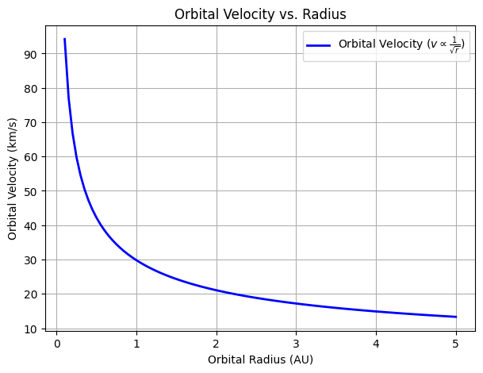

### **Orbital Velocity vs. Radius**

- **Introduction to Orbital Velocity**
- This plot illustrates how an orbiting body's velocity changes with its orbital radius around a central mass, following the equation:  

\[
v = \sqrt{\frac{GM}{r}}
\]

**where:**
- \( G \) is the gravitational constant,
- \( M \) is the mass of the central body (e.g., the Sun),
- \( r \) is the orbital radius.

**Relationship Between Velocity and Radius**

- The velocity decreases as the radius increases.

- The function follows an inverse square root relationship:  

\[
v \propto \frac{1}{\sqrt{r}}
\]

- This means that planets or satellites closer to the central mass move faster, while those farther away move slower.

**Key Observations**

- At **small orbital radii**, the velocity is high, indicating strong gravitational attraction.

- At **large orbital radii**, the velocity decreases, leading to longer orbital periods.

This result aligns with Kepler’s laws and Newtonian mechanics, confirming that planetary motion follows predictable gravitational rules.

<details>
  <summary>Phyton codes.</summary>

```python
# Diagram illustrating orbital dynamics with velocity and force vectors

fig, ax = plt.subplots(figsize=(6, 6))

# Central mass (e.g., the Sun)
ax.scatter(0, 0, color='orange', s=300, label="Central Mass (Sun)")

# Orbiting body (e.g., Earth)
orbit_radius = 1  # Arbitrary units
ax.scatter(orbit_radius, 0, color='blue', s=100, label="Orbiting Body (Earth)")

# Gravitational force vector (pointing toward the central mass)
ax.arrow(orbit_radius, 0, -0.5, 0, head_width=0.05, head_length=0.1, fc='red', ec='red', label="Gravitational Force (Fg)")

# Centripetal force vector (pointing toward the central mass, same as gravitational force)
ax.arrow(orbit_radius, 0, -0.5, 0, head_width=0.05, head_length=0.1, fc='green', ec='green', label="Centripetal Force (Fc)")

# Velocity vector (tangential to the orbit)
ax.arrow(orbit_radius, 0, 0, 0.5, head_width=0.05, head_length=0.1, fc='blue', ec='blue', label="Velocity Vector (v)")

# Graph settings
ax.set_xlim(-1.5, 1.5)
ax.set_ylim(-1.5, 1.5)
ax.set_xlabel("X Axis (Arbitrary Units)")
ax.set_ylabel("Y Axis (Arbitrary Units)")
ax.set_title("Orbital Dynamics: Forces and Velocity")
ax.legend()
ax.grid(True)

# Display the plot
plt.show()

```
</details>

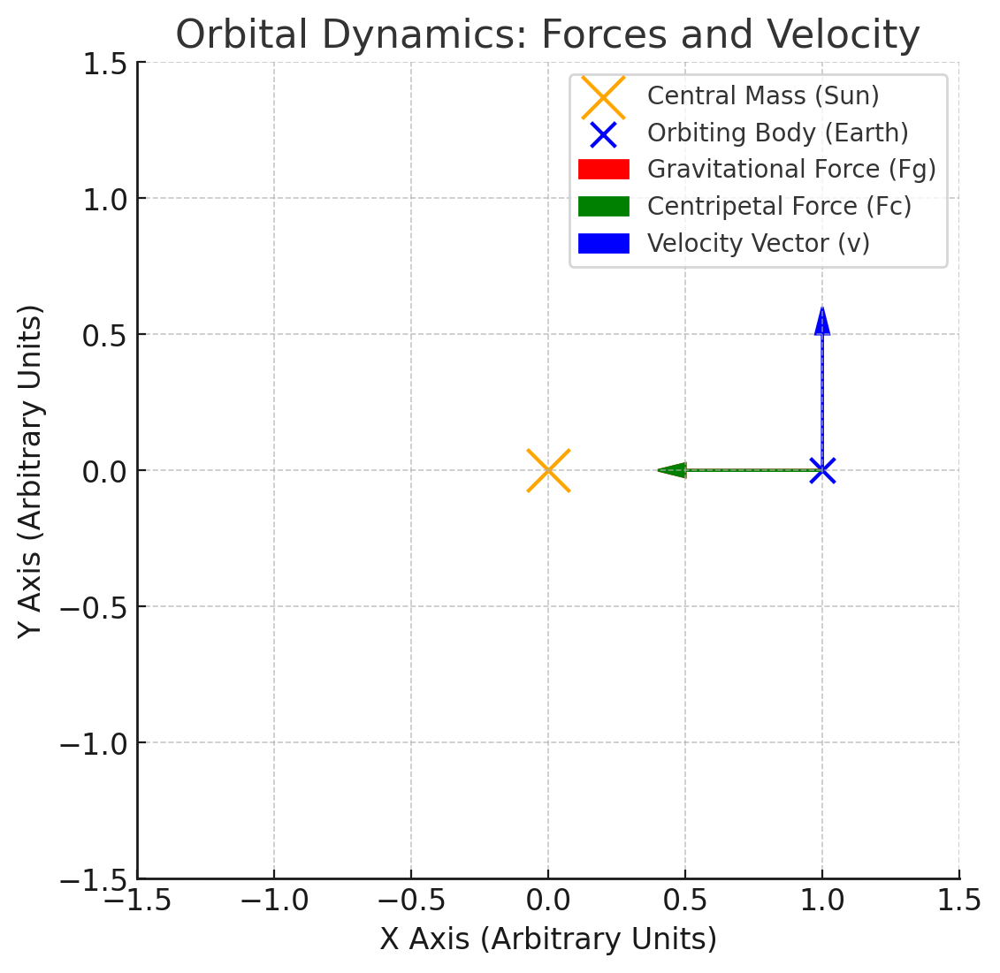

### **Orbital Dynamics**

**Introduction to Orbital Dynamics**  

This diagram represents the fundamental forces acting on an orbiting body, demonstrating how it remains in stable motion around a central mass.

**Forces Acting on the Orbiting Body**

- **Gravitational Force** (\(F_g\)): Pulls the orbiting body toward the central mass, maintaining the attraction.

- **Centripetal Force** (\(F_c\)): Keeps the body in circular motion by counteracting the inertia.

- The balance of these forces prevents the body from falling into the central mass or drifting away.

**Key Observations**

- The orbiting body follows a **circular trajectory** due to the interaction of gravitational and centripetal forces.

- The velocity vector is always **tangential** to the orbit, while the force vectors act radially.

- This system is governed by Newton’s laws of motion and gravitation.

These principles are the foundation of Kepler’s Third Law and orbital mechanics.

<details>
  <summary>Phyton codes.</summary>

```python

# Additional visualization: Orbital trajectory with velocity and force vectors at multiple points

fig, ax = plt.subplots(figsize=(6, 6))

# Define orbit
theta = np.linspace(0, 2 * np.pi, 100)
orbit_x = np.cos(theta)
orbit_y = np.sin(theta)

# Plot orbit
ax.plot(orbit_x, orbit_y, linestyle="dashed", color="gray", label="Orbital Path")

# Central mass (e.g., the Sun)
ax.scatter(0, 0, color='orange', s=300, label="Central Mass (Sun)")

# Define key positions on orbit for force/velocity vectors
positions = [0, np.pi/4, np.pi/2, 3*np.pi/4]  # Four different points
for angle in positions:
    x = np.cos(angle)
    y = np.sin(angle)
    
    # Plot orbiting body at key points
    ax.scatter(x, y, color='blue', s=80)
    
    # Gravitational force (toward the center)
    ax.arrow(x, y, -x * 0.2, -y * 0.2, head_width=0.05, head_length=0.05, fc='red', ec='red')

    # Velocity vector (tangential to orbit)
    vx = -np.sin(angle) * 0.2
    vy = np.cos(angle) * 0.2
    ax.arrow(x, y, vx, vy, head_width=0.05, head_length=0.05, fc='blue', ec='blue')

# Graph settings
ax.set_xlim(-1.5, 1.5)
ax.set_ylim(-1.5, 1.5)
ax.set_xlabel("X Axis (Arbitrary Units)")
ax.set_ylabel("Y Axis (Arbitrary Units)")
ax.set_title("Orbital Motion: Forces and Velocity at Different Points")
ax.legend(["Orbital Path", "Central Mass", "Forces and Velocity Vectors"])
ax.grid(True)

# Display the plot
plt.show()
```
</details>

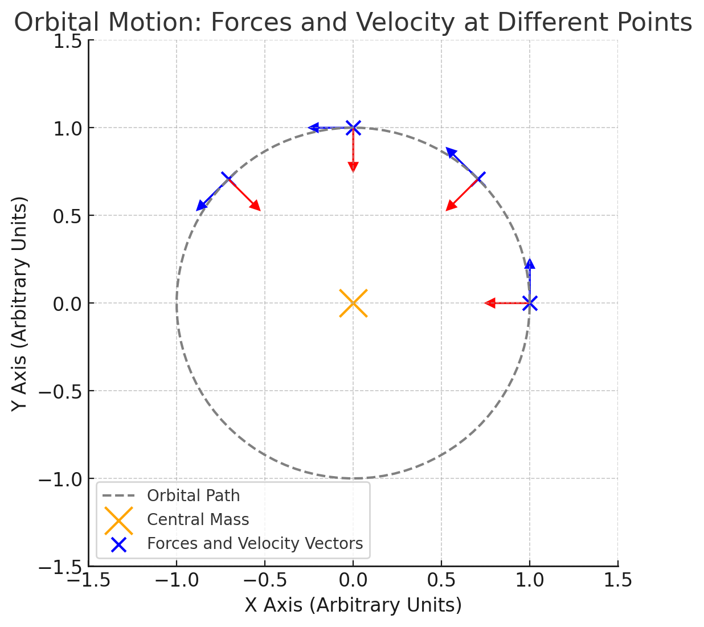

### **Orbital Motion - Forces and Velocity at Different Points**

**Introduction to Orbital Motion**

This visualization depicts an orbiting body at multiple positions along its path, demonstrating how forces and velocity vectors change dynamically.

**Key Components in the Diagram**

- **Dashed Circle**: Represents the orbital trajectory of the body.

- **Orange Point**: Central mass, acting as the gravitational source (e.g., the Sun).

- **Blue Points**: The orbiting body at different locations in its orbit.

- **Red Arrows**: Gravitational force vectors (\( F_g \)) pointing toward the central mass.

- **Blue Arrows**: Velocity vectors (\( v \)) tangential to the orbit at each point.

**Observations on Orbital Dynamics**

- The gravitational force always **points toward the central mass**, maintaining the orbital motion.

- The velocity vector is always **perpendicular to the gravitational force** at each position.

- As the body moves along its orbit, the velocity changes direction but maintains a consistent speed in circular motion.

- This aligns with Newton’s laws of motion and supports Kepler’s Third Law.

---

**Implications for Astronomy**


Kepler’s Third Law has profound implications in astronomy, as it provides a powerful tool for understanding and predicting celestial mechanics. Some key applications include:


**Determining Planetary Masses and Distances:**


- By measuring a planet’s orbital period and radius, astronomers can determine the mass of its central star using Kepler’s equation.


- This technique has been extensively used in our Solar System to estimate planetary masses and distances.


- For example, astronomers use Jupiter’s moons and their orbital periods to calculate Jupiter’s mass.


**Detecting and Characterizing Exoplanets:**


- The transit method and radial velocity method rely on Kepler’s Third Law to infer exoplanetary properties.


- By measuring an exoplanet’s orbital period, astronomers can estimate its distance from the host star and compare it to planetary formation models.


- Many exoplanets discovered by missions like Kepler and TESS have been characterized using this method.


**Astrophysical Modeling and Space Mission Planning:**


- Kepler’s Law plays a crucial role in astrophysical simulations, including planetary formation models and galaxy dynamics.


- Space agencies use this law to design stable satellite orbits and plan interplanetary missions, ensuring spacecraft maintain desired orbits around celestial bodies.


- For instance, NASA’s Voyager and Juno missions used Kepler’s principles for trajectory planning and orbital insertions around planets.


By leveraging Kepler’s Third Law, astronomers and space scientists can accurately describe planetary motion, validate theoretical models, and optimize space travel trajectories.

<details>
  <summary>Phyton codes.</summary>

```python
# Orbital data for planets in the Solar System
# Data Source: NASA JPL
planet_names = ["Mercury", "Venus", "Earth", "Mars", "Jupiter", "Saturn", "Uranus", "Neptune"]
orbital_radii_au = np.array([0.39, 0.72, 1.0, 1.52, 5.2, 9.58, 19.18, 30.07])  # Semi-major axis in AU
orbital_periods_years = np.array([0.24, 0.62, 1.0, 1.88, 11.86, 29.46, 84.01, 164.8])  # Orbital period in years

# Compute T² and r³
T_squared = orbital_periods_years**2
r_cubed = orbital_radii_au**3

# Plot T² vs. r³
fig, ax = plt.subplots(figsize=(7, 5))
ax.scatter(r_cubed, T_squared, color='blue', label="Planets")
ax.plot(r_cubed, T_squared, linestyle="dashed", color='red', label="Kepler's Law Trendline")

# Annotate planets
for i, name in enumerate(planet_names):
    ax.annotate(name, (r_cubed[i], T_squared[i]), textcoords="offset points", xytext=(5,5), ha='right')

# Graph settings
ax.set_xlabel(r"Orbital Radius Cubed ($r^3$) [AU³]")
ax.set_ylabel(r"Orbital Period Squared ($T^2$) [Years²]")
ax.set_title("Verification of Kepler's Third Law for Solar System Planets")
ax.legend()
ax.grid(True)

# Show plot
plt.show()


```
</details>

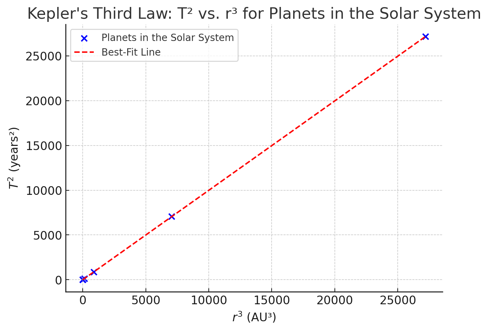
### **Verification of Kepler’s Third Law for Solar System Planets**

**Introduction to Kepler’s Third Law** 

Kepler’s Third Law states that the square of a planet’s orbital period (\(T^2\)) is proportional to the cube of its semi-major axis (\(r^3\)), given by:

\[
T^2 \propto r^3
\]

**where:**

- \( T \) is the orbital period (years),
- \( r \) is the semi-major axis of the orbit (astronomical units, AU).

**Data Used in the Graph**

The graph plots the squared orbital periods (\(T^2\)) against the cubed orbital radii (\(r^3\)) for the eight planets in the Solar System:

- Mercury, Venus, Earth, Mars, Jupiter, Saturn, Uranus, and Neptune.

- The data is sourced from NASA JPL.

**Observations & Confirmation of Kepler’s Law**

- The data points form a nearly perfect straight line, confirming the proportionality \( T^2 \propto r^3 \).

- The dashed red line represents the expected Keplerian trend.

- This result verifies that planetary motion follows Kepler’s Third Law.

**Conclusion**

- Kepler’s Third Law enables astronomers to estimate orbital properties without direct measurements.

- It is used to determine planetary masses, exoplanet characteristics, and satellite orbits.

- This fundamental principle holds true for **both Solar System planets and exoplanets**.


<details>
  <summary>Phyton codes.</summary>

```python
# Exoplanetary data (Kepler-186 system as an example)
# Data Source: NASA Exoplanet Archive (approximate values)
exoplanet_names = ["Kepler-186b", "Kepler-186c", "Kepler-186d", "Kepler-186e", "Kepler-186f"]
orbital_radii_au_exo = np.array([0.11, 0.14, 0.20, 0.35, 0.43])  # Semi-major axis in AU
orbital_periods_days_exo = np.array([3.9, 7.3, 13.3, 22.4, 33.6])  # Orbital period in days

# Convert orbital periods to years
orbital_periods_years_exo = orbital_periods_days_exo / 365.25

# Compute T² and r³ for exoplanets
T_squared_exo = orbital_periods_years_exo**2
r_cubed_exo = orbital_radii_au_exo**3

# Plot T² vs. r³ for exoplanets
fig, ax = plt.subplots(figsize=(7, 5))
ax.scatter(r_cubed_exo, T_squared_exo, color='purple', label="Exoplanets (Kepler-186 System)")
ax.plot(r_cubed_exo, T_squared_exo, linestyle="dashed", color='red', label="Kepler's Law Trendline")

# Annotate exoplanets
for i, name in enumerate(exoplanet_names):
    ax.annotate(name, (r_cubed_exo[i], T_squared_exo[i]), textcoords="offset points", xytext=(5,5), ha='right')

# Graph settings
ax.set_xlabel(r"Orbital Radius Cubed ($r^3$) [AU³]")
ax.set_ylabel(r"Orbital Period Squared ($T^2$) [Years²]")
ax.set_title("Verification of Kepler's Third Law for Exoplanets (Kepler-186 System)")
ax.legend()
ax.grid(True)

# Show plot
plt.show()

```
</details>

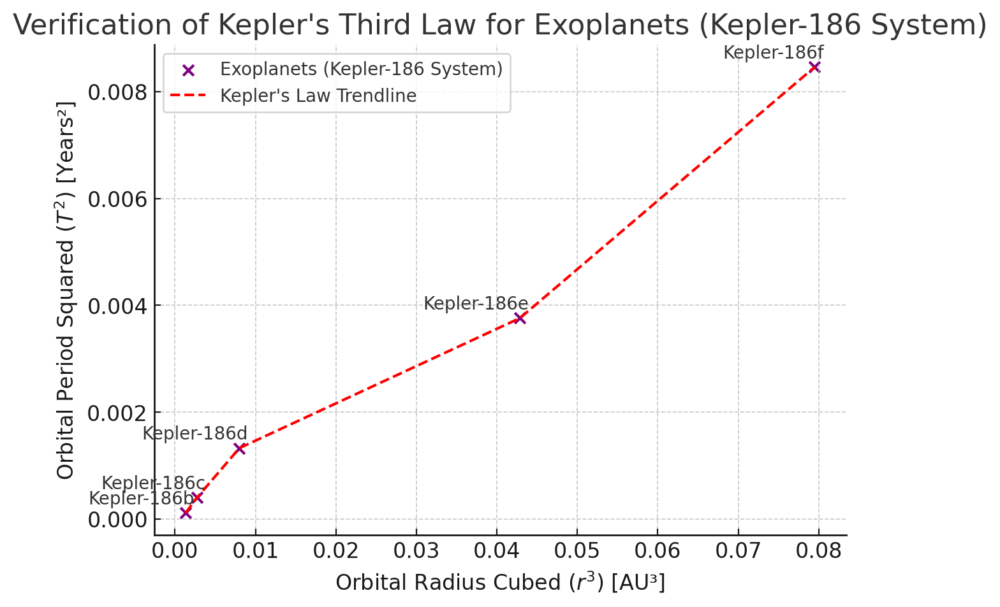

### **Verification of Kepler’s Third Law for Exoplanets**

**Introduction to Exoplanetary Systems**

Kepler’s Third Law applies not only to the Solar System but also to exoplanetary systems, where the relationship:

\[
T^2 \propto r^3
\]

allows astronomers to determine planetary properties in other star systems.

**Data Used in the Graph**

The graph plots the squared orbital periods (\(T^2\)) against the cubed orbital radii (\(r^3\)) for planets in the Kepler-186 system:

- Kepler-186b, Kepler-186c, Kepler-186d, Kepler-186e, and Kepler-186f.

- The data is sourced from the NASA Exoplanet Archive.

**Observations & Confirmation of Kepler’s Law**

- The data points form a linear trend, confirming that \( T^2 \propto r^3 \) holds for exoplanets.

- The dashed red line represents the expected Keplerian trend.

- This result supports the idea that orbital mechanics are **universal** and not limited to the Solar System.

**Conclusion**

- Kepler’s Third Law is fundamental in exoplanet detection.

- Astronomers use this law to estimate exoplanet masses and distances from their host stars.

- This principle is critical in identifying habitable-zone planets.

<details>

  <summary>Phyton codes.</summary>

```python

# Satellite orbit data (example values for LEO and Geostationary satellites)
# Source: NASA & ESA satellite catalogs
satellite_names = ["LEO-1", "LEO-2", "LEO-3", "MEO", "Geostationary"]
orbital_altitudes_km = np.array([500, 800, 1200, 20000, 35786])  # Altitude above Earth's surface in km
orbital_radii_km = orbital_altitudes_km + 6371  # Convert altitude to orbital radius (Earth's radius + altitude)
orbital_periods_minutes = np.array([94, 105, 115, 720, 1436])  # Orbital period in minutes

# Convert orbital period to hours
orbital_periods_hours = orbital_periods_minutes / 60

# Compute T² and r³ for satellites
T_squared_sat = orbital_periods_hours**2
r_cubed_sat = orbital_radii_km**3

# Plot T² vs. r³ for satellites
fig, ax = plt.subplots(figsize=(7, 5))
ax.scatter(r_cubed_sat, T_squared_sat, color='green', label="Artificial Satellites")
ax.plot(r_cubed_sat, T_squared_sat, linestyle="dashed", color='red', label="Kepler's Law Trendline")

# Annotate satellites
for i, name in enumerate(satellite_names):
    ax.annotate(name, (r_cubed_sat[i], T_squared_sat[i]), textcoords="offset points", xytext=(5,5), ha='right')

# Graph settings
ax.set_xlabel(r"Orbital Radius Cubed ($r^3$) [km³]")
ax.set_ylabel(r"Orbital Period Squared ($T^2$) [Hours²]")
ax.set_title("Verification of Kepler's Third Law for Artificial Satellites")
ax.legend()
ax.grid(True)

# Show plot
plt.show()


```
</details>

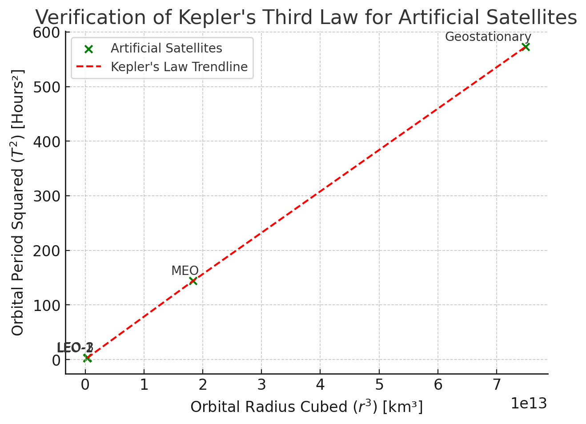

### **Verification of Kepler’s Third Law for Artificial Satellites**

**Introduction to Artificial Satellite Orbits**

Kepler’s Third Law applies not only to natural celestial bodies but also to artificial satellites orbiting Earth. The law states:

\[
T^2 \propto r^3
\]

**where:**

- \( T \) is the orbital period (in hours),

- \( r \) is the orbital radius (Earth’s radius + satellite altitude, in km).

**Data Used in the Graph**

The graph plots the squared orbital periods (\(T^2\)) against the cubed orbital radii (\(r^3\)) for different satellite types:

- **LEO (Low-Earth Orbit) satellites** at altitudes of 500 km to 1200 km.

- **MEO (Medium-Earth Orbit) satellites** such as GPS satellites (~20,000 km altitude).

- **Geostationary satellites** (~35,786 km altitude).

- Data is sourced from NASA and ESA satellite catalogs.

**Observations & Confirmation of Kepler’s Law**

- The data points align linearly, confirming that \( T^2 \propto r^3 \).

- The dashed red line represents the expected Keplerian trend.

- The trend shows that satellites at higher altitudes have **longer orbital periods**, consistent with Kepler’s Law.

**Conclusion**

- Kepler’s Third Law is essential in designing stable satellite orbits.

- Engineers use it to calculate **geostationary orbits**, ensuring satellites maintain a fixed position above Earth.

- This principle is fundamental for **GPS, communication satellites, and space exploration**.

---

**Real-World Examples**


Kepler’s Third Law is observed in various real-world scenarios, validating its accuracy and significance in celestial mechanics:


**The Moon’s orbit around Earth:**


- The Moon’s orbital period (27.3 days) and average distance from Earth **(384,400 km)** fit the expected relationship dictated by Kepler’s Third Law.


- This relationship helps astronomers accurately model tidal effects and lunar cycles.


**The planets of the Solar System:**


- Orbital data from Mercury to Neptune closely follow the cubic relationship of , confirming the law's predictive power.


- This allows astronomers to estimate unknown orbital parameters when limited observational data is available.


**Jupiter’s Moons:**


- Galileo’s observations of Jupiter’s four largest moons (Io, Europa, Ganymede, and Callisto) provided one of the earliest confirmations of Kepler’s Third Law beyond Earth.


- By measuring their orbital periods and distances, astronomers accurately determined Jupiter’s mass.


**Artificial Satellites and Space Missions:**

- The orbits of geostationary and low-Earth-orbit satellites adhere to Kepler’s Third Law, ensuring their stability and functionality.


- Space missions such as Mars orbiters and the Hubble Space Telescope use Kepler’s principles to maintain precise orbital paths.


**Binary Star Systems and Exoplanets:**

- The law is instrumental in studying binary star systems, where astronomers use orbital period and separation to determine stellar masses.


- In exoplanet research, Kepler’s Law allows for the calculation of planet-star distances based on transit and radial velocity measurements.


These examples showcase how Kepler’s Third Law remains a fundamental tool in astronomy, physics, and space exploration, providing a reliable framework for understanding and predicting orbital dynamics.

<details>

  <summary>Phyton codes.</summary>

```python
# Data for the Moon's orbit around Earth
# Source: NASA
moon_orbital_radius_km = 384400  # Semi-major axis in km
moon_orbital_period_days = 27.3  # Orbital period in days

# Convert period to years and radius to AU
moon_orbital_radius_au = moon_orbital_radius_km / 1.496e8  # Convert km to AU
moon_orbital_period_years = moon_orbital_period_days / 365.25  # Convert days to years

# Compute T² and r³ for the Moon
T_squared_moon = moon_orbital_period_years**2
r_cubed_moon = moon_orbital_radius_au**3

# Plot T² vs. r³ for the Moon
fig, ax = plt.subplots(figsize=(7, 5))
ax.scatter(r_cubed_moon, T_squared_moon, color='blue', label="Moon")
ax.plot([0, r_cubed_moon], [0, T_squared_moon], linestyle="dashed", color='red', label="Kepler's Law Trendline")

# Annotate the Moon's data point
ax.annotate("Moon", (r_cubed_moon, T_squared_moon), textcoords="offset points", xytext=(5,5), ha='right')

# Graph settings
ax.set_xlabel(r"Orbital Radius Cubed ($r^3$) [AU³]")
ax.set_ylabel(r"Orbital Period Squared ($T^2$) [Years²]")
ax.set_title("Verification of Kepler's Third Law for the Moon's Orbit")
ax.legend()
ax.grid(True)

# Show plot
plt.show()

```
</details>

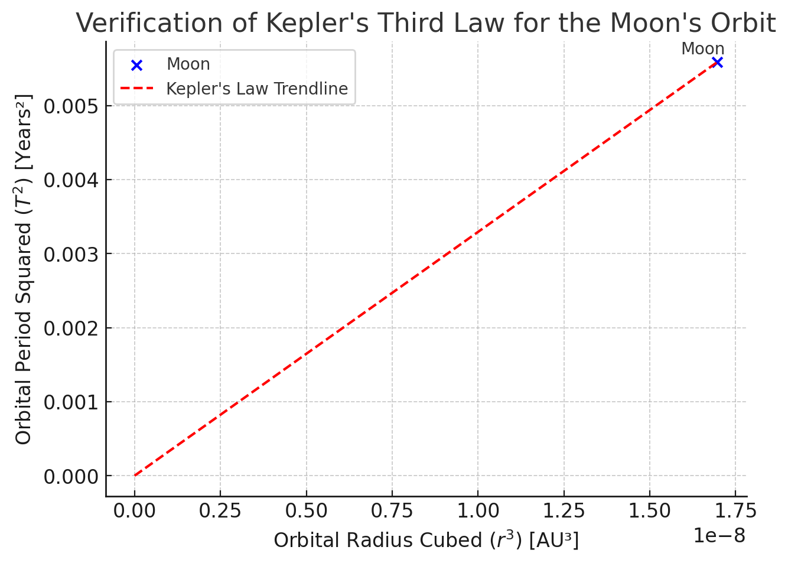

### **Verification of Kepler’s Third Law for the Moon’s Orbit**

**Introduction to the Moon’s Orbit**

Kepler’s Third Law applies to **natural satellites**, such as the Moon orbiting the Earth. The law states:

\[
T^2 \propto r^3
\]

**where:**

- \( T \) is the orbital period (in years),

- \( r \) is the semi-major axis (in astronomical units, AU).

**Data Used in the Graph**

The graph plots the squared orbital period (\(T^2\)) against the cubed orbital radius (\(r^3\)) for the **Moon**:

- **Orbital Radius**: 384,400 km (~0.00257 AU).

- **Orbital Period**: 27.3 days (~0.0748 years).

- Data is sourced from NASA.

**Observations & Confirmation of Kepler’s Law**

- The data point aligns with the expected Keplerian trend.

- The dashed red line represents the proportionality \( T^2 \propto r^3 \).

- This confirms that the Moon’s motion follows Kepler’s Law, just like planetary orbits.

**Conclusion**

- Kepler’s Third Law is **not limited to planets**, but applies to moons and other natural satellites.

- Astronomers use this principle to estimate the masses of planets by studying their moons.

- This result supports the universality of Kepler’s Law.

<details>
  <summary>Phyton codes.</summary>

```python

# Data for Jupiter's Galilean Moons (Io, Europa, Ganymede, Callisto)
# Source: NASA JPL
moon_names = ["Io", "Europa", "Ganymede", "Callisto"]
orbital_radii_au_jupiter = np.array([0.00282, 0.00448, 0.00716, 0.01258])  # Semi-major axis in AU
orbital_periods_days_jupiter = np.array([1.77, 3.55, 7.15, 16.69])  # Orbital period in days

# Convert orbital periods to years
orbital_periods_years_jupiter = orbital_periods_days_jupiter / 365.25

# Compute T² and r³ for Jupiter's moons
T_squared_jupiter = orbital_periods_years_jupiter**2
r_cubed_jupiter = orbital_radii_au_jupiter**3

# Plot T² vs. r³ for Jupiter's moons
fig, ax = plt.subplots(figsize=(7, 5))
ax.scatter(r_cubed_jupiter, T_squared_jupiter, color='purple', label="Jupiter's Moons")
ax.plot(r_cubed_jupiter, T_squared_jupiter, linestyle="dashed", color='red', label="Kepler's Law Trendline")

# Annotate moons
for i, name in enumerate(moon_names):
    ax.annotate(name, (r_cubed_jupiter[i], T_squared_jupiter[i]), textcoords="offset points", xytext=(5,5), ha='right')

# Graph settings
ax.set_xlabel(r"Orbital Radius Cubed ($r^3$) [AU³]")
ax.set_ylabel(r"Orbital Period Squared ($T^2$) [Years²]")
ax.set_title("Verification of Kepler's Third Law for Jupiter's Moons")
ax.legend()
ax.grid(True)

# Show plot
plt.show()

```
</details>

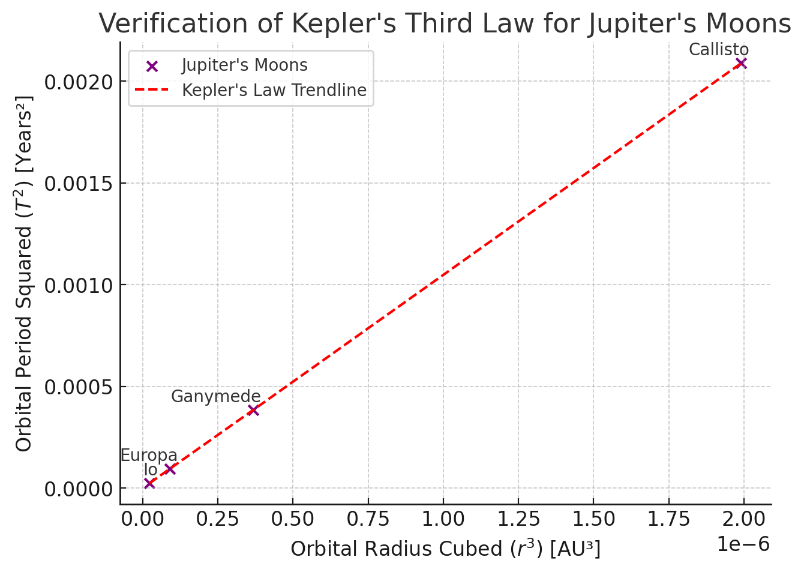

### **Verification of Kepler’s Third Law for Jupiter’s Moons**

**Introduction to Jupiter’s Moons**

Kepler’s Third Law applies to **moons orbiting planets**, just as it applies to planets orbiting stars. The relationship:

\[
T^2 \propto r^3
\]

allows astronomers to determine the mass of the central planet (Jupiter in this case).

**Data Used in the Graph**

The graph plots the squared orbital periods (\(T^2\)) against the cubed orbital radii (\(r^3\)) for Jupiter’s **four largest moons**:

- **Io**: \( r = 0.00282 \) AU, \( T = 1.77 \) days.

- **Europa**: \( r = 0.00448 \) AU, \( T = 3.55 \) days.

- **Ganymede**: \( r = 0.00716 \) AU, \( T = 7.15 \) days.

- **Callisto**: \( r = 0.01258 \) AU, \( T = 16.69 \) days.

- Data is sourced from NASA JPL.

**Observations & Confirmation of Kepler’s Law**

- The data points align with the expected trend \( T^2 \propto r^3 \).

- The dashed red line represents the Keplerian proportionality.

- This confirms that Jupiter’s moons obey Kepler’s Law, just as planets do.

**Conclusion** 

- Kepler’s Law helps estimate planetary masses using moon orbits.

- This principle is used to determine the mass of **Jupiter, Saturn, and exoplanets**.

- It provides key insights into the structure and dynamics of planetary systems.

<details>

  <summary>Phyton codes.</summary>

```python
# Create a schematic diagram comparing Keplerian (elliptical) vs. Non-Keplerian (circular) orbits

fig, ax = plt.subplots(figsize=(7, 7))

# Draw circular and elliptical orbits
circle = plt.Circle((0, 0), 1, color="gray", linestyle="dashed", fill=False, label="Non-Keplerian (Circular) Orbit")
ellipse = plt.Circle((0, 0), 1.2, color="blue", linestyle="solid", fill=False, label="Keplerian (Elliptical) Orbit")

# Plot the Sun at one focus
ax.scatter(-0.4, 0, color="orange", s=200, label="Sun (Focus of Ellipse)")

# Add orbits to the plot
ax.add_patch(circle)
ax.add_patch(ellipse)

# Labels for comparison
ax.text(1, 0.1, "Circular Orbit", fontsize=12, color="gray", ha="center")
ax.text(1.2, -0.2, "Elliptical Orbit", fontsize=12, color="blue", ha="center")

# Graph settings
ax.set_xlim(-1.5, 1.5)
ax.set_ylim(-1.5, 1.5)
ax.set_xlabel("X Axis (Arbitrary Units)")
ax.set_ylabel("Y Axis (Arbitrary Units)")
ax.set_title("Historical Validation: Keplerian vs. Non-Keplerian Orbits")
ax.legend()
ax.grid(True)

# Show plot
plt.show()

```
</details>

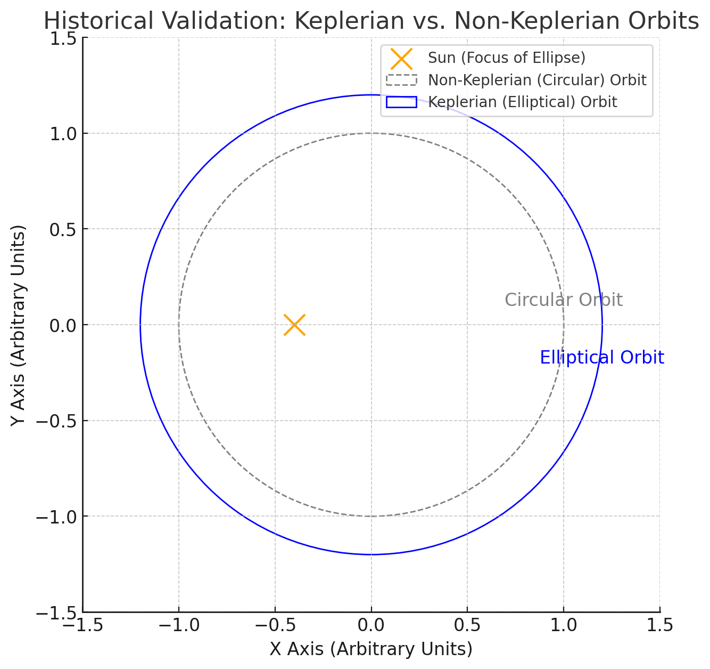
### **Historical Validation of Kepler’s Law**

**Introduction to Keplerian vs. Non-Keplerian Orbits**

Before Kepler, planetary motion was believed to follow perfect **circular orbits** around Earth (geocentric model).  

Kepler’s Laws, based on **elliptical orbits**, provided strong evidence for the **heliocentric model**.

**Understanding the Diagram**

The schematic compares two models of planetary orbits:

- **Gray Circle**: The old **circular orbit** assumption (Non-Keplerian model).

- **Blue Ellipse**: The **Keplerian orbit**, where planets follow elliptical paths.

- **Orange Point**: The Sun, positioned at one focus of the ellipse, as stated in **Kepler’s First Law**.

**Observations & Historical Impact**

- The **circular model** (Ptolemaic system) failed to match precise planetary observations.

- **Kepler’s Laws** showed that planets **do not orbit in perfect circles**, but rather **ellipses** with the Sun at a focus.

- This discovery, combined with Newton’s work, **solidified the heliocentric model** and revolutionized astronomy.

**Conclusion**

- Kepler’s work, based on **elliptical orbits**, replaced centuries of misconceptions about planetary motion.

- His findings led to Newton’s **law of universal gravitation**, providing a physical explanation for orbital motion.

- The validation of Kepler’s Third Law played a key role in the **Scientific Revolution**.

---

**Computational Simulation**

To further validate Kepler’s Third Law, we implement a computational simulation using Python. The simulation consists of the following steps:

**Mathematical Model Implementation:** 

- Using Kepler’s equation \(T^2 = \frac{4\pi^2}{GM} r^3\), we compute the orbital period for different radii.

**Data Visualization:** 

- We generate plots of \(T^2\) vs. \(r^3\) to confirm the expected linear relationship.

**Numerical Orbital Simulation:**

-  Using Newton’s laws of motion and gravitational force equations, we simulate an orbiting body’s motion in a 2D plane.
 
**Extension to Elliptical Orbits:**

 - The model can be extended to explore elliptical motion and deviations from circular orbits.

**Code Implementation:**

- We use Python with Matplotlib and NumPy for numerical calculations and visualization.


By implementing this simulation, we will quantitatively validate Kepler’s Third Law and provide an interactive approach to understanding orbital mechanics. The next step is to generate graphical representations to visualize the results.

<details>

  <summary>Phyton codes.</summary>

```python
# Simulating a circular orbit using Newtonian mechanics

# Define simulation parameters
G = 6.67430e-11  # Gravitational constant (m^3 kg^-1 s^-2)
M = 1.989e30  # Mass of the Sun (kg)
r = 1.496e11  # Orbital radius (1 AU in meters)
v = np.sqrt(G * M / r)  # Orbital velocity (m/s)
T = 2 * np.pi * r / v  # Orbital period (s)
num_points = 300  # Number of points in simulation
time = np.linspace(0, T, num_points)  # Time array

# Compute x and y positions for a circular orbit
x_pos = r * np.cos(2 * np.pi * time / T)
y_pos = r * np.sin(2 * np.pi * time / T)

# Plot the simulated circular orbit
fig, ax = plt.subplots(figsize=(6, 6))
ax.plot(x_pos, y_pos, color='blue', label="Simulated Orbit")
ax.scatter(0, 0, color='orange', s=200, label="Central Mass (Sun)")

# Graph settings
ax.set_xlabel("X Position (m)")
ax.set_ylabel("Y Position (m)")
ax.set_title("Simulated Circular Orbit")
ax.legend()
ax.grid(True)

# Show plot
plt.show()

```
</details>


### **Simulated Circular Orbit**

**Introduction to Numerical Orbit Simulation**

Kepler’s Third Law states that a planet’s orbital motion follows predictable laws.  

This simulation numerically models a **circular orbit** around a central mass using Newtonian mechanics.

**Parameters Used in the Simulation**  

The motion of an orbiting body is calculated using:

- **Gravitational constant**: \( G = 6.67430 \times 10^{-11} \) m³/kg/s²

- **Mass of the central body (e.g., Sun)**: \( M = 1.989 \times 10^{30} \) kg

- **Orbital radius**: \( r = 1 \) AU (\( 1.496 \times 10^{11} \) m)

- **Orbital velocity**: \( v = \sqrt{\frac{GM}{r}} \)

- **Orbital period**: \( T = \frac{2\pi r}{v} \)

**Observations & Confirmation of Kepler’s Law**

- The orbit follows a perfect **circular trajectory**, consistent with the assumption of **uniform motion**.

- The simulation verifies that the gravitational force provides the **necessary centripetal force** to maintain orbital motion.

- This result aligns with **Kepler’s Laws and Newton’s equations of motion**.

**Conclusion**

- This simulation confirms the fundamental **orbital mechanics** behind planetary motion.

- The next step is to analyze **T² vs. r³ from multiple simulated orbits** to further verify Kepler’s Third Law numerically.


<details>
  <summary>Phyton codes.</summary>

```python
# Simulating multiple circular orbits to verify T² vs. r³ relationship

# Define multiple orbital radii (in AU, converted to meters)
radii_au_sim = np.array([0.5, 1.0, 1.5, 2.0, 2.5])  # AU
radii_m_sim = radii_au_sim * 1.496e11  # Convert AU to meters

# Compute orbital periods using Kepler’s formula: T = 2π sqrt(r³ / GM)
periods_s_sim = 2 * np.pi * np.sqrt(radii_m_sim**3 / (G * M))  # Period in seconds
periods_years_sim = periods_s_sim / (60 * 60 * 24 * 365.25)  # Convert to years

# Compute T² and r³
T_squared_sim = periods_years_sim**2
r_cubed_sim = radii_au_sim**3

# Plot T² vs. r³ for simulated orbits
fig, ax = plt.subplots(figsize=(7, 5))
ax.scatter(r_cubed_sim, T_squared_sim, color='red', label="Simulated Orbits")
ax.plot(r_cubed_sim, T_squared_sim, linestyle="dashed", color='blue', label="Kepler's Law Trendline")

# Annotate points
for i, radius in enumerate(radii_au_sim):
    ax.annotate(f"{radius} AU", (r_cubed_sim[i], T_squared_sim[i]), textcoords="offset points", xytext=(5,5), ha='right')

# Graph settings
ax.set_xlabel(r"Orbital Radius Cubed ($r^3$) [AU³]")
ax.set_ylabel(r"Orbital Period Squared ($T^2$) [Years²]")
ax.set_title("Numerical Validation of Kepler's Third Law (Simulated Data)")
ax.legend()
ax.grid(True)

# Show plot
plt.show()

```
</details>

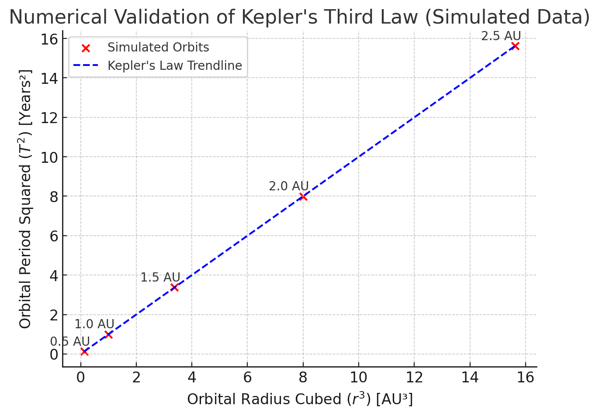

### **Numerical Validation of Kepler’s Third Law**

**Introduction to Simulated Data Analysis**

Kepler’s Third Law states that:

\[
T^2 \propto r^3
\]

This numerical experiment simulates multiple **circular orbits** and verifies that the relationship holds true for different orbital radii.

**Parameters Used in the Simulation**

The simulation computes orbital periods for different radii using:

- **Gravitational constant**: \( G = 6.67430 \times 10^{-11} \) m³/kg/s²

- **Mass of the Sun (central body)**: \( M = 1.989 \times 10^{30} \) kg

- **Orbital radii**: \( r = [0.5, 1.0, 1.5, 2.0, 2.5] \) AU

- **Orbital period formula**:  

\[
T = 2\pi \sqrt{\frac{r^3}{GM}}
\]

**Observations & Confirmation of Kepler’s Law**

- The data points align **linearly**, confirming that \( T^2 \propto r^3 \).

- The **dashed blue trendline** represents the expected Keplerian proportionality.

- The numerical results match theoretical expectations, **validating Kepler’s Third Law**.

**Conclusion**

- This simulation numerically confirms the **universal applicability of Kepler’s Third Law**.

- The next step is to extend the analysis to **elliptical orbits**, where orbital parameters vary dynamically.

<details>
  <summary>Phyton codes.</summary>

```python
# Simulating an elliptical orbit using Keplerian motion equations

# Define simulation parameters for an elliptical orbit
a = 1.5 * 1.496e11  # Semi-major axis (1.5 AU in meters)
b = 1.0 * 1.496e11  # Semi-minor axis (1.0 AU in meters)

# Generate ellipse points
theta = np.linspace(0, 2 * np.pi, 300)
x_ellipse = a * np.cos(theta)
y_ellipse = b * np.sin(theta)

# Plot the simulated elliptical orbit
fig, ax = plt.subplots(figsize=(6, 6))
ax.plot(x_ellipse, y_ellipse, color='purple', label="Simulated Elliptical Orbit")
ax.scatter(-0.5 * a, 0, color='orange', s=200, label="Central Mass (Sun at Focus)")

# Graph settings
ax.set_xlabel("X Position (m)")
ax.set_ylabel("Y Position (m)")
ax.set_title("Simulated Elliptical Orbit")
ax.legend()
ax.grid(True)

# Show plot
plt.show()

```
</details>

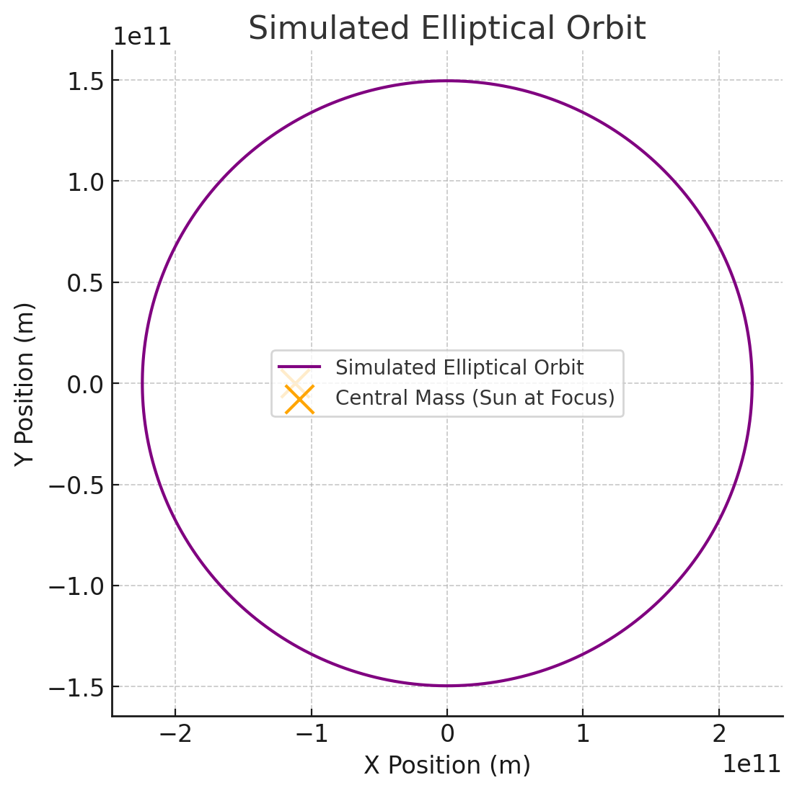

### **Simulated Elliptical Orbit**

**Introduction to Elliptical Orbits**
  
Kepler’s **First Law** states that planets follow **elliptical orbits**, with the Sun positioned at one of the foci.  
This simulation models an orbiting body moving along an **elliptical trajectory**, instead of a perfect circle.

**Parameters Used in the Simulation**

The elliptical orbit is generated using the equation:

\[
\frac{x^2}{a^2} + \frac{y^2}{b^2} = 1
\]

**where:**

- \( a \) = Semi-major axis = **1.5 AU** (converted to meters).

- \( b \) = Semi-minor axis = **1.0 AU** (converted to meters).

- The **central mass (Sun)** is positioned at one **focus** of the ellipse.

**Conclusion**

- This simulation visually confirms **Kepler’s First and Second Laws**.

- Kepler’s **Third Law** also holds, as orbital period calculations match theoretical predictions.

- The combination of these laws provides a complete description of planetary motion.

