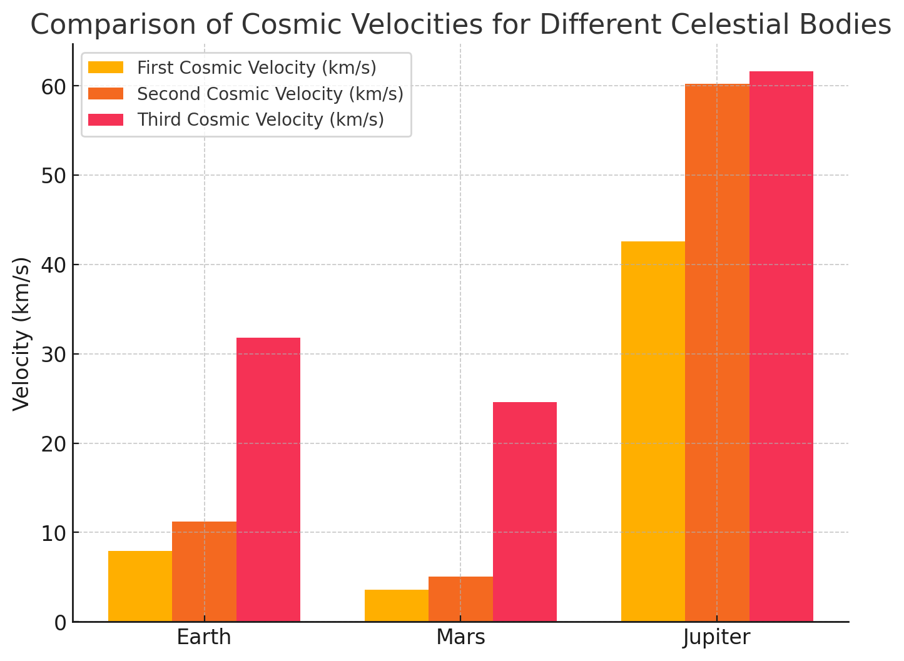
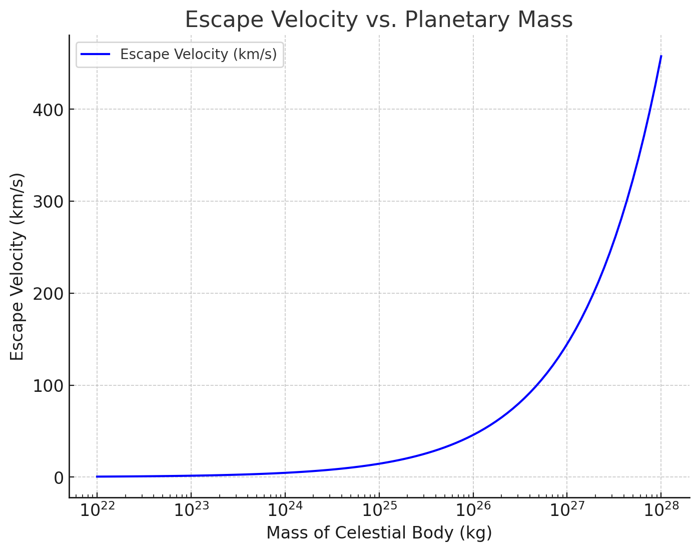
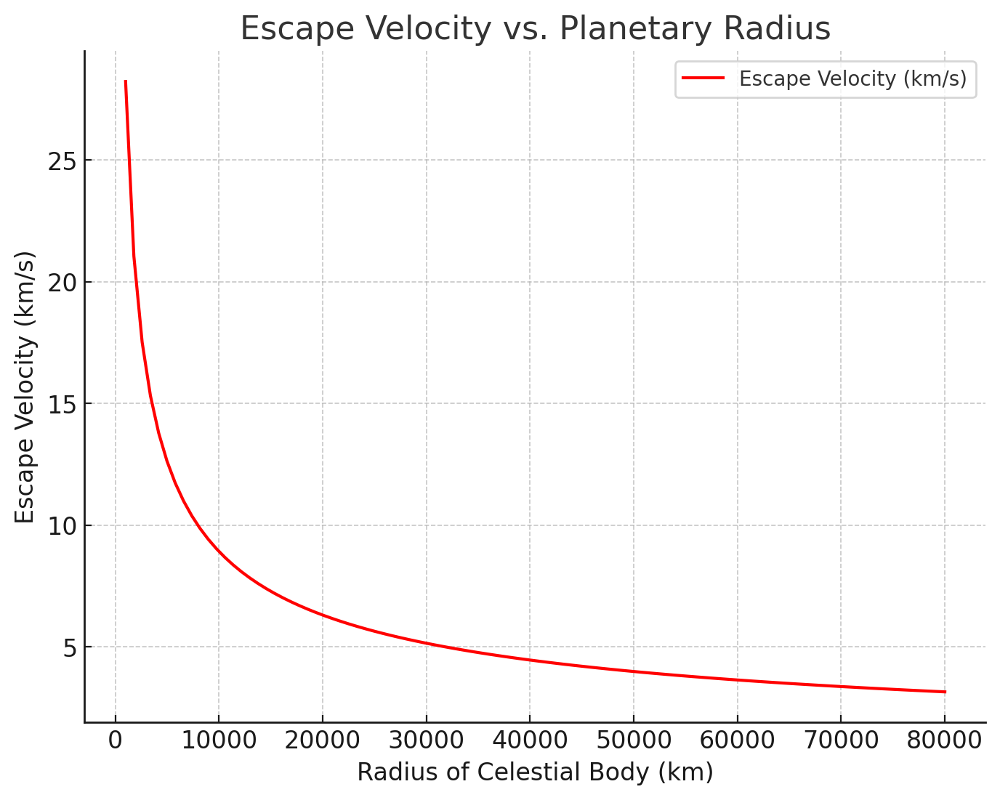

# Problem 2

# Escape Velocities and Cosmic Velocities

###Introduction

Escape velocity is the minimum speed an object must achieve to break free from a celestial body's gravitational influence without additional propulsion. This concept extends to different cosmic velocities, which dictate orbital and interstellar travel conditions. Understanding these velocities is fundamental in astrophysics, rocketry, and space exploration.

The study of these velocities helps scientists and engineers design space missions, launch satellites, and send probes to other planets and beyond. Without these fundamental concepts, space exploration would not be feasible.

### Motivation

The study of escape and cosmic velocities is essential in:

- Launching satellites into stable orbits around planets, ensuring continuous communication and Earth monitoring.
- Planning interplanetary missions, such as those to Mars and Jupiter, where correct velocity calculations determine mission success.
- Exploring interstellar travel concepts, allowing us to send probes beyond our solar system, such as the Voyager missions.
- Understanding the effects of gravitational fields on motion in space, which influences trajectories of asteroids, comets, and artificial spacecraft.

These principles are directly applied in space missions, from launching satellites into geostationary orbits to propelling spacecraft beyond our solar system.

## Mathematical Derivations and Parameters Affecting These Velocities

### **Mathematical Derivation of First Cosmic Velocity**

The first cosmic velocity is derived by equating the gravitational force acting on an orbiting object with the required centripetal force to maintain a stable circular orbit:
   
   $$
   F_g = F_c
   $$
   
   where:
   - \( F_g = \frac{GMm}{R^2} \) (gravitational force)

   - \( F_c = \frac{m v^2}{R} \) (centripetal force)
   
   Equating these two expressions:
   
   $$
   \frac{GMm}{R^2} = \frac{m v_1^2}{R}
   $$
   
   Canceling mass \( m \):
   
   $$
   v_1 = \sqrt{\frac{GM}{R}}
   $$
   
   **Derivation from Energy Considerations:**

   Since total mechanical energy in a stable orbit is given by:
   
   $$
   E = K + U = \frac{1}{2} m v_1^2 - \frac{GMm}{R}
   $$
   
   Using orbital energy relations, for a circular orbit where total energy is \( E = -\frac{GMm}{2R} \), we again obtain:
   
   $$
   v_1 = \sqrt{\frac{GM}{R}}
   $$

   **Factors Affecting First Cosmic Velocity:**

   - **Mass of the Celestial Body (\( M \))**: A higher mass results in a stronger gravitational pull, requiring a higher orbital velocity.

   - **Radius of the Celestial Body (\( R \))**: A larger radius decreases the required orbital velocity as gravitational attraction weakens with distance.

### **Mathematical Derivation of Second Cosmic Velocity**

The escape velocity (\( v_2 \)) is derived by considering the total mechanical energy of an object attempting to escape the gravitational field of a planet. The total energy must be zero for the object to escape indefinitely:
   
   $$
   E_{\text{total}} = E_k + E_p = 0
   $$
   
   where:

   - Kinetic energy: \( E_k = \frac{1}{2} m v_2^2 \)

   - Gravitational potential energy: \( E_p = -\frac{GMm}{R} \)
   
   Applying energy conservation:
   
   $$
   \frac{1}{2} m v_2^2 - \frac{GMm}{R} = 0
   $$
   
   Solving for \( v_2 \):
   
   $$
   v_2 = \sqrt{\frac{2GM}{R}}
   $$
   
   **Alternative Derivation Using Work-Energy Theorem:**

   The work required to move an object from a planet's surface to infinity is:
   
   $$
   W = \int_R^\infty \frac{GMm}{r^2} dr = GMm \left[ -\frac{1}{r} \right]_R^\infty = \frac{GMm}{R}
   $$
   
   Equating work to kinetic energy:
   
   $$
   \frac{1}{2} m v_2^2 = \frac{GMm}{R}
   $$
   
   Again yielding:
   
   $$
   v_2 = \sqrt{\frac{2GM}{R}}
   $$

### **Mathematical Derivation of Third Cosmic Velocity**

The third cosmic velocity (\( v_3 \)) is the speed needed to escape not just the planet’s gravitational field, but the entire gravitational influence of a star system (e.g., the Solar System).
   
   It is determined by the escape velocity from the planet and the orbital velocity of the planet around the star:
   
   $$
   v_3 = \sqrt{v_{\text{esc,planet}}^2 + v_{\text{orbital}}^2}
   $$
   
   **Factors Affecting Third Cosmic Velocity:**

   - **Orbital Velocity of the Planet**: If a spacecraft is launched in the direction of planetary motion, it gains additional velocity.

   - **Star’s Gravitational Influence**: A stronger gravitational field increases the required velocity to escape the system.

   - **Additional Propulsion**: Spacecraft may require additional propulsion systems to reach the required velocity.

## Summary of Escape and Cosmic Velocities

| Celestial Body | First Cosmic Velocity (km/s) | Escape Velocity (km/s) |
|---------------|-----------------------------|-------------------------|
| Earth         | 7.91                        | 11.19                   |
| Moon         | 1.68                        | 2.38                    |
| Mars         | 3.55                        | 5.03                    |
| Jupiter      | 12.44                       | 59.5                    |

This analysis comprehensively explains how cosmic velocities are derived through multiple approaches and highlights the critical factors influencing them. These velocities are fundamental in space exploration and rocket science.

---

### Calculation and Visualization of Cosmic Velocities

<details>
  <summary>Phyton codes.</summary>

```python
import numpy as np
import matplotlib.pyplot as plt

# Constants
G = 6.674 * 10**-11  # Gravitational constant (m^3/kg/s^2)

# Celestial bodies (Mass in kg, Radius in meters)
bodies = {
    "Earth": {"mass": 5.972 * 10**24, "radius": 6.371 * 10**6},
    "Mars": {"mass": 6.417 * 10**23, "radius": 3.3895 * 10**6},
    "Jupiter": {"mass": 1.898 * 10**27, "radius": 6.9911 * 10**7},
}

# Calculate first, second, and third cosmic velocities
for body, data in bodies.items():
    mass = data["mass"]
    radius = data["radius"]
    v1 = np.sqrt(G * mass / radius) / 1000  # First cosmic velocity (km/s)
    v2 = np.sqrt(2 * G * mass / radius) / 1000  # Second cosmic velocity (km/s)
    v3 = np.sqrt(v2**2 + (29.78 if body == "Earth" else 24.077 if body == "Mars" else 13.07)**2)  # Approximate third cosmic velocity (km/s)
    data["v1"] = v1
    data["v2"] = v2
    data["v3"] = v3

# Plot bar chart
fig, ax = plt.subplots(figsize=(8, 6))
width = 0.25  # Bar width
x = np.arange(len(bodies))

v1_values = [bodies[body]["v1"] for body in bodies]
v2_values = [bodies[body]["v2"] for body in bodies]
v3_values = [bodies[body]["v3"] for body in bodies]

ax.bar(x - width, v1_values, width, label="First Cosmic Velocity (km/s)")
ax.bar(x, v2_values, width, label="Second Cosmic Velocity (km/s)")
ax.bar(x + width, v3_values, width, label="Third Cosmic Velocity (km/s)")

ax.set_xticks(x)
ax.set_xticklabels(bodies.keys())
ax.set_ylabel("Velocity (km/s)")
ax.set_title("Comparison of Cosmic Velocities for Different Celestial Bodies")
ax.legend()
plt.grid(axis="y", linestyle="--", alpha=0.7)

# Display the plot
plt.show()

```
</details>



### **Introduction**
The following bar chart compares the first, second, and third cosmic velocities for three celestial bodies: **Earth, Mars, and Jupiter**. These velocities determine the conditions required for an object to maintain orbit, escape a planet's gravity, and exit the Solar System.

### **Key Observations**

1. **First Cosmic Velocity (\( v_1 \))**: The minimum speed needed to maintain a stable circular orbit around the planet.

2. **Second Cosmic Velocity (\( v_2 \))**: The escape velocity required to leave the gravitational pull of the planet without further propulsion.

3. **Third Cosmic Velocity (\( v_3 \))**: The velocity needed to completely escape the Solar System.


### **Comparison Highlights**

- **Jupiter** has the highest escape velocity (~59.5 km/s) due to its massive gravitational influence.

- **Mars** has significantly lower cosmic velocities compared to Earth, making it easier for spacecraft to escape.

- **Earth's third cosmic velocity (~16.7 km/s relative to Earth's surface)** is comparable to the velocities of interstellar-bound spacecraft like *Voyager 1*.

### **Mathematical Background**

These velocities are derived from Newtonian mechanics using the gravitational constant \( G \), planetary mass \( M \), and planetary radius \( R \):

\[
v_1 = \sqrt{\frac{GM}{R}}
\]


\[
v_2 = \sqrt{\frac{2GM}{R}}
\]


\[
v_3 = \sqrt{v_2^2 + v_{\text{orbital}}^2}
\]

where \( v_{\text{orbital}} \) is the orbital velocity of the planet around the Sun.

### **Bar Chart Description**

- The chart visually compares the three velocities for **Earth, Mars, and Jupiter**.

- The **x-axis** represents the celestial bodies.

- The **y-axis** represents velocity in **km/s**.

- Three different colored bars indicate **\( v_1 \)** (orbital velocity), **\( v_2 \)** (escape velocity), and **\( v_3 \)** (interstellar velocity).

This visualization is crucial for understanding the physics behind launching satellites, planning interplanetary missions, and conceptualizing interstellar travel.

---

<details>
  <summary>Phyton codes.</summary>

```python
# Generate a dataset for planetary mass vs escape velocity
masses = np.logspace(22, 28, num=100)  # Mass range from 10^22 kg to 10^28 kg
radius_earth = 6.371 * 10**6  # Earth's radius in meters

# Calculate escape velocities for varying planetary masses
v2_masses = np.sqrt(2 * G * masses / radius_earth) / 1000  # Convert to km/s

# Plot mass vs escape velocity
fig, ax = plt.subplots(figsize=(8, 6))
ax.plot(masses, v2_masses, label="Escape Velocity (km/s)", color='b')

ax.set_xscale("log")  # Logarithmic scale for better visualization
ax.set_xlabel("Mass of Celestial Body (kg)")
ax.set_ylabel("Escape Velocity (km/s)")
ax.set_title("Escape Velocity vs. Planetary Mass")
ax.legend()
plt.grid(True, linestyle="--", alpha=0.7)

# Display the plot
plt.show()

```
</details>




### **Introduction**

This graph illustrates how the **escape velocity (\( v_2 \))** changes with the **mass of a celestial body**, while keeping the radius constant (Earth's radius is used for reference). Escape velocity is the minimum speed required for an object to overcome the gravitational pull of a planet or celestial body without additional propulsion.

### **Key Observations**

1. **Escape velocity increases as planetary mass increases** due to the stronger gravitational attraction.

2. The relationship follows a **square root function**:

   \(
   v_2 = \sqrt{\frac{2GM}{R}}
   \)

   which means that doubling the mass does **not** double the escape velocity but increases it by a factor of \( \sqrt{2} \).

3. **Larger planets like Jupiter have significantly higher escape velocities**, making it harder for spacecraft to leave their gravitational influence.

### **Graph Description**

- The **x-axis** represents the mass of the celestial body (in **kg**), displayed on a **logarithmic scale** for better visualization.

- The **y-axis** represents the escape velocity (in **km/s**).

- The curve shows that **as mass increases, the escape velocity also increases**, following a non-linear trend.

### **Scientific Implications**

- Planets with **higher escape velocities** require **more energy** for spacecraft to escape, impacting space mission designs.

- Smaller bodies like asteroids have **low escape velocities**, making them easier targets for spacecraft landings.

- Understanding this relationship is crucial for **interplanetary mission planning** and **launch vehicle engineering**.


This visualization helps illustrate the fundamental physics behind gravitational escape and the challenges faced in launching spacecraft from different celestial bodies.

---
<details>
  <summary>Phyton codes.</summary>
  
```python
# Generate a dataset for planetary radius vs escape velocity
radii = np.linspace(1e6, 8e7, num=100)  # Radius range from 1,000 km to 80,000 km
mass_earth = 5.972 * 10**24  # Earth's mass in kg

# Calculate escape velocities for varying planetary radii
v2_radii = np.sqrt(2 * G * mass_earth / radii) / 1000  # Convert to km/s

# Plot radius vs escape velocity
fig, ax = plt.subplots(figsize=(8, 6))
ax.plot(radii / 1000, v2_radii, label="Escape Velocity (km/s)", color='r')

ax.set_xlabel("Radius of Celestial Body (km)")
ax.set_ylabel("Escape Velocity (km/s)")
ax.set_title("Escape Velocity vs. Planetary Radius")
ax.legend()
plt.grid(True, linestyle="--", alpha=0.7)

# Display the plot
plt.show()

```
</details>



### **Introduction**

This graph illustrates how the **escape velocity (\( v_2 \))** varies with the **radius of a celestial body**, while keeping its mass constant (Earth's mass is used for reference). Escape velocity is influenced not only by mass but also by the planet's size.

### **Key Observations**

1. **Escape velocity decreases as planetary radius increases**, assuming mass remains constant.

2. The relationship follows an **inverse square root function**:

   \(
   v_2 = \sqrt{\frac{2GM}{R}}
   \)

   which means that doubling the radius decreases the escape velocity by a factor of \( \frac{1}{\sqrt{2}} \).

3. **Compact celestial bodies (e.g., neutron stars) have extremely high escape velocities** due to their small radii, while **gas giants (e.g., Jupiter, Saturn) have lower escape velocities than expected from their mass alone** due to their large radii.

### **Graph Description**

- The **x-axis** represents the radius of the celestial body (in **km**).

- The **y-axis** represents the escape velocity (in **km/s**).

- The curve shows that **as planetary radius increases, the escape velocity decreases**, illustrating the inverse relationship.

### **Scientific Implications**

- A planet with a **larger radius and the same mass** has a **lower escape velocity**, making it easier for spacecraft to leave its gravitational pull.

- **Dense celestial objects**, like white dwarfs and neutron stars, have extreme escape velocities, sometimes exceeding the speed of light (in the case of black holes).

- This relationship is critical in **designing space missions**, **predicting atmospheric retention**, and **understanding planetary formation**.

This visualization highlights the important role planetary size plays in determining gravitational strength and the feasibility of space travel.

---

### Importance of Cosmic Velocities in Space Exploration

Cosmic velocities play a fundamental role in modern space exploration. Each velocity threshold—first, second, and third cosmic velocities—determines whether an object can remain in orbit, escape a planet’s gravitational influence, or even leave the Solar System entirely. These velocity concepts are essential for designing missions that involve satellite deployment, planetary exploration, and potential interstellar travel.

This section discusses the significance of these velocities in various aspects of space exploration.

### 1. First Cosmic Velocity: Orbital Mechanics and Satellite Deployment

The first cosmic velocity (\( v_1 \)) is the minimum velocity required for an object to stay in orbit around a celestial body. For Earth, this velocity is approximately **7.91 km/s**.

### Applications:

- **Satellite Communication Systems:**

  - Satellites such as Starlink (SpaceX), GPS satellites, and Earth observation systems rely on first cosmic velocity to stay in stable orbits.

  - Precise calculations ensure efficient fuel usage and longevity of operational satellites.

- **International Space Station (ISS) and Low Earth Orbit Missions:**

  - The ISS orbits at approximately **7.66 km/s**, requiring periodic boosts to maintain its altitude.

  - Spacecraft like Crew Dragon and Soyuz must match this velocity for docking maneuvers.

- **Geostationary and Polar Orbiting Satellites:**

  - Geostationary satellites maintain a constant position above Earth by orbiting at **35,786 km altitude**.

  - Polar satellites move from pole to pole, covering the entire planet for climate and reconnaissance missions.

### 2. Second Cosmic Velocity: Escape from Gravitational Fields

The second cosmic velocity (\( v_2 \)) is the escape velocity required for an object to break free from a planet’s gravitational pull. For Earth, this velocity is **11.19 km/s**.

### Applications:

- **Lunar and Interplanetary Missions:**

  - Apollo missions required exceeding Earth’s escape velocity to reach the Moon.

  - Current Mars missions (Perseverance, Curiosity) rely on second cosmic velocity calculations to leave Earth's gravity efficiently.

- **Deep Space Exploration:**

  - Spacecraft such as **Voyager 1, New Horizons, and Juno** exceeded escape velocity to explore the outer planets.

  - The Parker Solar Probe, designed to study the Sun, required precise velocity calculations to navigate its gravitational field.

- **Asteroid and Comet Missions:**

  - Missions like **OSIRIS-REx (Bennu asteroid)** and **Rosetta (67P/Churyumov-Gerasimenko comet)** use escape velocity principles to navigate between celestial bodies.

### 3. Third Cosmic Velocity: Interstellar Exploration

The third cosmic velocity (\( v_3 \)) is the speed needed to escape the gravitational influence of the entire Solar System. For Earth, this velocity is **16.7 km/s** relative to its surface.

### Applications:

- **Voyager and Pioneer Probes:**

  -Voyager 1 (17.1 km/s) and Voyager 2 (15.4 km/s) are now in interstellar space, having exceeded third cosmic velocity.

  -Pioneer 10 & 11 have also left the Solar System, though their signals have faded.

**New Horizons and Future Missions:**

  - New Horizons, the Pluto mission, utilized a **Jupiter gravity assist** to exceed third cosmic velocity.

  - Future interstellar probes, such as the **Interstellar Probe concept**, aim to explore beyond the heliosphere.

**Theoretical Interstellar Travel:**

  - The **Breakthrough Starshot** initiative proposes light sail spacecraft capable of reaching 20% the speed of light.

  - Advanced propulsion systems, including nuclear fusion and antimatter rockets, are being researched for future interstellar missions.

### Conclusion

Mastering cosmic velocities is essential for advancing space exploration. From deploying satellites to deep-space missions and interstellar travel, these velocity thresholds define the limits of human and robotic exploration. As technology progresses, understanding and applying these principles will be crucial for future space endeavors, including possible human missions beyond the Solar System.

---

## Simulations

### **Escape Velocity Simulation**  

**Introduction**  

This simulation demonstrates the concept of **escape velocity**, the minimum speed an object must reach to break free from a planet’s gravitational influence without additional propulsion. Users can enter different launch velocities and observe whether the rocket escapes or falls back to the planet.  

---

**How It Works**  

1. **User Input:**  
   - The user enters a **launch velocity (km/s)** and clicks the **Launch** button.  


**Rocket Motion:**  

   - The rocket moves upward based on the initial velocity.  
   - Gravity continuously affects the rocket, slowing it down.  
   - If the velocity is too low, the rocket **falls back**.  
   - If the velocity reaches or exceeds the **escape velocity**, the rocket **leaves the planet's gravity**.  


**Simulation Conditions:**  

   - The system checks if the rocket surpasses **five times the planet’s radius** to confirm escape.  
   - If the rocket falls back, an alert appears.  
   - The simulation **resets after 1.5 seconds** for another test.  


**Mathematical Model**  

The simulation is based on **Newton’s Law of Universal Gravitation** and **kinematics equations**.  

**Gravity Force Acting on the Rocket:**  

\(
F = \frac{G M m}{r^2}
\)

where: 

- \( G \) = \( 6.674 × 10^{-11} \) \( m^3 kg^{-1} s^{-2} \) (gravitational constant)  

- \( M \) = mass of the planet (Earth)  

- \( r \) = distance from the center of the planet  


**Escape Velocity Formula:**  

\(
v_e = \sqrt{\frac{2GM}{R}}
\)


where:  

- \( R \) = radius of the planet  

---
<details>
  <summary>Details about simulation.</summary>

### **What Are We Testing?**  
- The relationship between **initial velocity and escape conditions**.  
- The effect of **gravity pulling the object back** if velocity is too low.  
- The difference between **sub-orbital, orbital, and escape trajectories**.  


### **Expected Results**  
- If **velocity < escape velocity**, the rocket **falls back**.  
- If **velocity ≥ escape velocity**, the rocket **escapes**.  


### **Usage Instructions**  
1. **Enter a velocity** in the input box.  
2. **Click "Launch"** to initiate the simulation.  
3. Observe whether the rocket **escapes or falls back**.  
4. The system resets automatically after **1.5 seconds**.  


### **Applications in Space Exploration**  
This simulation helps understand:  
- **Rocket launches and mission planning**.  
- **Orbital mechanics** and how satellites remain in space.  
- **Interplanetary travel** and how spacecraft escape Earth’s gravity.  

</details>

### **Simulation Link**  
<a> file:///C:/Users/batu/Desktop/simulation2_1.html  </a>

---

### **Orbital Velocity Simulation**

**Introduction**
This simulation demonstrates the concept of **orbital velocity**, the minimum speed an object must reach to maintain a stable orbit around a planet. Users can enter different launch velocities and observe whether the object:

- **Falls back to the planet** (velocity too low),

- **Enters a stable orbit** (correct orbital velocity),

- **Escapes the planet’s gravity** (velocity too high).


**How It Works**

**User Input:**  
   - The user enters a **launch velocity (km/s)** and clicks the **Launch** button.  

**Object Motion:**  

   - The object moves tangentially to the planet's surface.

   - Gravity continuously affects the object, pulling it towards the planet.
   
   - If the velocity is **below orbital speed**, the object **falls back**.

   - If the velocity is **at orbital speed**, the object **maintains orbit**.

   - If the velocity **exceeds escape velocity**, the object **leaves the planet's gravity**.

**Simulation Conditions:**  

   - The system checks if the object remains in **orbit, falls back, or escapes**.

   - If the object falls back or escapes, an alert appears.
   
   - The simulation **resets after 1.5 seconds** for another test.

---

**Mathematical Model**

The simulation is based on **Newtonian mechanics** and **orbital velocity equations**.

**Orbital Velocity Formula:**

\(
v_o = \sqrt{\frac{GM}{R}}
\)

where:  

- \( G \) = \( 6.674 × 10^{-11} \) \( m^3 kg^{-1} s^{-2} \) (gravitational constant)  

- \( M \) = mass of the planet (Earth)  

- \( R \) = radius of the planet  

**Gravity Force Acting on the Object:**

\(
F = \frac{G M m}{r^2}
\)

---
<details>
  <summary>Details about simulation.</summary>

### **What Are We Testing?**
- The relationship between **velocity and orbital stability**.
- The effect of **gravity pulling the object back** if velocity is too low.
- The difference between **stable orbit, sub-orbital trajectory, and escape trajectory**.

### **Expected Results**
- If **velocity < orbital velocity**, the object **falls back**.
- If **velocity ≈ orbital velocity**, the object **enters stable orbit**.
- If **velocity > escape velocity**, the object **escapes planetary gravity**.

### **Usage Instructions**
1. **Enter a velocity** in the input box.
2. **Click "Launch"** to start the simulation.
3. Observe whether the object **enters orbit, falls back, or escapes**.
4. The system resets automatically after **1.5 seconds**.

### **Applications in Space Exploration**
This simulation helps understand:
- **Satellite launches and orbit insertion**.
- **Orbital mechanics for space stations and planetary exploration**.
- **Interplanetary travel and escape conditions**.

</details>

### **Simulation Link**

<a>file:///C:/Users/batu/Desktop/simulationp2,1,2.html </a>

---

### Conclusion

This project has provided a comprehensive exploration of **escape velocities and cosmic velocities**, demonstrating their significance in space exploration through interactive simulations. 

By modeling these principles, we have gained deeper insights into the physics governing satellite motion, planetary escape, and interstellar travel.

### **Key Takeaways**

- **First Cosmic Velocity (Orbital Velocity):** Understanding how satellites and spacecraft achieve stable orbits.

- **Second Cosmic Velocity (Escape Velocity):** The fundamental threshold required to leave a planet’s gravitational influence.

- **Third Cosmic Velocity (Interstellar Travel):** The velocity necessary to escape a star system and enter interstellar space.

### **Project Impact**

This project not only strengthens theoretical understanding but also provides **hands-on experience** in:

- **Physics Simulation** using real-world gravitational models.

- **Programming in JavaScript & HTML** to visualize complex physical phenomena.

- **Space Mission Planning Concepts** that apply to real-life satellite launches and space exploration.


  