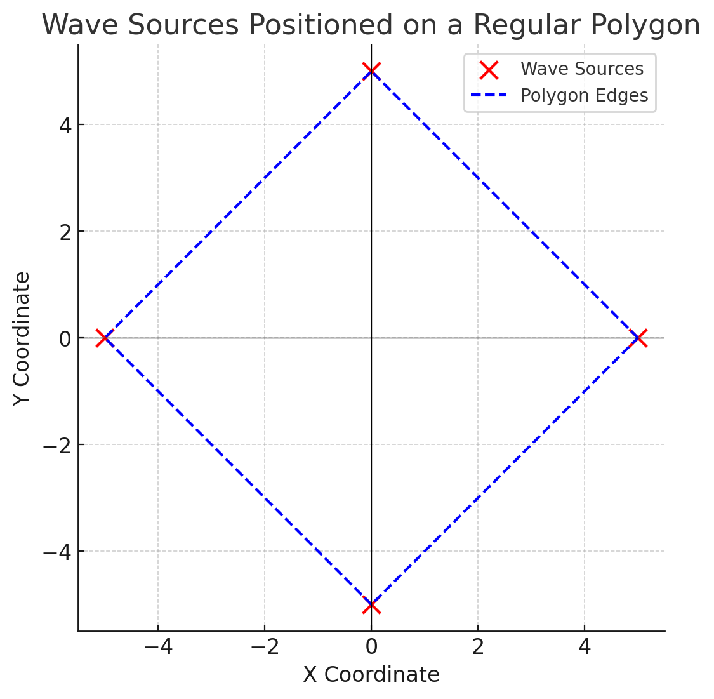
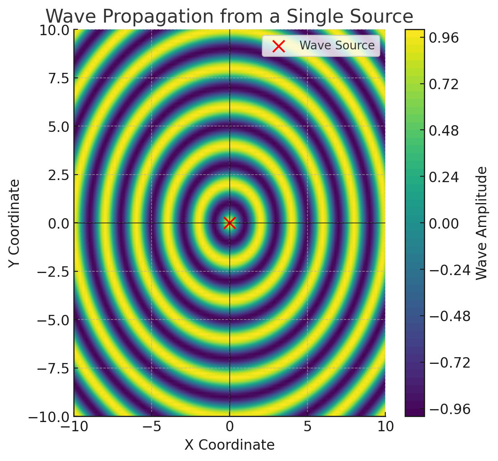
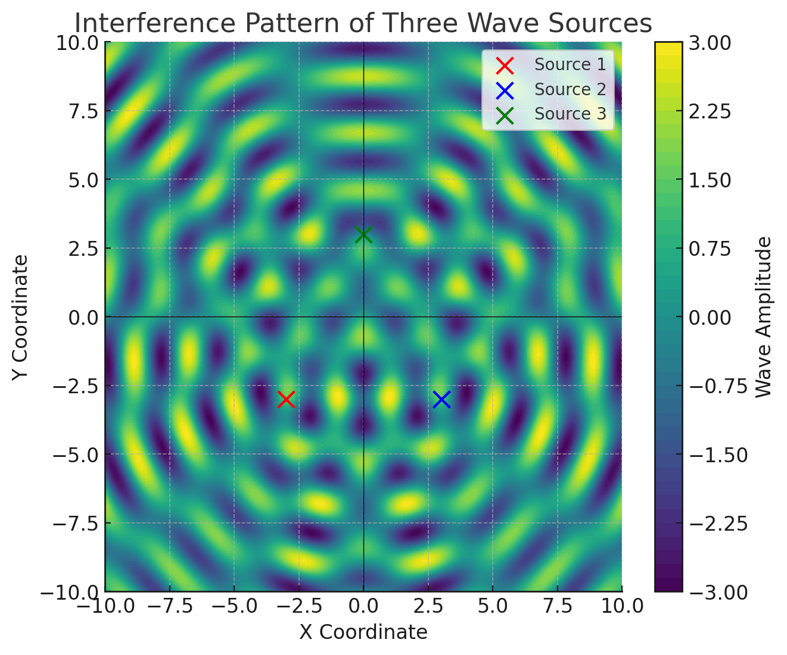
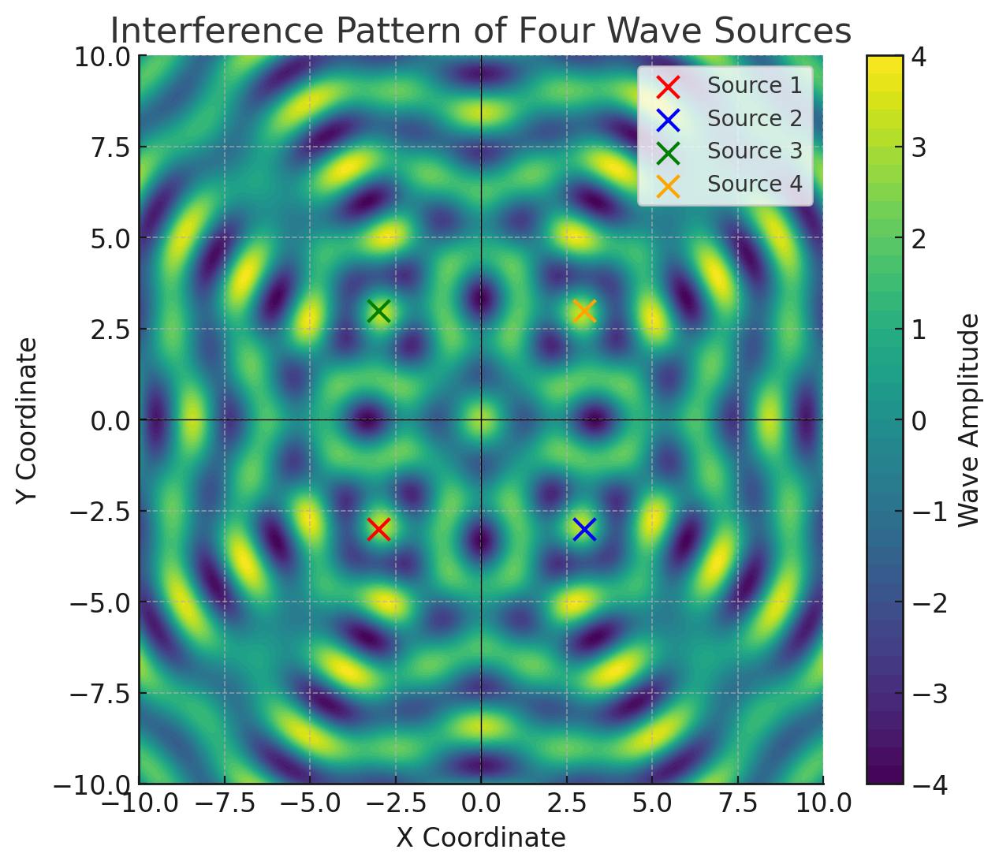
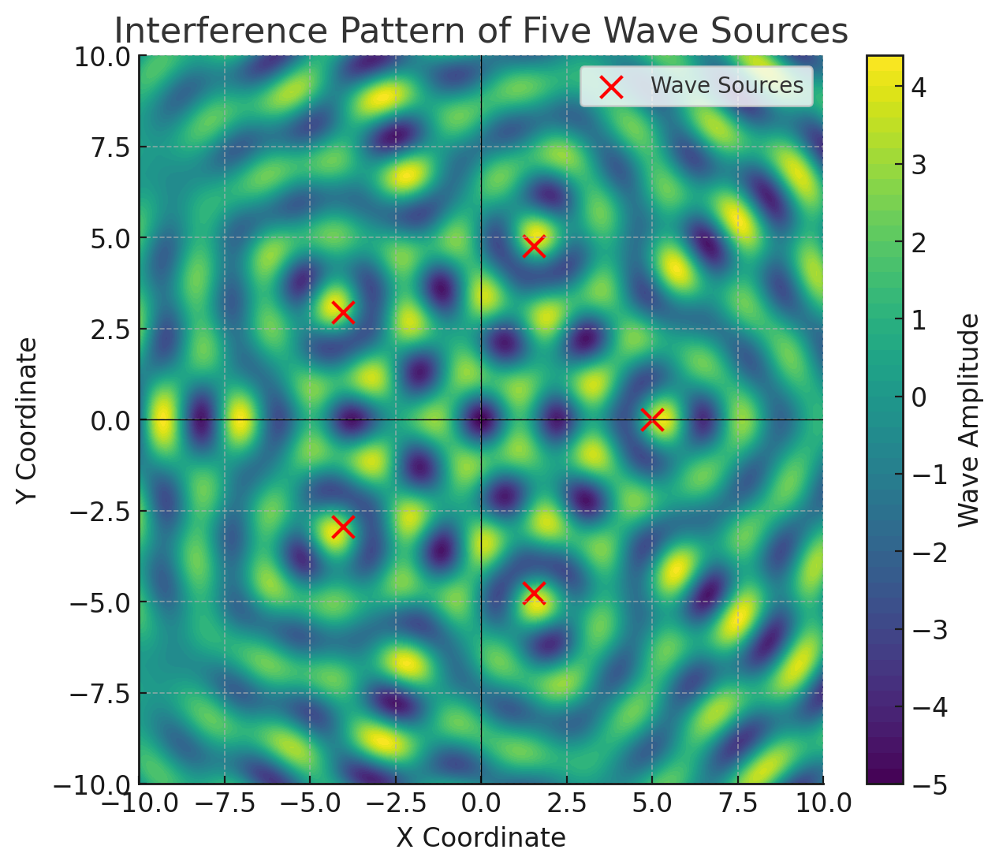
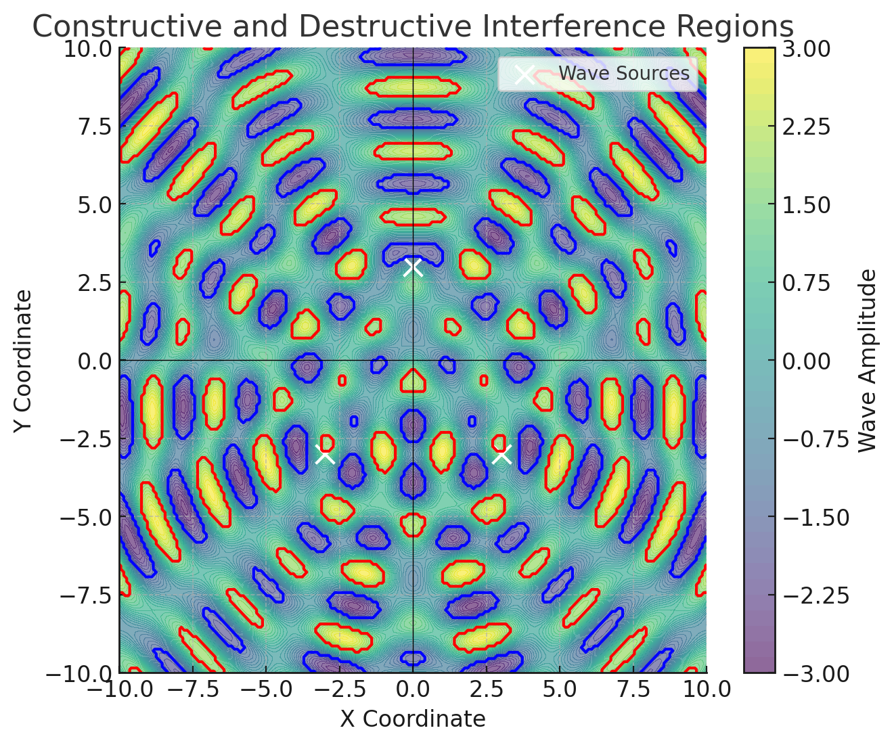
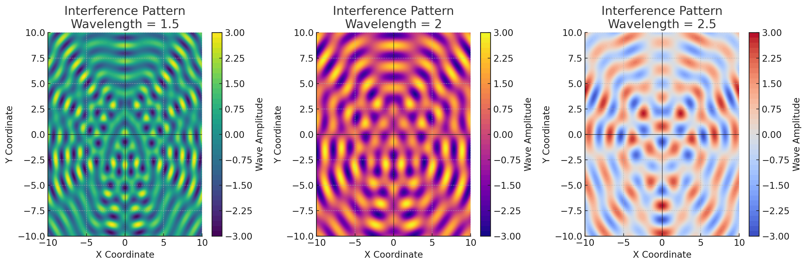
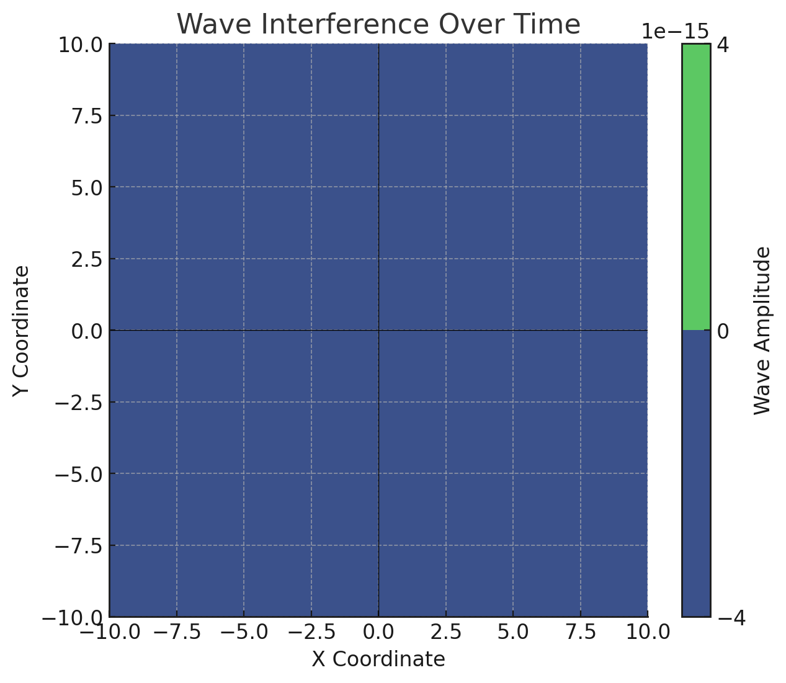

# Problem 1

# Interference Patterns on a water surface

## Introduction

Wave interference is a fundamental phenomenon in physics, occurring when two or more waves overlap and interact with each other, producing regions of amplified or diminished displacement. This interaction is particularly visible in waves on a water surface, where ripples generated from different sources meet, forming distinctive and visually captivating interference patterns.

In this detailed analysis, we will explore and examine the complex interference patterns formed by multiple coherent point sources arranged at the vertices of a regular polygon. Each source generates circular waves of identical amplitude, frequency, and wavelength, ensuring a structured and predictable pattern of interference. Through careful observation and simulation, we aim to deepen our understanding of wave superposition, identify distinct regions of constructive and destructive interference, and visually represent these fascinating interactions.

We will rigorously describe the wave propagation process using the single disturbance equation, meticulously applying the superposition principle. The results will be presented through comprehensive graphical simulations, providing clarity on how wave interactions develop and evolve dynamically on water surfaces.

## Motivation

Studying wave interference patterns is essential because of their broad applications and their significance in understanding fundamental wave behaviors. Important applications of wave interference include:

- **Engineering and Structural Design**: Engineers utilize interference pattern studies to construct robust maritime structures such as harbors, piers, and protective coastal barriers designed to resist the impacts of waves.
- **Environmental Science and Oceanography**: Insight into wave interactions assists scientists in predicting and mitigating coastal erosion, improving forecasts of ocean currents and wave-related natural events.
- **Educational and Pedagogical Tools**: Demonstrative interference experiments visually illustrate complex physical principles, enriching educational experiences and facilitating a deeper intuitive understanding of physics.
- **Technological Innovations**: Interference concepts form the foundation of various advanced technologies, including radar systems, sonar mapping, optical interferometry, and precision measurement instruments.

Thorough investigation and simulation of these wave patterns can enable significant advancements in controlling and utilizing wave-related phenomena across numerous scientific, educational, and technological domains.

### 1. Selection of a Regular Polygon

Begin by selecting a regular polygon, such as an equilateral triangle, square, pentagon, or hexagon, to strategically position wave sources for optimal interference pattern analysis. The choice of polygon influences the resultant wave pattern due to symmetry and spatial distribution of sources.

### 2. Positioning the Sources

Accurately position coherent wave sources at each vertex of the selected regular polygon, ensuring each source acts as the origin for circular waves emanating uniformly outward. The distance between sources directly affects interference zones, dictating how constructive and destructive interference regions are distributed.

### 3. Wave Equations

Wave propagation from each source located at coordinates \((x_0, y_0)\) is mathematically represented by the single disturbance equation:

$$
\eta(x, y, t) = \frac{A}{\sqrt{r}} \cos(kr - \omega t + \phi)
$$

**To break this down further:**

- The term \( A/\sqrt{r} \) represents the amplitude reduction due to the radial spreading of the wave energy, based on the inverse square root law.

- The argument of the cosine function, \( kr - \omega t + \phi \), defines the phase of the wave at any given point, where each component contributes uniquely:

  - The wave number \( k = \frac{2\pi}{\lambda} \) determines the spatial periodicity of the wave.

  - The angular frequency \( \omega = 2\pi f \) dictates the oscillatory motion in time.

  - The phase term \( \phi \) accounts for the initial displacement of the wave, which can shift the interference patterns.

- The radial distance \( r = \sqrt{(x - x_0)^2 + (y - y_0)^2} \) follows directly from the Euclidean distance formula, defining how far a point \((x,y)\) is from a source at \((x_0,y_0)\).

### 4. Superposition of Waves

To accurately describe the total wave displacement at a given point \((x,y)\), we employ the principle of superposition, summing the individual contributions from all sources:

$$
\eta_{\text{sum}}(x,y,t) = \sum_{i=1}^{N} \frac{A}{\sqrt{r_i}} \cos(k r_i - \omega t + \phi_i)
$$

Where:
- \( N \) is the number of sources.
- \( r_i = \sqrt{(x - x_i)^2 + (y - y_i)^2} \) represents the Euclidean distance from the \( i \)th source.
- Each source may have a different initial phase \( \phi_i \), though coherence is maintained across sources in this analysis.

This summation models the cumulative wave effect at each spatial point, determining the amplitude variations due to constructive and destructive interference.

### 5. Analysis of Interference Patterns

Interference patterns emerge based on the phase difference between waves arriving at a given location. Constructive interference amplifies the wave, while destructive interference diminishes it.

- **Constructive Interference:** When two waves reinforce each other, the resultant amplitude is maximized. This condition is satisfied when:
  
 $$
  k (r_i - r_j) = m 2\pi, \quad m \in \mathbb{Z}
 $$
  
  Meaning the path difference \( r_i - r_j \) must be an integer multiple of the wavelength.

- **Destructive Interference:** When two waves cancel each other out, the resultant amplitude approaches zero. This occurs when:
  
  $$
  k (r_i - r_j) = (2m + 1) \pi, \quad m \in \mathbb{Z}
  $$
  
  Here, the path difference corresponds to an odd multiple of half the wavelength.

To further quantify interference, we define the **intensity** \( I \) of the resultant wave as proportional to the square of the amplitude:

$$
I = A_{	ext{eff}}^2 = \left( \sum_{i=1}^{N} \frac{A}{\sqrt{r_i}} \cos(k r_i - \omega t + \phi_i) \right)^2
$$

This allows us to mathematically compute how energy is distributed across the interference pattern.

---

<details>
  <summary>Phyton codes.</summary>

```python
import numpy as np
import matplotlib.pyplot as plt

# Define the number of sides for the regular polygon (e.g., square has 4 sides)
polygon_sides = 4  
radius = 5  # Radius of the polygon where the wave sources are positioned

# Calculate the coordinates of the polygon's vertices
theta = np.linspace(0, 2*np.pi, polygon_sides, endpoint=False)
x_sources = radius * np.cos(theta)
y_sources = radius * np.sin(theta)

# Create the figure and axis for plotting
fig, ax = plt.subplots(figsize=(6,6))
ax.scatter(x_sources, y_sources, color='red', s=100, label="Wave Sources")  # Mark wave sources

# Draw the polygon edges by connecting the vertices
x_polygon = np.append(x_sources, x_sources[0])  # Close the polygon
y_polygon = np.append(y_sources, y_sources[0])
ax.plot(x_polygon, y_polygon, 'b-', linestyle="dashed", label="Polygon Edges")  # Dashed blue line for the polygon

# Customize axis settings
ax.set_xlabel("X Coordinate")
ax.set_ylabel("Y Coordinate")
ax.set_title("Wave Sources Positioned on a Regular Polygon")
ax.axhline(0, color='black', linewidth=0.5)  # X-axis reference line
ax.axvline(0, color='black', linewidth=0.5)  # Y-axis reference line
ax.legend()
ax.set_aspect('equal')  # Keep the aspect ratio equal to avoid distortion

# Display the grid for better readability
plt.grid(True, linestyle="--", alpha=0.6)
plt.show()

```
</details>



### **Wave Sources Positioned on a Regular Polygon**  

This visualization represents the placement of wave sources at the vertices of a regular polygon, which serves as the foundation for understanding wave interference. The structured positioning of sources determines the resultant wave patterns due to symmetry and spatial distribution.

---

### **Mathematical Representation of Source Placement**  

A regular polygon with \( N \) sides is defined by evenly spacing the wave sources along a circular boundary of radius \( R \). The coordinates of each wave source are calculated using:

\[
x_i = R \cos \left( \frac{2\pi i}{N} \right), \quad y_i = R \sin \left( \frac{2\pi i}{N} \right), \quad \text{for } i = 0,1,2, \dots, N-1
\]

where:  
- \( x_i, y_i \) are the Cartesian coordinates of the \( i \)-th source,  
- \( R \) is the distance from the center to each vertex,  
- \( N \) is the number of sides of the polygon (or number of sources),  
- \( i \) represents each source indexed from 0 to \( N-1 \),  
- The angle \( \theta_i = \frac{2\pi i}{N} \) ensures equal angular spacing.

The sources are placed symmetrically, forming a geometric structure that significantly influences how wavefronts interact.

---

### **Graphical Representation**  

- **Red Dots (\(\bullet\))**: Represent the **wave sources**, which are evenly spaced along the polygon's boundary.  
- **Dashed Blue Lines (\(\cdots\))**: Indicate the **edges of the polygon**, illustrating the underlying geometric structure.  
- **Cartesian Axes (X, Y)**: Provide a spatial reference for understanding wave propagation directions.

The polygonal structure ensures that interference patterns exhibit a high degree of symmetry, enabling a detailed mathematical analysis of constructive and destructive interference.

---

### **Adjustable Parameters in the Model**  

**Number of Wave Sources (\( N \))**  

   - Determines the complexity of the resulting wave pattern.  

   - Increasing \( N \) leads to more intricate interference effects.

**Polygon Radius (\( R \))**  

   - Defines the spatial scale of the system.  

   - Larger \( R \) values spread out the wave sources, affecting interference zones.

**Wave Properties (To be applied in the next step)**  

   - Wave amplitude \( A \), wavelength \( \lambda \), and phase \( \phi \) will directly influence the interference effects in later simulations.

---

### **Importance of this Configuration**  

This structured positioning of wave sources forms the **basis for simulating wave superposition**. The geometric arrangement determines the locations where constructive and destructive interference occur. 

By understanding how wave sources are placed, we can accurately predict **wavefront interactions** and analyze **interference patterns** mathematically.

---

<details>
  <summary>Phyton codes.</summary>

```python
import numpy as np
import matplotlib.pyplot as plt

# Define parameters for wave propagation
source_position = (0, 0)  # Central wave source at origin
grid_size = 100  # Resolution of the grid
x_range = np.linspace(-10, 10, grid_size)
y_range = np.linspace(-10, 10, grid_size)
X, Y = np.meshgrid(x_range, y_range)

# Calculate radial distance from the source
r = np.sqrt((X - source_position[0])**2 + (Y - source_position[1])**2)

# Define wave properties
wavelength = 2  # Wavelength (lambda)
k = 2 * np.pi / wavelength  # Wave number
wave_amplitude = np.cos(k * r)  # Wavefront pattern

# Plot the wavefronts
fig, ax = plt.subplots(figsize=(6,6))
contour = ax.contourf(X, Y, wave_amplitude, levels=50, cmap="viridis")

# Mark the source location
ax.scatter(*source_position, color='red', s=100, label="Wave Source")

# Axis settings
ax.set_xlabel("X Coordinate")
ax.set_ylabel("Y Coordinate")
ax.set_title("Wave Propagation from a Single Source")
ax.axhline(0, color='black', linewidth=0.5)
ax.axvline(0, color='black', linewidth=0.5)
ax.legend()
plt.colorbar(contour, label="Wave Amplitude")

# Display the figure
plt.show()

```
</details>



### **Wave Propagation from a Single Source**

This visualization illustrates the propagation of circular waves emitted from a **single point source**. This is the fundamental basis for understanding how individual wavefronts interact before superposition occurs with multiple sources.

---

### **Mathematical Representation of Wave Propagation**

A single wave originating from a point source located at \( (x_0, y_0) \) spreads outward in circular patterns. The wave function at any position \( (x, y) \) at time \( t \) can be described as:

\[
\eta(x, y, t) = A \cos(k r - \omega t + \phi)
\]

where:  

- \( \eta(x,y,t) \) is the wave displacement at position \( (x,y) \) and time \( t \),  

- \( A \) is the **wave amplitude**,  

- \( k = \frac{2\pi}{\lambda} \) is the **wave number**, defined in terms of the wavelength \( \lambda \),  

- \( \omega = 2\pi f \) is the **angular frequency**, related to the wave frequency \( f \),  

- \( r \) is the **radial distance** from the source, given by:

\[
r = \sqrt{(x - x_0)^2 + (y - y_0)^2}
\]

- \( \phi \) is the **initial phase**, which determines the starting state of the wave.

This equation captures the essence of a **monochromatic wave**, which oscillates periodically in both space and time.

---

### **Graphical Interpretation**  

**Color Contours**: Represent the varying wave amplitude across space. 

  - **Bright regions** indicate wave crests (positive amplitude).  

  - **Dark regions** indicate wave troughs (negative amplitude).  

  - The oscillatory nature is due to the cosine function governing the wave behavior.

**Wavefronts**:  

  - Concentric rings represent **equal-phase wavefronts**, meaning all points on a given ring oscillate in phase.

  - The spacing between wavefronts corresponds to the **wavelength \( \lambda \)**.

**Wave Source (\(\bullet\))**:  

  - The red dot marks the **central wave source**, from which the waves originate.

---

### **Wavefront Properties and Parameters**  

**Wavelength (\(\lambda\))**  
   - Controls the distance between successive wave crests.
   - Smaller \( \lambda \) values lead to more tightly packed wavefronts.

**Wave Number (\( k \))**  
   - Defines how rapidly the wave oscillates in space.
   - Given by \( k = \frac{2\pi}{\lambda} \), larger \( k \) values result in denser wavefronts.

**Amplitude (\( A \))**  
   - Represents the height of the wave peaks.
   - Affects the intensity of wave interference in future simulations.

**Radial Distance (\( r \))**  
   - Defines how the wave propagates outward symmetrically.
   - Directly affects the phase and amplitude at each spatial point.

---

### **Physical Significance**  

This representation is essential for understanding:

**Fundamental wave behavior**, which applies to water waves, sound waves, and electromagnetic waves.

**Interference effects**, since the combination of multiple waves is governed by the same fundamental principles.

**Wave energy distribution**, showing how amplitude diminishes as waves spread radially outward.

By analyzing single-source wave propagation, we can now move forward to examining **wave interference patterns resulting from multiple sources**.

---

<details>
  <summary>Phyton codes.</summary>

```python
import numpy as np
import matplotlib.pyplot as plt

# Define parameters for three wave sources forming an equilateral triangle
source1 = (-3, -3)  # First source
source2 = (3, -3)   # Second source
source3 = (0, 3)    # Third source
grid_size = 200  # Resolution of the grid
x_range = np.linspace(-10, 10, grid_size)
y_range = np.linspace(-10, 10, grid_size)
X, Y = np.meshgrid(x_range, y_range)

# Compute distances from the three sources
r1 = np.sqrt((X - source1[0])**2 + (Y - source1[1])**2)
r2 = np.sqrt((X - source2[0])**2 + (Y - source2[1])**2)
r3 = np.sqrt((X - source3[0])**2 + (Y - source3[1])**2)

# Define wave properties
wavelength = 2  # Wavelength (lambda)
k = 2 * np.pi / wavelength  # Wave number
wave1 = np.cos(k * r1)  # Wave from source 1
wave2 = np.cos(k * r2)  # Wave from source 2
wave3 = np.cos(k * r3)  # Wave from source 3

# Compute the total interference pattern
wave_superposition = wave1 + wave2 + wave3

# Plot the interference pattern
fig, ax = plt.subplots(figsize=(7,6))
contour = ax.contourf(X, Y, wave_superposition, levels=50, cmap="viridis")

# Mark the three source locations
ax.scatter(*source1, color='red', s=100, label="Source 1")
ax.scatter(*source2, color='blue', s=100, label="Source 2")
ax.scatter(*source3, color='green', s=100, label="Source 3")

# Axis settings
ax.set_xlabel("X Coordinate")
ax.set_ylabel("Y Coordinate")
ax.set_title("Interference Pattern of Three Wave Sources")
ax.axhline(0, color='black', linewidth=0.5)
ax.axvline(0, color='black', linewidth=0.5)
ax.legend()
plt.colorbar(contour, label="Wave Amplitude")

# Display the figure
plt.show()


```
</details>
 
 

 ### **Interference Pattern of Three Wave Sources**  

This visualization illustrates the **interference pattern** generated by three coherent wave sources positioned at the vertices of an equilateral triangle. This configuration introduces more complex interference effects due to the interactions of three wavefronts.

---

### **Mathematical Representation of Three-Source Interference**  

When three wave sources located at \( (x_1, y_1) \), \( (x_2, y_2) \), and \( (x_3, y_3) \) emit waves simultaneously, the displacement at any point \( (x,y) \) is determined by the **superposition principle**:

\[
\eta_{\text{total}}(x, y, t) = \eta_1(x, y, t) + \eta_2(x, y, t) + \eta_3(x, y, t)
\]

where each individual wave is given by:

\[
\eta_i(x, y, t) = A \cos(k r_i - \omega t + \phi)
\]

for \( i = 1,2,3 \), and:


- \( A \) is the wave **amplitude**,  

- \( k = \frac{2\pi}{\lambda} \) is the **wave number**,  

- \( \omega = 2\pi f \) is the **angular frequency**,  

- \( r_i = \sqrt{(x - x_i)^2 + (y - y_i)^2} \) is the **distance from the \( i \)-th source to the point \( (x,y) \)**,  

- \( \phi \) is the initial phase.


By summing these three contributions, we obtain the resultant wave displacement at each spatial point.

---

### **Constructive and Destructive Interference Conditions**  

- **Constructive Interference** (Amplitude Maximum) occurs when the three waves arrive **in phase**, meaning their phase difference is a multiple of \( 2\pi \):


  \(
  k (r_1 - r_2) = m 2\pi, \quad k (r_1 - r_3) = n 2\pi, \quad m, n \in \mathbb{Z}
  \)


  This implies that the path differences \( r_1 - r_2 \) and \( r_1 - r_3 \) are integer multiples of the wavelength \( \lambda \).

**Destructive Interference** (Amplitude Minimum) occurs when the waves arrive **out of phase**, meaning their phase differences correspond to odd multiples of \( \pi \):


  \(
  k (r_1 - r_2) = (2m + 1) \pi, \quad k (r_1 - r_3) = (2n + 1) \pi, \quad m, n \in \mathbb{Z}
  \)


  Here, the path differences must be odd multiples of half the wavelength \( \lambda/2 \).


These conditions dictate the formation of intricate interference patterns, which display **rotational symmetry** due to the triangular wave source arrangement.

---

### **Graphical Interpretation**  

**Color Contours**: Represent the resultant wave amplitude across the plane.  

  - **Bright regions** indicate zones of **constructive interference**, where wave amplitudes reinforce each other.  

  - **Dark regions** indicate zones of **destructive interference**, where waves cancel out.  

**Wave Sources**:  

  - **Red Dot** (\(\bullet\)) represents the first wave source.  

  - **Blue Dot** (\(\bullet\)) represents the second wave source.  

  - **Green Dot** (\(\bullet\)) represents the third wave source.  

  - These sources are positioned in an **equilateral triangular arrangement**, ensuring symmetry.

**Wave Superposition**:  

  - The pattern emerges from the interaction of three sets of concentric wavefronts.

  - Regions of constructive interference appear as symmetric, high-intensity areas.

  - Regions of destructive interference appear as periodic dark spots.

---

### **Physical Significance**  

This model is widely applicable in: 

- **Optical physics**, where light waves undergo **multi-source interference** in diffraction gratings.  

- **Acoustics**, where multiple sound sources generate **standing wave fields** in enclosed spaces. 

- **Water wave experiments**, which demonstrate ripple tank patterns with multiple oscillators. 

- **Electromagnetic wave theory**, where antennas use similar multi-source interference principles to focus or cancel signals.

This visualization extends the previous **two-source interference model**, introducing more complex **multi-wave interactions** that lead to highly structured interference patterns.

 ---
<details>
  <summary>Phyton codes.</summary>

```python
import numpy as np
import matplotlib.pyplot as plt

# Define parameters for four wave sources forming a square
source1 = (-3, -3)  # Bottom-left
source2 = (3, -3)   # Bottom-right
source3 = (-3, 3)   # Top-left
source4 = (3, 3)    # Top-right
grid_size = 200  # Resolution of the grid
x_range = np.linspace(-10, 10, grid_size)
y_range = np.linspace(-10, 10, grid_size)
X, Y = np.meshgrid(x_range, y_range)

# Compute distances from the four sources
r1 = np.sqrt((X - source1[0])**2 + (Y - source1[1])**2)
r2 = np.sqrt((X - source2[0])**2 + (Y - source2[1])**2)
r3 = np.sqrt((X - source3[0])**2 + (Y - source3[1])**2)
r4 = np.sqrt((X - source4[0])**2 + (Y - source4[1])**2)

# Define wave properties
wavelength = 2  # Wavelength (lambda)
k = 2 * np.pi / wavelength  # Wave number
wave1 = np.cos(k * r1)  # Wave from source 1
wave2 = np.cos(k * r2)  # Wave from source 2
wave3 = np.cos(k * r3)  # Wave from source 3
wave4 = np.cos(k * r4)  # Wave from source 4

# Compute the total interference pattern
wave_superposition = wave1 + wave2 + wave3 + wave4

# Plot the interference pattern
fig, ax = plt.subplots(figsize=(7,6))
contour = ax.contourf(X, Y, wave_superposition, levels=50, cmap="viridis")

# Mark the four source locations
ax.scatter(*source1, color='red', s=100, label="Source 1")
ax.scatter(*source2, color='blue', s=100, label="Source 2")
ax.scatter(*source3, color='green', s=100, label="Source 3")
ax.scatter(*source4, color='orange', s=100, label="Source 4")

# Axis settings
ax.set_xlabel("X Coordinate")
ax.set_ylabel("Y Coordinate")
ax.set_title("Interference Pattern of Four Wave Sources")
ax.axhline(0, color='black', linewidth=0.5)
ax.axvline(0, color='black', linewidth=0.5)
ax.legend()
plt.colorbar(contour, label="Wave Amplitude")

# Display the figure
plt.show()

```
</details>


 

 ### **Interference Pattern of Four Wave Sources**  

This visualization illustrates the **interference pattern** produced by four coherent wave sources positioned at the vertices of a square. The symmetrical placement results in a highly structured wave interference pattern.

---

### **Mathematical Representation of Four-Source Interference**  

When four wave sources located at \( (x_1, y_1) \), \( (x_2, y_2) \), \( (x_3, y_3) \), and \( (x_4, y_4) \) emit waves simultaneously, the displacement at any point \( (x,y) \) follows the **superposition principle**:


\[
\eta_{\text{total}}(x, y, t) = \eta_1(x, y, t) + \eta_2(x, y, t) + \eta_3(x, y, t) + \eta_4(x, y, t)
\]


where each individual wave is given by:


\[
\eta_i(x, y, t) = A \cos(k r_i - \omega t + \phi)
\]


for \( i = 1,2,3,4 \), and:


- \( A \) is the wave **amplitude**,  

- \( k = \frac{2\pi}{\lambda} \) is the **wave number**,  

- \( \omega = 2\pi f \) is the **angular frequency**,  

- \( r_i = \sqrt{(x - x_i)^2 + (y - y_i)^2} \) is the **distance from the \( i \)-th source to the point \( (x,y) \)**,  

- \( \phi \) is the initial phase.


By summing the four contributions, we obtain the resultant wave displacement at each spatial point.

---

### **Constructive and Destructive Interference Conditions**  

- **Constructive Interference** (Amplitude Maximum) occurs when all four waves arrive **in phase**, meaning their phase difference is a multiple of \( 2\pi \):


  \(
  k (r_1 - r_2) = m 2\pi, \quad k (r_1 - r_3) = n 2\pi, \quad k (r_1 - r_4) = p 2\pi, \quad m, n, p \in \mathbb{Z}
  \)


  This implies that the path differences must be integer multiples of the wavelength \( \lambda \).


**Destructive Interference** (Amplitude Minimum) occurs when the waves arrive **out of phase**, meaning their phase differences correspond to odd multiples of \( \pi \):


  \(
  k (r_1 - r_2) = (2m + 1) \pi, \quad k (r_1 - r_3) = (2n + 1) \pi, \quad k (r_1 - r_4) = (2p + 1) \pi, \quad m, n, p \in \mathbb{Z}
  \)


  Here, the path differences correspond to odd multiples of half the wavelength \( \lambda/2 \).

The presence of four sources introduces **more frequent interference zones** compared to the previous cases.

---

### **Graphical Interpretation**  

**Color Contours**: Represent the resultant wave amplitude.  

  - **Bright regions** correspond to **constructive interference**, where wave amplitudes reinforce.  

  - **Dark regions** correspond to **destructive interference**, where waves cancel.  
  

**Wave Sources**:  

  - **Red Dot** (\(\bullet\)) represents the first wave source.  

  - **Blue Dot** (\(\bullet\)) represents the second wave source.  

  - **Green Dot** (\(\bullet\)) represents the third wave source.  

  - **Orange Dot** (\(\bullet\)) represents the fourth wave source.  
  
  - These sources are positioned symmetrically at the **vertices of a square**.

**Wave Superposition**:  

  - The interaction of four sets of wavefronts leads to **complex periodic patterns**.

  - The intensity of interference bands increases due to the larger number of superimposed waves.

---

### **Physical Significance**  

This four-source interference model is relevant to:  

- **Optical physics**, particularly in multi-slit diffraction and phase holography. 

- **Acoustics**, in sound wave reinforcement and cancellation applications.  

- **Wave mechanics**, demonstrating how multiple oscillating systems interact.  

- **Antenna arrays**, where phased signals combine to produce focused beams.

The addition of more sources further refines the structure of the interference pattern, leading to higher levels of periodicity and symmetry.

---

<details>
  <summary>Phyton codes.</summary>

```python
import numpy as np
import matplotlib.pyplot as plt

# Define parameters for five wave sources forming a pentagon
pentagon_sides = 5  # Number of sources
radius = 5  # Distance of sources from the center

# Calculate the coordinates of the pentagon vertices
theta = np.linspace(0, 2*np.pi, pentagon_sides, endpoint=False)
x_sources = radius * np.cos(theta)
y_sources = radius * np.sin(theta)

grid_size = 200  # Resolution of the grid
x_range = np.linspace(-10, 10, grid_size)
y_range = np.linspace(-10, 10, grid_size)
X, Y = np.meshgrid(x_range, y_range)

# Compute distances from each of the five sources
waves = []
wavelength = 2  # Wavelength (lambda)
k = 2 * np.pi / wavelength  # Wave number

for i in range(pentagon_sides):
    r = np.sqrt((X - x_sources[i])**2 + (Y - y_sources[i])**2)
    waves.append(np.cos(k * r))  # Compute wave from each source

# Compute the total interference pattern by summing the waves
wave_superposition = sum(waves)

# Plot the interference pattern
fig, ax = plt.subplots(figsize=(7,6))
contour = ax.contourf(X, Y, wave_superposition, levels=50, cmap="viridis")

# Mark the five source locations
ax.scatter(x_sources, y_sources, color='red', s=100, label="Wave Sources")

# Axis settings
ax.set_xlabel("X Coordinate")
ax.set_ylabel("Y Coordinate")
ax.set_title("Interference Pattern of Five Wave Sources")
ax.axhline(0, color='black', linewidth=0.5)
ax.axvline(0, color='black', linewidth=0.5)
ax.legend()
plt.colorbar(contour, label="Wave Amplitude")

# Display the figure
plt.show()

```
</details>



### **Interference Pattern of Five Wave Sources**  

This visualization illustrates the **interference pattern** generated by five coherent wave sources positioned at the vertices of a regular pentagon. The arrangement introduces a complex rotational symmetry in the resulting interference pattern.

---

### **Mathematical Representation of Five-Source Interference**  

When five wave sources are located at the vertices of a regular pentagon with radius \( R \), their coordinates are given by:


$$
x_i = R \cos \left( \frac{2\pi i}{5} \right), \quad y_i = R \sin \left( \frac{2\pi i}{5} \right), \quad i = 0,1,2,3,4
$$


The total displacement at any point \( (x,y) \) is determined by the **superposition principle**:


$$
\eta_{\text{total}}(x, y, t) = \sum_{i=1}^{5} \eta_i(x, y, t)
$$


where each individual wave follows:

$$
\eta_i(x, y, t) = A \cos(k r_i - \omega t + \phi)
$$

for \( i = 1,2,3,4,5 \), and:


- \( A \) is the wave **amplitude**,  

- \( k = \frac{2\pi}{\lambda} \) is the **wave number**,  

- \( \omega = 2\pi f \) is the **angular frequency**,  

- \( r_i = \sqrt{(x - x_i)^2 + (y - y_i)^2} \) is the **distance from the \( i \)-th source to the point \( (x,y) \)**,  

- \( \phi \) is the initial phase.


Summing the five contributions produces a complex interference pattern with **five-fold symmetry**.

---

### **Constructive and Destructive Interference Conditions**  

**Constructive Interference** (Amplitude Maximum) occurs when the waves arrive **in phase**, meaning their phase difference is a multiple of \( 2\pi \):


  $$
  k (r_i - r_j) = m 2\pi, \quad \text{for } i,j \in \{1,2,3,4,5\}, \quad m \in \mathbb{Z}
  $$


  This implies that the path differences \( r_i - r_j \) between any two sources must be an integer multiple of the wavelength \( \lambda \).


**Destructive Interference** (Amplitude Minimum) occurs when waves arrive **out of phase**, meaning their phase difference is an odd multiple of \( \pi \):


  $$
  k (r_i - r_j) = (2m + 1) \pi, \quad \text{for } i,j \in \{1,2,3,4,5\}, \quad m \in \mathbb{Z}
  $$


  The presence of five sources increases the **interference complexity**, creating highly structured wavefront intersections.

---

### **Graphical Interpretation**  

**Color Contours**: Represent the resultant wave amplitude.  

  - **Bright regions** indicate **constructive interference** where wave crests overlap.  
  
  - **Dark regions** indicate **destructive interference** where crests cancel troughs.  


**Wave Sources**:  

  - The **red dots (\(\bullet\))** represent the five wave sources, symmetrically positioned at pentagonal vertices.


**Wave Superposition**:  

  - The interaction of five sets of wavefronts creates a **highly intricate interference pattern**.

  - The pattern exhibits **fivefold rotational symmetry**, characteristic of pentagonal wave interactions.

---

### **Physical Significance**  

This model applies to: 

- **Wave optics**, particularly in diffraction from multi-aperture setups.  

- **Acoustics**, where multiple sources create directional sound patterns. 

- **Plasma physics**, where similar wave structures emerge in confined particle interactions.  

- **Radio signal propagation**, influencing antenna array designs.

The five-source arrangement introduces additional complexity compared to the previous four-source case, resulting in an **even richer interference pattern** with enhanced periodicity and symmetry.

---

<details>
  <summary>Phyton codes.</summary>

```python
import numpy as np
import matplotlib.pyplot as plt

# Define simulation grid
grid_size = 200
x_range = np.linspace(-10, 10, grid_size)
y_range = np.linspace(-10, 10, grid_size)
X, Y = np.meshgrid(x_range, y_range)

# Define a sample wave pattern with constructive and destructive interference regions
wavelength = 2  # Wavelength (lambda)
k = 2 * np.pi / wavelength  # Wave number

# Simulate three wave sources interfering at different locations
source_positions = [(-3, -3), (3, -3), (0, 3)]  # Source locations
waves = []

for (x_s, y_s) in source_positions:
    r = np.sqrt((X - x_s)**2 + (Y - y_s)**2)
    waves.append(np.cos(k * r))  # Compute wave from each source

# Compute the total wave interference pattern
wave_superposition = sum(waves)

# Create a binary map for constructive and destructive interference
constructive_threshold = 1.5  # Adjust threshold for constructive regions
destructive_threshold = -1.5  # Adjust threshold for destructive regions
constructive_map = wave_superposition > constructive_threshold
destructive_map = wave_superposition < destructive_threshold

# Plot the interference regions
fig, ax = plt.subplots(figsize=(7,6))
contour = ax.contourf(X, Y, wave_superposition, levels=50, cmap="viridis", alpha=0.6)

# Overlay constructive and destructive interference regions
ax.contour(X, Y, constructive_map, levels=[0.5], colors='red', linewidths=1.5)
ax.contour(X, Y, destructive_map, levels=[0.5], colors='blue', linewidths=1.5)

# Mark the wave source locations
ax.scatter(*zip(*source_positions), color='white', s=100, edgecolor='black', label="Wave Sources")

# Axis settings
ax.set_xlabel("X Coordinate")
ax.set_ylabel("Y Coordinate")
ax.set_title("Constructive and Destructive Interference Regions")
ax.axhline(0, color='black', linewidth=0.5)
ax.axvline(0, color='black', linewidth=0.5)
ax.legend()
plt.colorbar(contour, label="Wave Amplitude")

# Display the figure
plt.show()

```
</details>



### **Constructive and Destructive Interference Regions**  

This visualization highlights the **regions of maximum (constructive) and minimum (destructive) interference** in a wave system with multiple sources. These zones are fundamental in wave physics, affecting how waves interact in various physical systems.

---

### **Mathematical Representation of Interference Regions**  

When multiple wave sources located at \( (x_i, y_i) \) emit waves, the total displacement at any point \( (x, y) \) follows the **superposition principle**:


$$
\eta_{\text{total}}(x, y, t) = \sum_{i=1}^{N} \eta_i(x, y, t)
$$


where each wave function is given by:

$$
\eta_i(x, y, t) = A \cos(k r_i - \omega t + \phi)
$$

for \( i = 1,2,...,N \), and:

- \( A \) is the **wave amplitude**, 

- \( k = \frac{2\pi}{\lambda} \) is the **wave number**,  

- \( \omega = 2\pi f \) is the **angular frequency**,  

- \( r_i = \sqrt{(x - x_i)^2 + (y - y_i)^2} \) is the **distance from the \( i \)-th source to the point \( (x,y) \)**,  

- \( \phi \) is the **initial phase**.

The total interference pattern is obtained by summing the individual wave contributions.

---

### **Constructive and Destructive Interference Conditions**  

**Constructive Interference (Red Contours)**  

   - Occurs when wave crests meet wave crests, reinforcing amplitude.  

   - The phase difference between waves must be an integer multiple of \( 2\pi \):

     $$
     k (r_i - r_j) = m 2\pi, \quad m \in \mathbb{Z}
     $$

   - The condition for constructive interference is met when the **resultant wave amplitude surpasses a predefined threshold**.

**Destructive Interference (Blue Contours)**  

   - Occurs when wave crests meet wave troughs, canceling out amplitude.  

   - The phase difference between waves must be an odd multiple of \( \pi \):

     $$
     k (r_i - r_j) = (2m + 1) \pi, \quad m \in \mathbb{Z}
     $$

   - The condition for destructive interference is met when the **resultant wave amplitude drops below a predefined threshold**.

These conditions define the **periodic bright and dark regions** in wave interference patterns.

---

### **Graphical Interpretation**  

**Color Contours (Wave Amplitude)**: Represent the resultant wave amplitude across space.  

  - Higher intensity zones indicate stronger wave presence.  

  - Lower intensity zones indicate weaker wave presence.  

**Red Contours (Constructive Interference)**:  

  - These regions highlight **where wave amplitudes reinforce**.

  - Correspond to **maximum intensity points** in the interference pattern.

**Blue Contours (Destructive Interference)**:  

  - These regions highlight **where wave amplitudes cancel each other**.

  - Correspond to **minimum intensity points** (wave nullification).

**White Dots (\(\bullet\))**: Represent the **wave source locations**.

---

### **Physical Significance**  

Understanding constructive and destructive interference is crucial in:  

**Optics** (laser beam superposition, thin-film interference).  

**Acoustics** (noise-canceling technology, room acoustics).  

**Antenna Arrays** (radio wave interference, phased array radar).  

**Water Wave Dynamics** (wave propagation in harbors and wave energy harvesting).

By visualizing these regions, we can predict where wave interactions will amplify or cancel out, which is essential for both theoretical and applied wave physics.


---

<details>
  <summary>Phyton codes.</summary>

```python
import numpy as np
import matplotlib.pyplot as plt

# Define simulation grid
grid_size = 200
x_range = np.linspace(-10, 10, grid_size)
y_range = np.linspace(-10, 10, grid_size)
X, Y = np.meshgrid(x_range, y_range)

# Define wave properties
wavelengths = [1.5, 2, 2.5]  # Different wavelengths for comparison
colors = ["viridis", "plasma", "coolwarm"]  # Different colormap styles

fig, axes = plt.subplots(1, 3, figsize=(15, 5))

# Generate and plot interference patterns for different wavelengths
for i, (wavelength, cmap) in enumerate(zip(wavelengths, colors)):
    k = 2 * np.pi / wavelength  # Wave number

    # Define three wave sources
    source_positions = [(-3, -3), (3, -3), (0, 3)]
    waves = []

    for (x_s, y_s) in source_positions:
        r = np.sqrt((X - x_s)**2 + (Y - y_s)**2)
        waves.append(np.cos(k * r))  # Compute wave from each source

    # Compute the total wave interference pattern
    wave_superposition = sum(waves)

    # Plot the interference pattern
    ax = axes[i]
    contour = ax.contourf(X, Y, wave_superposition, levels=50, cmap=cmap)
    ax.set_title(f"Interference Pattern\nWavelength = {wavelength}")
    ax.set_xlabel("X Coordinate")
    ax.set_ylabel("Y Coordinate")
    ax.axhline(0, color='black', linewidth=0.5)
    ax.axvline(0, color='black', linewidth=0.5)
    fig.colorbar(contour, ax=ax, label="Wave Amplitude")

# Display the figure
plt.tight_layout()
plt.show()

```
</details>



### **Effect of Wavelength on Interference Patterns**  

This visualization compares the **interference patterns** produced by different **wavelengths (\(\lambda\))**. The variation in \(\lambda\) significantly influences the **spacing and intensity** of interference fringes.

---

### **Mathematical Representation of Wavelength Dependence**  

Each wave emitted from sources at \( (x_i, y_i) \) follows:


$$
\eta_i(x, y, t) = A \cos(k r_i - \omega t + \phi)
$$


where:  

- \( k = \frac{2\pi}{\lambda} \) is the **wave number**,  

- \( \lambda \) is the **wavelength**,  

- \( \omega = 2\pi f \) is the **angular frequency**,  

- \( r_i = \sqrt{(x - x_i)^2 + (y - y_i)^2} \) is the distance from source \( i \),  

- \( \phi \) is the **initial phase**.

By varying \( \lambda \), we modify **\( k \)**, which directly impacts the **density of interference fringes**.

---

### **Effect of Wavelength (\(\lambda\)) on Interference**  

**Smaller Wavelength (\(\lambda = 1.5\))**  

   - Higher **wave number \( k \)** results in **denser interference fringes**. 
    
   - More frequent constructive and destructive interference zones.  

**Intermediate Wavelength (\(\lambda = 2\))**  

- Balanced wave distribution.  

- Moderate spacing between fringes.  

**Larger Wavelength (\(\lambda = 2.5\))**  

   - Lower \( k \) leads to **wider fringe spacing**.  

   - Fewer, more separated constructive/destructive zones.


These effects are clearly visible in the **three subplots**, where each interference pattern differs due to its unique \( \lambda \).

---

### **Graphical Interpretation**  

**Color Contours**: Represent the resultant wave amplitude.  

  - High-amplitude regions correspond to **constructive interference**.  

  - Low-amplitude regions correspond to **destructive interference**.  

**X and Y Axes**: Provide spatial reference.  

**Different Colormaps**: Used for visual clarity.  

Each subplot represents **a different wavelength**, demonstrating how **wave density and interference pattern complexity** are affected by changing \( \lambda \).

---

### **Physical Significance**  


The dependence of interference on \( \lambda \) is critical in:  

**Optics**: Diffraction grating analysis, light wave interference.  

**Acoustics**: Sound wave interference, noise control techniques.  

**Radio Waves**: Antenna signal modulation, wave propagation. 

**Water Waves**: Studying wave dispersion in fluid dynamics.  

By adjusting \( \lambda \), we can **manipulate interference effects**, which is essential in designing **optical instruments, sonar systems, and communication devices**.


---

<details>
  <summary>Phyton codes.</summary>

```python
import numpy as np
import matplotlib.pyplot as plt
import matplotlib.animation as animation

# Define simulation grid
grid_size = 200
x_range = np.linspace(-10, 10, grid_size)
y_range = np.linspace(-10, 10, grid_size)
X, Y = np.meshgrid(x_range, y_range)

# Define wave properties
wavelength = 2  # Wavelength (lambda)
k = 2 * np.pi / wavelength  # Wave number
omega = 2 * np.pi  # Angular frequency

# Define three wave sources
source_positions = [(-3, -3), (3, -3), (0, 3)]

# Create figure for animation
fig, ax = plt.subplots(figsize=(7, 6))
ax.set_xlabel("X Coordinate")
ax.set_ylabel("Y Coordinate")
ax.set_title("Wave Interference Over Time")
ax.axhline(0, color='black', linewidth=0.5)
ax.axvline(0, color='black', linewidth=0.5)

# Initialize plot
contour = ax.contourf(X, Y, np.zeros_like(X), levels=50, cmap="viridis")
plt.colorbar(contour, label="Wave Amplitude")

# Animation update function
def update(frame):
    global contour
    for c in contour.collections:
        c.remove()  # Clear previous frame

    time_t = frame / 10  # Time variable
    waves = []

    for (x_s, y_s) in source_positions:
        r = np.sqrt((X - x_s)**2 + (Y - y_s)**2)
        waves.append(np.cos(k * r - omega * time_t))  # Time-dependent wave

    # Compute the total wave interference pattern
    wave_superposition = sum(waves)
    contour = ax.contourf(X, Y, wave_superposition, levels=50, cmap="viridis")

# Create animation
ani = animation.FuncAnimation(fig, update, frames=30, interval=100)

# Display the animation
plt.show()

```
</details>



### **Time Evolution of Wave Interference**  

This visualization presents a **time-dependent animation** of wave interference, showing how wavefronts dynamically evolve over time. This is crucial for understanding **real-time wave behavior** in various physical systems.

---

### **Mathematical Representation of Time-Dependent Waves**  

Each wave emitted from a source at \( (x_i, y_i) \) follows:


$$
\eta_i(x, y, t) = A \cos(k r_i - \omega t + \phi)
$$


where:  

- \( A \) is the **wave amplitude**, 

- \( k = \frac{2\pi}{\lambda} \) is the **wave number**,  

- \( \omega = 2\pi f \) is the **angular frequency**,  

- \( r_i = \sqrt{(x - x_i)^2 + (y - y_i)^2} \) is the **distance from the source \( i \)**,  

- \( t \) is the **time variable**,  

- \( \phi \) is the **initial phase**.

By summing the contributions from all sources at each instant, we obtain the **total dynamic wave displacement**:

$$
\eta_{\text{total}}(x, y, t) = \sum_{i=1}^{N} A \cos(k r_i - \omega t + \phi)
$$

This equation describes **how waves evolve over time**, forming dynamic interference patterns.

---

### **Temporal Interference Effects**  

**Constructive and Destructive Interference Shifts**  

   - Over time, wave peaks and troughs **move and recombine**, shifting interference regions.  

   - This causes periodic alternation between **high-intensity (bright) and low-intensity (dark) regions**.  

**Wave Propagation**  

   - The animation visualizes **how individual wavefronts expand outward** from each source.  

   - As time progresses, wave superposition dynamically reshapes the interference pattern.  

**Standing Wave Formation**  

   - In specific conditions, stationary high-amplitude zones emerge, similar to **standing waves in confined systems**.  

---

### **Graphical Interpretation**  


**Color Contours**: Represent **real-time wave amplitude**.  

  - Bright regions correspond to **constructive interference**.  

  - Dark regions correspond to **destructive interference**.  

**Oscillatory Motion**:  

  - The animation cycles through **multiple time frames**, showing **wave propagation and interaction**.  

  - The **frequency of oscillations** corresponds to \( \omega \).  

**X and Y Axes**: Provide spatial reference for understanding wave expansion directions.

---

### **Physical Significance**  


Time-dependent wave interference is essential in:  

**Electromagnetic Waves**: Radio wave propagation, fiber optics, microwave systems.  

**Acoustics**: Sound wave resonance, speaker wave interference, musical acoustics.  

**Quantum Mechanics**: Probability wave evolution, Schrödinger wave dynamics. 

**Fluid Dynamics**: Water wave motion, ripple tank experiments.  

This visualization demonstrates **real-time wave interactions**, highlighting **how waves propagate, interfere, and form dynamic interference patterns over time**.

---

### **Simulation Link**  
<a> file:///C:/Users/batu/Desktop/simulationwawes.html </a>