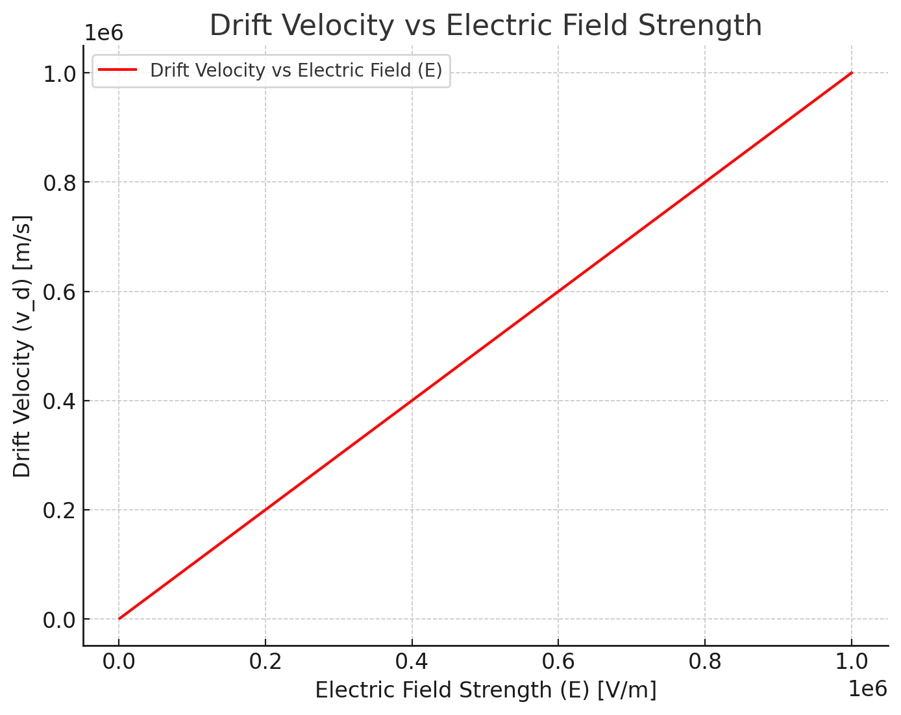

# Simulating the Effects of the Lorentz Force

## Introduction
The study of charged particle motion under the influence of electromagnetic fields is a fundamental topic in classical electromagnetism and has broad applications in various scientific and technological fields. The Lorentz force law describes the force experienced by a charged particle moving through electric and magnetic fields, which can be expressed as:

$$
\vec{F} = q \vec{E} + q \vec{v} \times \vec{B}
$$

This force law is essential in understanding the dynamics of charged particles in systems such as particle accelerators, magnetic confinement devices (e.g., tokamaks), mass spectrometers, and various plasma physics applications. The motion of charged particles can exhibit complex trajectories depending on the configuration and strength of the applied electric and magnetic fields. Understanding these trajectories through simulations provides valuable insights into real-world systems and their underlying physical principles.

## Motivation

The Lorentz force governs the motion of charged particles and plays a critical role in numerous technological and scientific domains. For example:

**Particle Accelerators**: Charged particles are accelerated and guided using electromagnetic fields to collide at high energies, enabling the study of fundamental particles and interactions.

**Magnetic Confinement in Plasma Physics**: Devices such as tokamaks use strong magnetic fields to confine plasma, a hot, ionized gas, for the purpose of achieving nuclear fusion.

**Mass Spectrometry**: Charged particles are separated based on their mass-to-charge ratio using magnetic and electric fields.

**Astrophysical Phenomena**: Understanding the motion of charged particles in cosmic magnetic fields helps explain processes such as the formation of cosmic rays and solar wind interactions.

By focusing on simulations, we can visualize and analyze various scenarios, including motion under uniform magnetic fields, combined electric and magnetic fields, and crossed fields. This study will also allow us to explore important phenomena such as Larmor radius, cyclotron frequency, and drift velocity.

## Task

### 1. Exploration of Applications
The Lorentz force is a fundamental concept with broad applications across various scientific and technological fields. To better understand its significance, we will identify specific systems where this force plays a crucial role and discuss how electric and magnetic fields influence the motion of charged particles.

#### 1.1 Systems Involving Lorentz Force

- **Particle Accelerators**:
  - Particle accelerators, such as synchrotrons and cyclotrons, rely heavily on the Lorentz force to manipulate and accelerate charged particles. Magnetic fields are used to bend particle paths, while electric fields accelerate them.
  - In synchrotrons, a circular magnetic field keeps particles moving in a closed orbit while radio-frequency electric fields boost their speed.

  - **Derivation of Cyclotron Frequency**:
    - The centripetal force acting on the particle is provided by the magnetic force:
      
      $$
      F = qvB = \frac{mv^2}{r}
      $$

    - Solving for the radius of curvature \(r\):
      
      $$
      r = \frac{mv}{qB}
      $$

    - The angular frequency \(\omega\) is defined as:
      
      $$
      \omega = \frac{v}{r}
      $$

    - Substituting the value of \(r\):
      
      $$
      \omega = \frac{qB}{m}
      $$

- **Mass Spectrometers**:
  - Mass spectrometry is a technique used to determine the mass-to-charge ratio of ions. Charged particles are accelerated by electric fields and then deflected by magnetic fields. The degree of deflection depends on the particle's mass and charge.

  - **Derivation of Mass-to-Charge Ratio**:
    - When a charged particle moves through a region with only a magnetic field:
      
      $$
      F = qvB = \frac{mv^2}{r}
      $$

    - Solving for the radius of curvature:
      
      $$
      r = \frac{mv}{qB}
      $$

    - Rearranging to find the mass-to-charge ratio:
      
      $$
      \frac{m}{q} = \frac{rB}{v}
      $$

- **Plasma Confinement (Tokamaks and Stellarators)**:
  - Devices such as tokamaks and stellarators are designed to confine hot plasma for nuclear fusion. Magnetic fields are used to trap charged particles, preventing them from escaping and achieving high temperatures needed for fusion.

  - **Derivation of Larmor Radius**:
    - When a charged particle moves perpendicular to a uniform magnetic field, it undergoes circular motion. The Lorentz force acts as a centripetal force:
      
      $$
      F = qv_{\perp} B = \frac{mv_{\perp}^2}{r_L}
      $$

    - Solving for the Larmor radius \(r_L\):
      
      $$
      r_L = \frac{mv_{\perp}}{qB}
      $$

    - The cyclotron frequency (\(\omega\)) is similarly derived:
      
      $$
      \omega = \frac{qB}{m}
      $$

- **Astrophysical Phenomena**:
  - In cosmic environments, charged particles are influenced by planetary magnetic fields, solar winds, and interstellar magnetic fields. Understanding these interactions helps explain phenomena like auroras and cosmic ray propagation.

  - **Derivation in Astrophysical Contexts**:
    - The same derivations apply for motion in magnetic fields with varying geometries, but may require numerical techniques to solve when the fields are non-uniform or complex.

#### 1.2 Relevance of Electric and Magnetic Fields
- **Electric Fields (\(\vec{E}\))**:
  - Directly accelerates or decelerates charged particles based on their charge sign.
  - Can cause particles to gain kinetic energy and alter their velocities.

- **Magnetic Fields (\(\vec{B}\))**:
  - Only affects the direction of a charged particle’s motion, causing it to move in circular or helical paths without changing its speed.
  - Essential for guiding particles along specific paths in applications such as mass spectrometers and particle accelerators.

The interaction between electric and magnetic fields allows for sophisticated control over particle motion, which is the basis for many experimental and practical setups in physics and engineering.

---

### 2. Simulating Particle Motion
The motion of charged particles under electromagnetic fields is governed by the Lorentz force law. To simulate particle motion, we will solve the differential equations derived from the Lorentz force using numerical methods. We will explore the following scenarios:

#### 2.1 Uniform Magnetic Field (\(\vec{E} = 0\))
When a charged particle moves in a uniform magnetic field and no electric field is present, the Lorentz force becomes:

$$
\vec{F} = q(\vec{v} \times \vec{B})
$$

Using Newton's second law:

$$
m \frac{d\vec{v}}{dt} = q(\vec{v} \times \vec{B})
$$

#### Derivation of Equations of Motion

Assume the magnetic field is along the \(z\)-axis: \(\vec{B} = [0, 0, B_z]\). Expanding the cross product:

$$
\vec{v} \times \vec{B} = 
\begin{vmatrix} 
\hat{i} & \hat{j} & \hat{k} \\
 v_x & v_y & v_z \\
 0 & 0 & B_z 
\end{vmatrix} = [v_y B_z, -v_x B_z, 0]
$$

Thus, the force components become:

$$
F_x = q v_y B_z, \quad F_y = -q v_x B_z, \quad F_z = 0
$$

Applying Newton’s second law:

$$
m \frac{dv_x}{dt} = qB_z v_y, \quad m \frac{dv_y}{dt} = -qB_z v_x, \quad m \frac{dv_z}{dt} = 0
$$

From the equations, we can derive:

$$
\frac{d^2 x}{dt^2} = -\omega^2 x, \quad \frac{d^2 y}{dt^2} = -\omega^2 y, \quad \frac{d^2 z}{dt^2} = 0
$$

Where:

$$
\omega = \frac{qB_z}{m}
$$

These are simple harmonic motion equations describing circular or helical motion.

#### 2.2 Combined Electric and Magnetic Fields
If an electric field is also present, the equation becomes:

\[
m \frac{d\vec{v}}{dt} = q(\vec{E} + \vec{v} \times \vec{B})
\]

#### Derivation of Drift Velocity

Consider a scenario where \(\vec{E}\) and \(\vec{B}\) are perpendicular. The particle experiences a force due to both fields:

$$
\vec{F} = q(\vec{E} + \vec{v} \times \vec{B})
$$

Since the motion is complex, we look for the steady-state condition where the net force along the \(\vec{B}\) direction is zero. The drift velocity \(\vec{v_d}\) is given by:

$$
\vec{v_d} = \frac{\vec{E} \times \vec{B}}{B^2}
$$

This derivation shows that the particle undergoes a drift motion perpendicular to both the electric and magnetic fields.

#### 2.3 Numerical Implementation
The differential equations will be solved using the **Runge-Kutta method (RK45)** for high accuracy. The following Python code implements the simulation for the uniform magnetic field case.

<details>
  <summary>Phyton codes.</summary>

```python
import numpy as np
import matplotlib.pyplot as plt
from scipy.integrate import solve_ivp

# Constants
q = 1.6e-19  # Charge of the particle (Coulombs)
m = 9.11e-31  # Mass of the particle (kg)
B = np.array([0, 0, 1])  # Magnetic field in the z-direction (Tesla)
E = np.array([0, 0, 0])  # Electric field (V/m)

# Lorentz force differential equation
def lorentz_force(t, y):
    v = y[3:]
    dv_dt = (q / m) * (E + np.cross(v, B))
    return [v[0], v[1], v[2], dv_dt[0], dv_dt[1], dv_dt[2]]

# Initial conditions
v0 = np.array([1e6, 0, 0])  # Initial velocity (m/s)
r0 = np.array([0, 0, 0])  # Initial position (m)
initial_conditions = np.concatenate((r0, v0))

# Time span
t_span = (0, 1e-6)
t_eval = np.linspace(*t_span, 1000)

# Solving the differential equation
solution = solve_ivp(lorentz_force, t_span, initial_conditions, t_eval=t_eval, method='RK45')

# Plotting the result
fig = plt.figure(figsize=(8, 6))
ax = fig.add_subplot(111, projection='3d')
ax.plot(solution.y[0], solution.y[1], solution.y[2], label='Particle Path')
ax.set_xlabel('X (m)')
ax.set_ylabel('Y (m)')
ax.set_zlabel('Z (m)')
ax.set_title('Particle Motion in Uniform Magnetic Field')
ax.legend()
plt.show()
```

</details>


This simulation will be expanded to include scenarios involving electric fields and crossed electric and magnetic fields in the next steps.

---

#### 3.1 Field Strengths (\(\vec{E}, \vec{B}\))
- By increasing or decreasing the magnitude of the magnetic field \(\vec{B}\), the radius of the particle’s circular motion changes. From the Larmor radius formula:

$$
r_L = \frac{mv_{\perp}}{qB}
$$

**Derivation of Larmor Radius:**

The centripetal force acting on the particle due to the magnetic field is:

$$
F_{centripetal} = \frac{mv_{\perp}^2}{r_L}
$$

The magnetic force acting on the charged particle is given by:

$$
F_{magnetic} = qv_{\perp}B
$$

Equating these forces:

$$
\frac{mv_{\perp}^2}{r_L} = qv_{\perp}B
$$

Solving for \(r_L\):

$$
r_L = \frac{mv_{\perp}}{qB}
$$

- The presence of an electric field \(\vec{E}\) introduces a drift motion when it is perpendicular to \(\vec{B}\). The drift velocity is given by:

$$
\vec{v_d} = \frac{\vec{E} \times \vec{B}}{B^2}
$$

**Derivation of Drift Velocity:**

The drift velocity arises from the balance between the electric force and the magnetic force. When the particle reaches a steady-state motion:

$$
\vec{v_d} \times \vec{B} = \vec{E}
$$

Solving for \(\vec{v_d}\):

$$
\vec{v_d} = \frac{\vec{E} \times \vec{B}}{B^2}
$$

#### 3.2 Initial Particle Velocity (\(\vec{v}\))

- The initial velocity components determine whether the motion is purely circular or helical. If there is a component parallel to \(\vec{B}\), the motion will be helical with a constant drift along the field lines.

- Changing the magnitude of the initial velocity \(\vec{v}\) also affects the radius of the trajectory:

$$
r_L = \frac{mv_{\perp}}{qB}
$$

**Derivation of Radius with Initial Velocity:**

The radius of curvature is derived from the balance of centripetal and magnetic forces:

$$
\frac{mv_{\perp}^2}{r_L} = qv_{\perp}B
$$

Solving for \(r_L\):

$$
r_L = \frac{mv_{\perp}}{qB}
$$

#### 3.3 Charge and Mass of the Particle (\(q, m\))

- The radius of curvature is directly proportional to the mass and inversely proportional to the charge:

$$
r = \frac{mv}{qB}
$$

**Derivation of Curvature Radius:**

The centripetal force is balanced by the magnetic force:

$$
\frac{mv^2}{r} = qvB
$$

Solving for \(r\):

$$
r = \frac{mv}{qB}
$$

- The cyclotron frequency is also affected:

$$
\omega = \frac{qB}{m}
$$

**Derivation of Cyclotron Frequency:**

The angular velocity \(\omega\) is given by:

$$
\omega = \frac{v}{r}
$$

Using the radius of curvature formula:

$$
\omega = \frac{qB}{m}
$$

#### 3.4 Observations and Analysis

- When changing the parameters, we can observe the differences in particle trajectories and compare them.

- These parameter variations will be implemented in Python simulations to visualize the effects.

---

### 4. Visualization:

<details>
  <summary>Phyton codes.</summary>

```python

import numpy as np
import matplotlib.pyplot as plt
from scipy.integrate import solve_ivp

# Constants
q = 1.6e-19  # Charge of the particle (Coulombs)
m = 9.11e-31  # Mass of the particle (kg)
B = np.array([0, 0, 1])  # Magnetic field in the z-direction (Tesla)
E = np.array([0, 0, 0])  # Electric field (V/m)

# Lorentz force differential equation
def lorentz_force(t, y):
    v = y[3:]
    dv_dt = (q / m) * (E + np.cross(v, B))
    return [v[0], v[1], v[2], dv_dt[0], dv_dt[1], dv_dt[2]]

# Initial conditions
v0 = np.array([1e6, 0, 0])  # Initial velocity (m/s)
r0 = np.array([0, 0, 0])  # Initial position (m)
initial_conditions = np.concatenate((r0, v0))

# Time span
t_span = (0, 1e-6)
t_eval = np.linspace(*t_span, 1000)

# Solving the differential equation
solution = solve_ivp(lorentz_force, t_span, initial_conditions, t_eval=t_eval, method='RK45')

# Plotting the result - 3D path
fig = plt.figure(figsize=(8, 6))
ax = fig.add_subplot(111, projection='3d')
ax.plot(solution.y[0], solution.y[1], solution.y[2], label='Particle Path')
ax.set_xlabel('X (m)')
ax.set_ylabel('Y (m)')
ax.set_zlabel('Z (m)')
ax.set_title('Particle Motion in Uniform Magnetic Field (3D)')
ax.legend()
plt.show()

# Plotting the result - 2D path
fig2 = plt.figure(figsize=(8, 6))
ax2 = fig2.add_subplot(111)
ax2.plot(solution.y[0], solution.y[1], label='Particle Path (2D)')
ax2.set_xlabel('X (m)')
ax2.set_ylabel('Y (m)')
ax2.set_title('Particle Motion in Uniform Magnetic Field (2D)')
ax2.legend()
plt.show()

```
</details>


#### Particle Motion in Uniform Magnetic Field (2D)

This graph shows the particle motion under a uniform magnetic field in 2D. The particle follows a circular path due to the effect of the magnetic field. Only the x and y axes are considered here for the motion. The Larmor radius changes depending on the initial velocity of the particle and the strength of the magnetic field.

**Mathematical Explanation:**

- The equations that describe the particle's circular motion are:

$$
\vec{F} = q (\vec{v} \times \vec{B})
$$

- This force results in the particle’s circular motion. The Larmor radius is calculated as:

$$
r_L = \frac{mv_{\perp}}{qB}
$$

Where:

- \(v_{\perp}\) is the component of the particle's velocity perpendicular to the magnetic field,


- \(B\) is the strength of the magnetic field,

- \(m\) is the mass of the particle,

- \(q\) is the charge of the particle.

---


#### Particle Motion in Uniform Magnetic Field (3D)

This graph shows the 3D motion of the same particle. The particle exhibits helical motion due to the combined effect of the magnetic field. In addition to the circular motion in the \(x - y\) plane, there is also a motion along the \(z\)-axis, which makes the path spiral.

**Mathematical Explanation:**

The particle's helical motion is described by the combination of circular motion in the plane and linear motion along the magnetic field direction. The mathematical model for this motion is:

$$
\vec{F} = q (\vec{v} \times \vec{B})
$$

The Larmor radius and the cyclotron frequency are given by:

$$
r_L = \frac{mv_{\perp}}{qB}
$$


$$
\omega = \frac{qB}{m}
$$

Where the \(z\)-axis component of the motion depends on the initial velocity's \(z\)-component and the strength of the magnetic field.

---

<details>
  <summary>Phyton codes.</summary>

```python

# Constants for Larmor radius graph
B_values = np.linspace(0.1, 2, 10)  # Magnetic field strengths (Tesla)
v_perp = 1e6  # Perpendicular velocity (m/s)
m = 9.11e-31  # Mass of the particle (kg)
q = 1.6e-19  # Charge of the particle (Coulombs)

# Calculate Larmor radius for each magnetic field strength
r_L_values = (m * v_perp) / (q * B_values)

# Plotting the Larmor radius vs magnetic field strength
fig = plt.figure(figsize=(8, 6))
ax = fig.add_subplot(111)
ax.plot(B_values, r_L_values, label='Larmor Radius')
ax.set_xlabel('Magnetic Field Strength (B) [Tesla]')
ax.set_ylabel('Larmor Radius (r_L) [m]')
ax.set_title('Larmor Radius vs Magnetic Field Strength')
ax.legend()
plt.show()

```
</details>


### Larmor Radius vs Magnetic Field Strength

This graph shows how the **Larmor radius** of a particle changes as the strength of the magnetic field varies. As the magnetic field strength increases, the Larmor radius decreases. This inverse relationship can be derived from the following equation:

$$
r_L = \frac{mv_{\perp}}{qB}
$$

Where:

- \(m\) is the mass of the particle,

- \(v_{\perp}\) is the perpendicular component of the velocity,

- \(q\) is the charge of the particle,

- \(B\) is the magnetic field strength.

This equation shows that as \(B\) increases, the radius \(r_L\) decreases, which is reflected in the graph.

---

<details>
  <summary>Phyton codes.</summary>

```python
# Constants for Larmor radius with different initial velocities (v)
v_perp_values = np.linspace(1e5, 1e7, 10)  # Different initial velocities (m/s)

# Calculate Larmor radius for each velocity
r_L_velocity_values = (m * v_perp_values) / (q * B)

# Plotting the Larmor radius vs initial velocity
fig = plt.figure(figsize=(8, 6))
ax = fig.add_subplot(111)
ax.plot(v_perp_values, r_L_velocity_values, label='Larmor Radius vs Initial Velocity (v)', color='green')
ax.set_xlabel('Initial Velocity (v) [m/s]')
ax.set_ylabel('Larmor Radius (r_L) [m]')
ax.set_title('Larmor Radius vs Initial Velocity')
ax.legend()
plt.show()


```
</details>


### Larmor Radius vs Initial Velocity (v)

This graph shows how the **Larmor radius** of a particle changes with its initial velocity. As the initial velocity increases, the Larmor radius also increases linearly, indicating that faster particles experience a larger circular motion under the same magnetic field.

#### Mathematical Explanation:

The Larmor radius is given by:

$$
r_L = \frac{mv_{\perp}}{qB}
$$

Where:

- \(m\) is the mass of the particle,

- \(v_{\perp}\) is the perpendicular component of the velocity,

- \(q\) is the charge of the particle,

- \(B\) is the magnetic field strength.

This equation shows that as the velocity \(v_{\perp}\) increases, the radius \(r_L\) increases as well, which is reflected in the graph.


---
<details>
  <summary>Phyton codes.</summary>

```python

# Constants for Cyclotron Frequency graph
q_values = np.linspace(1e-19, 1e-18, 10)  # Charge values (Coulombs)
m_values = np.linspace(1e-30, 1e-29, 10)  # Mass values (kg)

# Cyclotron frequency equation
def cyclotron_frequency(q, m, B):
    return q * B / m

# Magnetic field strength
B = 1  # Tesla (constant for this plot)

# Calculate cyclotron frequency for different q and m
frequencies_q = cyclotron_frequency(q_values, m, B)
frequencies_m = cyclotron_frequency(q, m_values, B)

# Plotting the Cyclotron Frequency vs Charge (q) and Mass (m)
fig, ax = plt.subplots(1, 2, figsize=(16, 6))

# Plot for Charge (q)
ax[0].plot(q_values, frequencies_q, label='Cyclotron Frequency vs Charge (q)', color='orange')
ax[0].set_xlabel('Charge (q) [Coulombs]')
ax[0].set_ylabel('Cyclotron Frequency [Hz]')
ax[0].set_title('Cyclotron Frequency vs Charge (q)')
ax[0].legend()

# Plot for Mass (m)
ax[1].plot(m_values, frequencies_m, label='Cyclotron Frequency vs Mass (m)', color='blue')
ax[1].set_xlabel('Mass (m) [kg]')
ax[1].set_ylabel('Cyclotron Frequency [Hz]')
ax[1].set_title('Cyclotron Frequency vs Mass (m)')
ax[1].legend()

plt.tight_layout()
plt.show()

```
</details>


### Cyclotron Frequency vs Charge (q) and Mass (m)

This graph shows how the **cyclotron frequency** varies with the particle's **charge (q)** and **mass (m)**. The cyclotron frequency increases with charge, as shown in the left plot, while it decreases with mass, as shown in the right plot.

#### Mathematical Explanation:

The cyclotron frequency (\( \omega \)) is given by:

$$
\omega = \frac{qB}{m}
$$


Where:

- \(q\) is the charge of the particle,

- \(B\) is the magnetic field strength,

- \(m\) is the mass of the particle.


As seen in the left plot, the cyclotron frequency increases linearly with charge (\(q\)), and in the right plot, it decreases with increasing mass (\(m\)).

---

<details>
  <summary>Phyton codes.</summary>

```python
# Constants for Drift Velocity graph (Electric and Magnetic Field Combination)
E_values = np.linspace(1e3, 1e6, 10)  # Different Electric Field strengths (V/m)
B = 1  # Tesla (Magnetic field strength)

# Drift velocity calculation: v_d = (E x B) / B^2
v_d_values = (E_values * B) / (B**2)

# Plotting the Drift velocity vs Electric field strength
fig = plt.figure(figsize=(8, 6))
ax = fig.add_subplot(111)
ax.plot(E_values, v_d_values, label='Drift Velocity vs Electric Field (E)', color='red')
ax.set_xlabel('Electric Field Strength (E) [V/m]')
ax.set_ylabel('Drift Velocity (v_d) [m/s]')
ax.set_title('Drift Velocity vs Electric Field Strength')
ax.legend()
plt.show()


```
</details>



### Drift Velocity vs Electric Field Strength

This graph shows how the **drift velocity** of a particle changes with the strength of the electric field. As the electric field strength increases, the drift velocity increases linearly. The drift velocity can be derived from the equation:

$$
\vec{v_d} = \frac{\vec{E} \times \vec{B}}{B^2}
$$

Where:

- \( \vec{E} \) is the electric field strength,

- \( \vec{B} \) is the magnetic field strength.

This equation shows that the drift velocity is directly proportional to the electric field strength \( E \), which is reflected in the graph.

---


