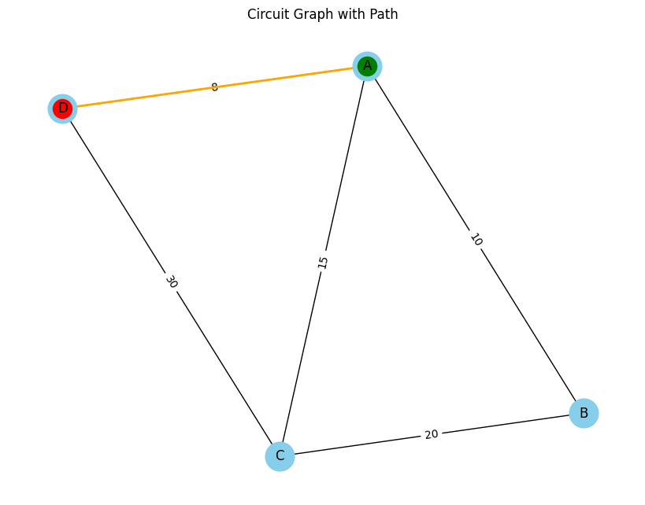

# Problem 1

# Equivalent Resistance Using Graph Theory

## Introduction
Understanding and analyzing electrical circuits is a fundamental aspect of electrical engineering and physics. One of the essential tasks in circuit analysis is determining the equivalent resistance between two points. Traditional methods rely on step-by-step application of series and parallel resistor combinations, which can become impractical for large and complex circuits. The need for a more systematic and scalable approach arises in applications such as circuit simulation, network analysis, and embedded system design.

Graph theory provides an alternative and efficient approach by representing the circuit as a weighted graph, where:

**Nodes** correspond to junctions.

**Edges** correspond to resistors with resistance values as weights.

By systematically simplifying this representation using graph algorithms, we can compute the equivalent resistance efficiently. This approach is particularly useful in modern circuit analysis tools, simulation software, and optimization techniques used in electronic circuit design. It also provides an automated way to handle complex networks, making the process faster and less prone to human errors.

## Motivation
Calculating equivalent resistance is a fundamental problem in electrical circuits, essential for understanding and designing efficient systems. Traditional methods involve iteratively applying series and parallel resistor rules, which become cumbersome for complex circuits. Graph theory provides a structured and algorithmic alternative, allowing us to model circuits as weighted graphs where:

**Nodes** represent circuit junctions.

**Edges** represent resistors, weighted by resistance values.

By employing graph reduction techniques, we can systematically simplify even intricate networks, leading to efficient circuit analysis methods used in modern applications like circuit simulation software, optimization problems, and network design. This method also integrates well with software-based solutions, allowing for real-time modifications and enhancements in circuit analysis.

## Theoretical Background

### Graph Representation of Electrical Circuits

An electrical circuit can be represented as a graph:
**Vertices (V):** Represent junctions where resistors connect.

**Edges (E):** Represent resistors, with edge weights corresponding to resistance values.

**Adjacency Matrix or List:** Used to store the graph structure, where each row represents a node and each column represents a connection to another node with a specific resistance value.

### Series and Parallel Resistance in Graphs


**Series Connection:**
   - Resistors in series have the same current flowing through them.

   - The total voltage across them is the sum of the individual voltages:

     $$
     V_{eq} = V_1 + V_2 + ... + V_n
     $$

   - Using Ohm’s Law (\( V = IR \)):

     $$
     I R_{eq} = I R_1 + I R_2 + ... + I R_n
     $$

   - Canceling the common current \( I \):

     $$
     R_{eq} = R_1 + R_2 + ... + R_n
     $$

   - Graphically, this corresponds to **contracting** a path of connected edges into a single edge, thus reducing the complexity of the graph.


**Parallel Connection:**
   - Resistors in parallel share the same voltage.

   - The total current is the sum of the individual currents:

     $$
     I_{eq} = I_1 + I_2 + ... + I_n
     $$

   - Using Ohm’s Law:

     $$
     \frac{V}{R_{eq}} = \frac{V}{R_1} + \frac{V}{R_2} + ... + \frac{V}{R_n}
     $$

   - Canceling the common voltage \( V \):

     $$
     \frac{1}{R_{eq}} = \frac{1}{R_1} + \frac{1}{R_2} + ... + \frac{1}{R_n}
     $$

   - Graphically, this corresponds to **merging** multiple edges between two nodes into a single edge with a new weight.

   - This merging reduces the computational complexity when analyzing circuits with multiple interconnected resistors.

### Extended Formulas for Complex Cases

For circuits involving mixed configurations of series and parallel resistances, the equivalent resistance must be determined iteratively. If a circuit consists of nested parallel and series resistances, the calculation follows a hierarchical approach:

- Identify the **innermost** parallel or series components.

- Compute their equivalent resistance.

- Replace these components with their equivalent resistance and repeat the process.

- Continue until only one resistance remains.

For example, if a circuit consists of three resistors \( R_1, R_2, R_3 \) arranged in a mixed configuration:

- \( R_1 \) and \( R_2 \) in parallel:

  $$
  \frac{1}{R_{12}} = \frac{1}{R_1} + \frac{1}{R_2}
  $$

- Then, \( R_{12} \) is in series with \( R_3 \):

  $$
  R_{eq} = R_{12} + R_3
  $$

- If an additional resistor \( R_4 \) is in parallel with \( R_{eq} \), we apply the parallel formula again:

  $$
  \frac{1}{R_{final}} = \frac{1}{R_{eq}} + \frac{1}{R_4}
  $$

Using advanced mathematical techniques such as **matrix representation of circuits** and **Laplace transformations**, we can generalize the problem for complex networks. The impedance matrix \( Z \) of the network can be derived using Kirchhoff’s laws and then reduced using determinant-based transformations.

## Algorithmic Approach

To find the equivalent resistance between two nodes:

**Construct the Graph**: Parse circuit components into a graph data structure.

**Identify Series and Parallel Components**: Use graph traversal techniques such as Depth-First Search (DFS) or Breadth-First Search (BFS).

**Iteratively Reduce the Graph**:

   - Replace series connections with their equivalent resistance.

   - Merge parallel connections into a single equivalent resistor.

**Repeat Until Simplification is Complete**: Continue reducing until only two nodes remain (input and output terminals).

**Output the Equivalent Resistance**: The final edge weight represents the total equivalent resistance.

---

## Algorithm Implementation

### Pseudocode: Equivalent Resistance Calculation Using Graph Theory

<details>
  <summary>Pseudocode </summary>

```python

1. INPUT & INITIALIZATION
    INPUT: 
        - A graph G representing the circuit.
        - Nodes N = {n1, n2, n3, ...} representing junctions in the circuit.
        - Edges E = {(n1, n2, R), (n2, n3, R), ...} where each edge is a tuple:
            (Start_Node, End_Node, Resistance)
        - Define INPUT_NODE and OUTPUT_NODE representing the start and end points of the circuit.

    INITIALIZE:
        - Create a Graph G with NetworkX or similar library.
        - Mark INPUT_NODE and OUTPUT_NODE in G.
        - Visualize the initial graph (G) for reference.

2. DEFINE HELPER FUNCTIONS

    FUNCTION: Detect_Series_Connection(G)
        FOR each Node N in G:
            IF Node N has exactly TWO connections (degree = 2) AND NOT (N is INPUT_NODE or OUTPUT_NODE):
                Identify the two edges: (N, A, R1) and (N, B, R2)
                COMPUTE: Combined Resistance R = R1 + R2
                REPLACE edges (N, A) and (N, B) with a single edge (A, B, R)
                REMOVE Node N from G
                RETURN Updated Graph G

    FUNCTION: Detect_Parallel_Connection(G)
        FOR each pair of Nodes (A, B) in G:
            IF Multiple edges exist between A and B (Parallel Connection):
                LET R1, R2, ... Rn be the resistances of these edges
                COMPUTE: Combined Resistance R = 1 / (1/R1 + 1/R2 + ... + 1/Rn)
                REMOVE all edges between A and B
                ADD new edge (A, B, R)
                RETURN Updated Graph G

3. ALGORITHM (Main Procedure)
    WHILE (Number of Edges in G > 1):
        STEP 1: Display Current Graph G for Visualization
        
        STEP 2: Apply Detect_Series_Connection(G)
            - Identify and simplify all series connections in G.
            - Visualize the updated graph after this step.
            
        STEP 3: Apply Detect_Parallel_Connection(G)
            - Identify and simplify all parallel connections in G.
            - Visualize the updated graph after this step.
            
        STEP 4: If no changes were made by Detect_Series_Connection or Detect_Parallel_Connection:
            - Terminate the loop as the graph cannot be further simplified.
        
        STEP 5: Repeat the process until G contains only a single edge between INPUT_NODE and OUTPUT_NODE.

4. OUTPUT & VISUALIZATION
    IF (Single Edge exists between INPUT_NODE and OUTPUT_NODE):
        - OUTPUT: Equivalent Resistance of the Circuit is the weight of that single edge.
    ELSE:
        - ERROR: Graph could not be fully reduced. Check for topological errors.

    DISPLAY:
        - Show the original graph and all intermediate steps as the graph is simplified.

5. GRAPH VALIDATION (Optional Step)
    FUNCTION: Validate_Graph_Topology(G)
        IF (INPUT_NODE or OUTPUT_NODE is missing):
            RETURN Error: "Starting or Ending node is missing."
            
        IF (INPUT_NODE is isolated or OUTPUT_NODE is isolated):
            RETURN Error: "Invalid topology. Ensure connections are properly established."
            
        RETURN "Graph Topology is Valid."

```
</details>

### Implementation Plan

<details>
  <summary>Phyton codes.</summary>

```python
import networkx as nx
import matplotlib.pyplot as plt

class CircuitGraph:
    def __init__(self):
        self.G = nx.Graph()  # Create a new graph
        self.input_node = None  # Define the input node
        self.output_node = None  # Define the output node
    
    def add_resistor(self, node1, node2, resistance):
        """Adds a resistor (edge) between two nodes with a given resistance."""
        self.G.add_edge(node1, node2, resistance=resistance)
    
    def set_input_output(self, input_node, output_node):
        """Sets the input and output nodes."""
        self.input_node = input_node
        self.output_node = output_node
    
    def visualize(self, title="Circuit Graph", path=None):
        """Visualizes the current state of the circuit graph."""
        pos = nx.spring_layout(self.G, seed=42)
        labels = nx.get_edge_attributes(self.G, 'resistance')
        
        plt.figure(figsize=(8, 6))
        nx.draw(self.G, pos, with_labels=True, node_size=700, node_color='skyblue', font_size=12, font_color='black')
        nx.draw_networkx_edge_labels(self.G, pos, edge_labels=labels)
        
        # Highlight the input and output nodes
        nx.draw_networkx_nodes(self.G, pos, nodelist=[self.input_node], node_color='green', label='Input Node')
        nx.draw_networkx_nodes(self.G, pos, nodelist=[self.output_node], node_color='red', label='Output Node')
        
        # Highlight the path from input to output if provided
        if path:
            edge_list = [(path[i], path[i+1]) for i in range(len(path)-1)]
            nx.draw_networkx_edges(self.G, pos, edgelist=edge_list, edge_color='orange', width=2)
        
        plt.title(title)
        plt.show()
    
    def find_path(self):
        """Finds a path from input node to output node."""
        if self.input_node and self.output_node:
            try:
                # Find the shortest path between input and output nodes
                path = nx.shortest_path(self.G, source=self.input_node, target=self.output_node)
                return path
            except nx.NetworkXNoPath:
                print("No path found between input and output nodes.")
                return None
        else:
            print("Input or Output node is not defined.")
            return None

```
</details>


# Explanation of CircuitGraph Class

This code defines a Python Class (`CircuitGraph`) that represents an electrical circuit as a graph. The purpose of this code is to:


- Model an electrical circuit using the `NetworkX` library where nodes represent junctions and edges represent resistors.

- Add resistors between nodes by creating edges with resistance attributes.

- Define the starting and ending points of the circuit (Input and Output nodes).

- Visualize the graph using `Matplotlib`, displaying nodes, edges, and paths between input and output nodes.

## Why This Code Is Written?

The purpose of writing this code is to create a system that can:

- Model a complex electrical circuit as a graph.

- Identify connections between nodes and simplify the circuit using graph theory techniques.

- Visualize the entire graph and the identified path between input and output nodes, making the process of simplification clearer.

## Components of This Code

- `__init__()` Method: Initializes an empty graph and placeholders for input and output nodes.

- `add_resistor()` Method: Adds resistors as edges with resistance values between nodes.

- `set_input_output()` Method: Sets the starting and ending points of the circuit.

- `visualize()` Method: Displays the graph, marking the input and output nodes and optionally showing the path between them.

- `find_path()` Method: Finds the shortest path from the input node to the output node using NetworkX's shortest path function.

This code is the foundation for building the circuit graph. Now, we will focus on finding and simplifying series and parallel connections using


---

<details>
  <summary>Phyton codes.</summary>

```python
# Create a new circuit graph
circuit = CircuitGraph()

# Add resistors
circuit.add_resistor('A', 'B', 10)
circuit.add_resistor('B', 'C', 20)
circuit.add_resistor('C', 'D', 30)
circuit.add_resistor('D', 'A', 8)
circuit.add_resistor('A', 'C', 15)

# Set the input and output nodes
circuit.set_input_output('A', 'D')

# Find the path from input to output
path = circuit.find_path()

# Visualize the circuit graph with highlighted path
circuit.visualize("Circuit Graph with Path", path=path)

```
</details>



#  Explanation of CircuitGraph Usage

This code uses the `CircuitGraph` class to create a graphical representation of an electrical circuit. It demonstrates how to:

- Initialize a new graph.
- Add resistors between nodes to form connections.
- Define the input and output nodes.
- Visualize the graph and highlight the path from input to output.

---

## What Does the Graph Show?

**Nodes (A, B, C, D):**  

   - These are the points where the connections (resistors) meet.

   - In a real circuit, nodes are junctions where wires or components connect.  

   - Each node is represented as a circle with a label.

**Edges (Connections Between Nodes):**  

   - The lines connecting the nodes are called edges. 

   - Each edge represents a **resistor** with a specific resistance value (in ohms).  

   - The resistance values are labeled on the edges. 

**Input and Output Nodes (Green and Red):**  

   - The **Green Node (A)** is the **Input Node**, which is where the current starts.  

   - The **Red Node (D)** is the **Output Node**, which is where the current exits the circuit.  

   - The `set_input_output()` function is used to define these nodes.  

**Orange Path (Highlighted Connection):**  

   - The orange line represents the **shortest path between the Input Node (A) and the Output Node (D)**. 

   - It is calculated using NetworkX’s `shortest_path()` function.  

   - The shortest path only indicates the most direct connection, not necessarily the correct calculation of the overall resistance.  

**Resistance Values (Numbers on Edges):**  

   - The numbers (e.g., 10, 20, 30, 8, 15) represent the resistance values in ohms.  

   - Each resistance is assigned when creating an edge using the `add_resistor()` function.  

   - Example: `circuit.add_resistor('A', 'B', 10)` means there is a resistor of 10 ohms between nodes A and B.

---
<details>
  <summary>Phyton codes.</summary>

```python
import networkx as nx
import matplotlib.pyplot as plt

class CircuitGraph:
    def __init__(self):
        self.G = nx.Graph()
        self.input_node = None
        self.output_node = None

    def add_resistor(self, node1, node2, resistance):
        self.G.add_edge(node1, node2, resistance=resistance)

    def set_input_output(self, input_node, output_node):
        self.input_node = input_node
        self.output_node = output_node

    def find_path(self):
        if self.input_node and self.output_node:
            try:
                path = nx.shortest_path(self.G, source=self.input_node, target=self.output_node)
                return path
            except nx.NetworkXNoPath:
                return None

    def visualize(self, title="Circuit Graph", path=None):
        pos = nx.spring_layout(self.G, seed=42)
        labels = nx.get_edge_attributes(self.G, 'resistance')

        plt.figure(figsize=(8, 6))
        nx.draw(self.G, pos, with_labels=True, node_size=700, node_color='skyblue', font_size=12, font_color='black')
        nx.draw_networkx_edge_labels(self.G, pos, edge_labels=labels)

        nx.draw_networkx_nodes(self.G, pos, nodelist=[self.input_node], node_color='green')
        nx.draw_networkx_nodes(self.G, pos, nodelist=[self.output_node], node_color='red')

        if path:
            edge_list = [(path[i], path[i+1]) for i in range(len(path)-1)]
            nx.draw_networkx_edges(self.G, pos, edgelist=edge_list, edge_color='orange', width=2)

        plt.title(title)
        plt.show()
    
    def simplify_series(self):
        nodes_to_remove = []
        
        for node in list(self.G.nodes):
            if node not in [self.input_node, self.output_node] and self.G.degree(node) == 2:
                neighbors = list(self.G.neighbors(node))
                
                if len(neighbors) == 2:
                    R1 = self.G[node][neighbors[0]]['resistance']
                    R2 = self.G[node][neighbors[1]]['resistance']
                    total_resistance = R1 + R2  # Series formula: R_eq = R1 + R2
                    
                    self.G.add_edge(neighbors[0], neighbors[1], resistance=total_resistance)
                    nodes_to_remove.append(node)
        
        self.G.remove_nodes_from(nodes_to_remove)
        self.visualize("After Series Simplification")

    def simplify_parallel(self):
        edges_to_remove = []
        combined_edges = {}

        for u, v, data in self.G.edges(data=True):
            if (u, v) not in combined_edges:
                combined_edges[(u, v)] = [data['resistance']]
            else:
                combined_edges[(u, v)].append(data['resistance'])

        for (u, v), resistances in combined_edges.items():
            if len(resistances) > 1:
                total_resistance = 1 / sum(1 / r for r in resistances)  # Parallel formula: 1/R_eq = 1/R1 + 1/R2 + ...
                self.G[u][v]['resistance'] = total_resistance

        self.visualize("After Parallel Simplification")
    
    def simplify_circuit(self):
        """Fully simplifies the circuit by repeatedly applying series and parallel simplifications."""
        changed = True
        
        while changed:
            changed = False
            
            # Apply series simplification
            initial_node_count = len(self.G.nodes)
            self.simplify_series()
            if len(self.G.nodes) < initial_node_count:
                changed = True
            
            # Apply parallel simplification
            initial_edge_count = len(self.G.edges)
            self.simplify_parallel()
            if len(self.G.edges) < initial_edge_count:
                changed = True
            
            # Visualize the graph at each step
            self.visualize("Simplifying Circuit")


```
</details>

# Explanation of CircuitGraph Class (Mathematical & Physical Context)

### **Purpose of the Code:**

The purpose of this code is to model an electrical circuit using Graph Theory. The electrical circuit is represented as a graph where:


- **Nodes:** Represent points of connection (junctions) in the circuit. For example, junctions where resistors meet.

- **Edges:** Represent resistors between nodes with specific resistance values (in Ohms).

- **Input Node:** The starting point of the circuit where the current enters.

- **Output Node:** The ending point of the circuit where the current exits.

### **Mathematical & Physical Representation:**

- The circuit is treated as an **undirected graph** \( G = (V, E) \) where:

  - \( V \) is the set of vertices (nodes).

  - \( E \) is the set of edges (resistors) between nodes.

- The resistance between two nodes \( A \) and \( B \) is represented by an edge \( (A, B) \) with an attribute `resistance`.

### **Series and Parallel Connections (Fundamental Physics Laws):**

- **Series Connection:** When two or more resistors are connected end-to-end between two nodes.

  - The total resistance \( R_{eq} \) is the sum of individual resistances:

    $$
    R_{eq} = R_1 + R_2 + \ldots + R_n
    $$

- **Parallel Connection:** When two or more resistors are connected between the same two nodes.

  - The total resistance \( R_{eq} \) is calculated using the reciprocal sum formula:

    $$
    \frac{1}{R_{eq}} = \frac{1}{R_1} + \frac{1}{R_2} + \ldots + \frac{1}{R_n}
    $$


---

#  Explanation of Simplification Functions (Series & Parallel Connections)


## **Mathematical & Physical Context:**

The simplification process is based on the fundamental physics rules of series and parallel resistances.

---

### **Series Connections (Physics Law):**

- When resistors are connected in a sequence, the total resistance is simply the sum of all resistances in the path.

- The total resistance for a series connection between two points is calculated as:

  $$
  R_{eq} = R_1 + R_2 + \ldots + R_n
  $$

- This is a direct application of **Ohm’s Law** and **Kirchhoff’s Voltage Law (KVL)** which states that the sum of potential differences around any closed loop must be zero.


---


### **Parallel Connections (Physics Law):**

- When resistors are connected across the same two points, the total resistance is calculated using the reciprocal sum formula:

  $$
  \frac{1}{R_{eq}} = \frac{1}{R_1} + \frac{1}{R_2} + \ldots + \frac{1}{R_n}
  $$

- This relation comes from **Kirchhoff’s Current Law (KCL)** which states that the total current entering a junction is equal to the total current leaving it.

---

## **Implementation of Simplification Functions:**
The code adds two functions to the `CircuitGraph` class:

---

### ** Detecting and Simplifying Series Connections:**

<details>
  <summary>Phyton codes.</summary>

```python
def simplify_series(self):
    nodes_to_remove = []
    
    for node in list(self.G.nodes):
        if node not in [self.input_node, self.output_node] and self.G.degree(node) == 2:
            neighbors = list(self.G.neighbors(node))
            
            if len(neighbors) == 2:
                R1 = self.G[node][neighbors[0]]['resistance']
                R2 = self.G[node][neighbors[1]]['resistance']
                total_resistance = R1 + R2  # Series formula: R_eq = R1 + R2
                
                self.G.add_edge(neighbors[0], neighbors[1], resistance=total_resistance)
                nodes_to_remove.append(node)
    
    self.G.remove_nodes_from(nodes_to_remove)
    self.visualize("After Series Simplification")

```
</details>

#  Explanation of Iterative Simplification Process

### **Purpose of the Code:**
This code extends the `CircuitGraph` class to apply the series and parallel simplification functions repeatedly until the entire circuit is reduced to a single equivalent resistance between the input and output nodes.

---

## **Mathematical & Physical Context:**

The iterative simplification process relies on continuously applying the following principles until the graph is fully simplified:

### **Series Simplification (Ohm’s Law):**

\[
R_{eq} = R_1 + R_2 + \ldots + R_n
\]

### **Parallel Simplification (Kirchhoff’s Laws):**

\[
\frac{1}{R_{eq}} = \frac{1}{R_1} + \frac{1}{R_2} + \ldots + \frac{1}{R_n}
\]

---

## **Implementation of the Iterative Process:**

The following function is added to the `CircuitGraph` class:

---

### **Complete Simplification Process:**

<details>
  <summary>Phyton codes.</summary>

```python
def simplify_circuit(self):
    """Fully simplifies the circuit by repeatedly applying series and parallel simplifications."""
    changed = True
    
    while changed:
        changed = False
        
        # Apply series simplification
        initial_node_count = len(self.G.nodes)
        self.simplify_series()
        if len(self.G.nodes) < initial_node_count:
            changed = True
        
        # Apply parallel simplification
        initial_edge_count = len(self.G.edges)
        self.simplify_parallel()
        if len(self.G.edges) < initial_edge_count:
            changed = True
        
        # Visualize the graph at each step
        self.visualize("Simplifying Circuit")
```
</details>


