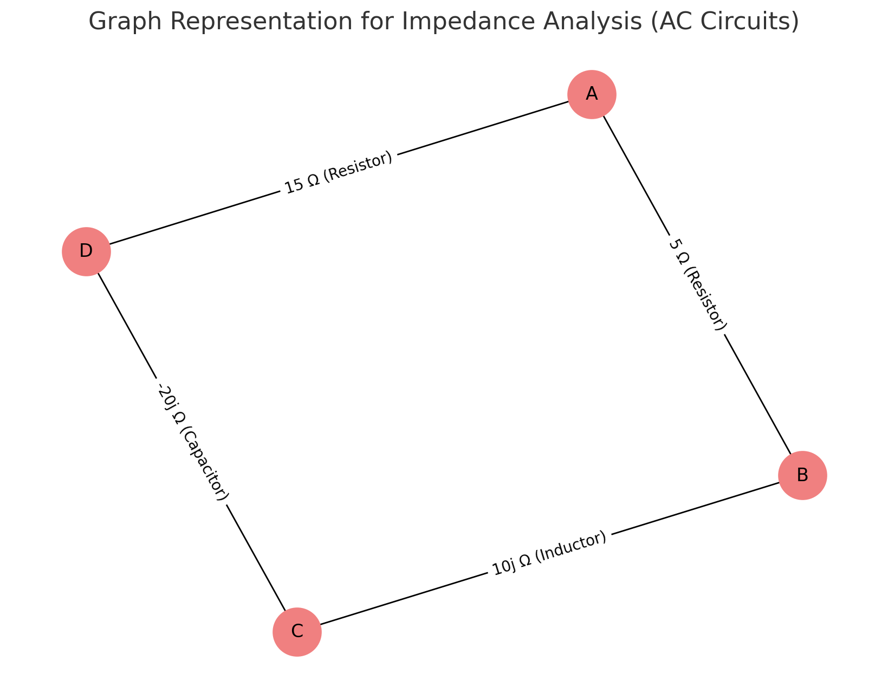
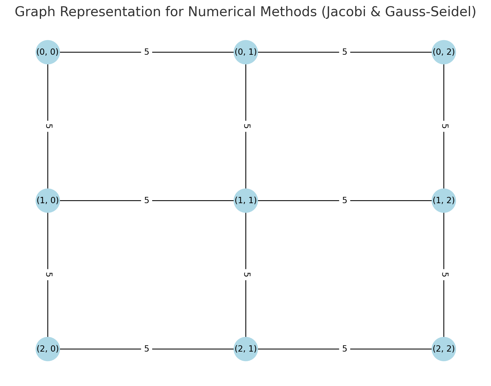
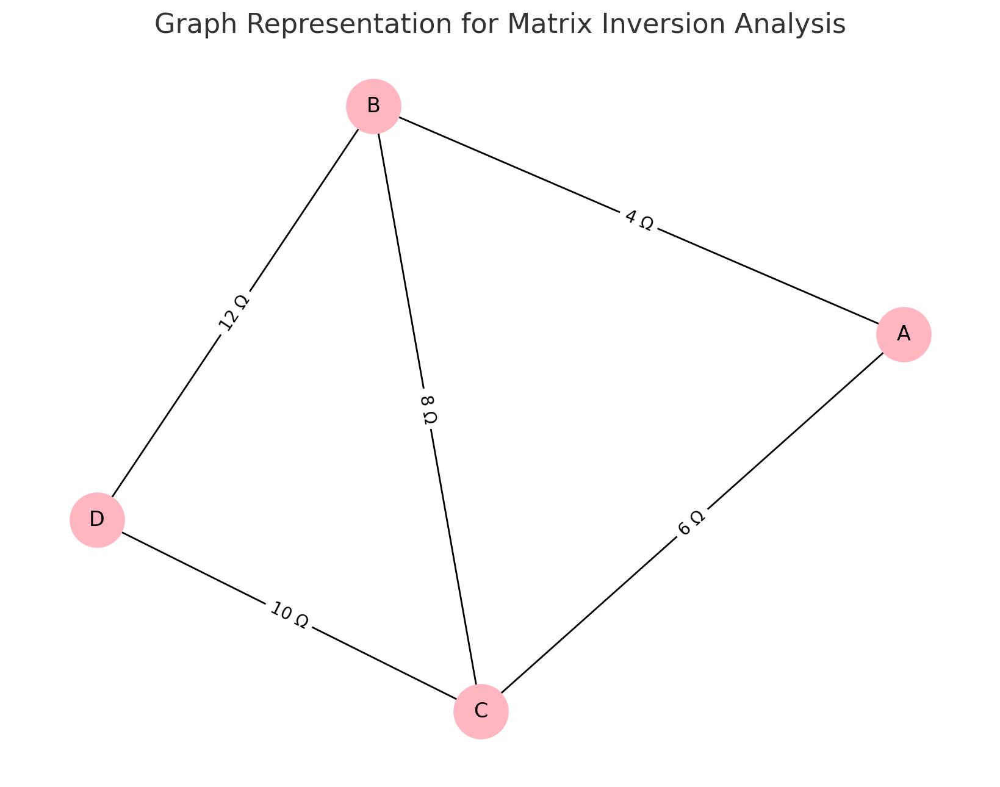
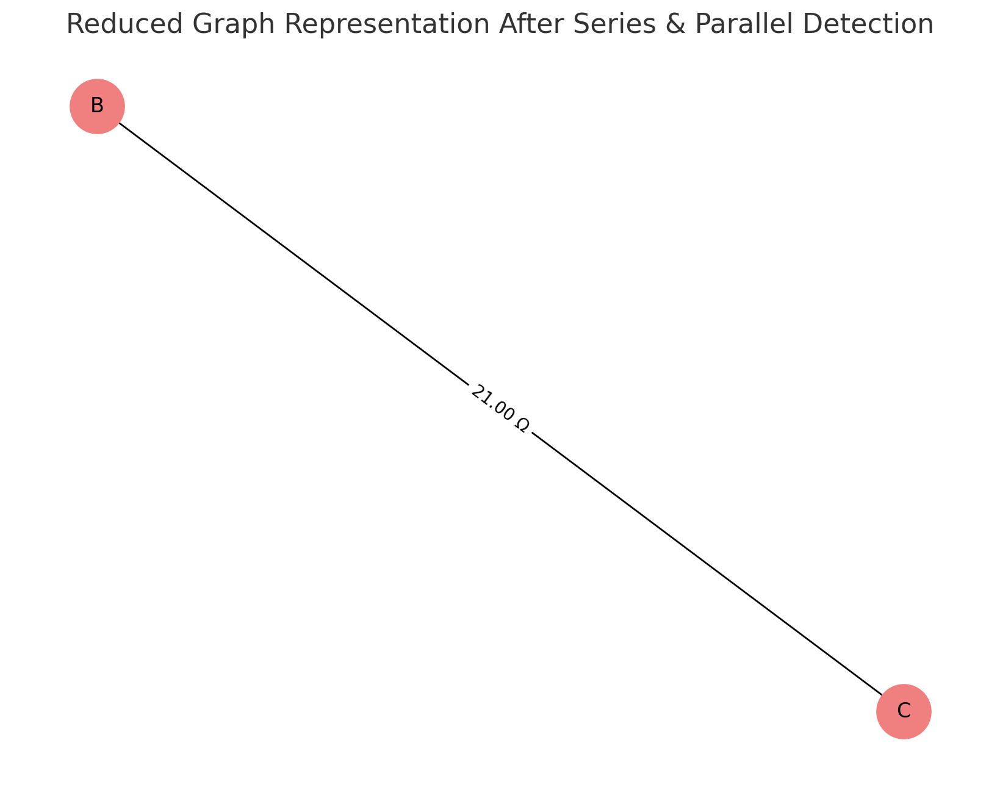

# Problem 1

# Equivalent Resistance Using Graph Theory

## Introduction
Understanding and analyzing electrical circuits is a fundamental aspect of electrical engineering and physics. One of the essential tasks in circuit analysis is determining the equivalent resistance between two points. Traditional methods rely on step-by-step application of series and parallel resistor combinations, which can become impractical for large and complex circuits. The need for a more systematic and scalable approach arises in applications such as circuit simulation, network analysis, and embedded system design.

Graph theory provides an alternative and efficient approach by representing the circuit as a weighted graph, where:

**Nodes** correspond to junctions.

**Edges** correspond to resistors with resistance values as weights.

By systematically simplifying this representation using graph algorithms, we can compute the equivalent resistance efficiently. This approach is particularly useful in modern circuit analysis tools, simulation software, and optimization techniques used in electronic circuit design. It also provides an automated way to handle complex networks, making the process faster and less prone to human errors.

## Motivation
Calculating equivalent resistance is a fundamental problem in electrical circuits, essential for understanding and designing efficient systems. Traditional methods involve iteratively applying series and parallel resistor rules, which become cumbersome for complex circuits. Graph theory provides a structured and algorithmic alternative, allowing us to model circuits as weighted graphs where:

**Nodes** represent circuit junctions.

**Edges** represent resistors, weighted by resistance values.

By employing graph reduction techniques, we can systematically simplify even intricate networks, leading to efficient circuit analysis methods used in modern applications like circuit simulation software, optimization problems, and network design. This method also integrates well with software-based solutions, allowing for real-time modifications and enhancements in circuit analysis.

## Theoretical Background

### Graph Representation of Electrical Circuits

An electrical circuit can be represented as a graph:
**Vertices (V):** Represent junctions where resistors connect.

**Edges (E):** Represent resistors, with edge weights corresponding to resistance values.

**Adjacency Matrix or List:** Used to store the graph structure, where each row represents a node and each column represents a connection to another node with a specific resistance value.

### Series and Parallel Resistance in Graphs


**Series Connection:**
   - Resistors in series have the same current flowing through them.

   - The total voltage across them is the sum of the individual voltages:

     $$
     V_{eq} = V_1 + V_2 + ... + V_n
     $$

   - Using Ohm’s Law (\( V = IR \)):

     $$
     I R_{eq} = I R_1 + I R_2 + ... + I R_n
     $$

   - Canceling the common current \( I \):

     $$
     R_{eq} = R_1 + R_2 + ... + R_n
     $$

   - Graphically, this corresponds to **contracting** a path of connected edges into a single edge, thus reducing the complexity of the graph.


**Parallel Connection:**
   - Resistors in parallel share the same voltage.

   - The total current is the sum of the individual currents:

     $$
     I_{eq} = I_1 + I_2 + ... + I_n
     $$

   - Using Ohm’s Law:

     $$
     \frac{V}{R_{eq}} = \frac{V}{R_1} + \frac{V}{R_2} + ... + \frac{V}{R_n}
     $$

   - Canceling the common voltage \( V \):

     $$
     \frac{1}{R_{eq}} = \frac{1}{R_1} + \frac{1}{R_2} + ... + \frac{1}{R_n}
     $$

   - Graphically, this corresponds to **merging** multiple edges between two nodes into a single edge with a new weight.

   - This merging reduces the computational complexity when analyzing circuits with multiple interconnected resistors.

### Extended Formulas for Complex Cases

For circuits involving mixed configurations of series and parallel resistances, the equivalent resistance must be determined iteratively. If a circuit consists of nested parallel and series resistances, the calculation follows a hierarchical approach:

- Identify the **innermost** parallel or series components.

- Compute their equivalent resistance.

- Replace these components with their equivalent resistance and repeat the process.

- Continue until only one resistance remains.

For example, if a circuit consists of three resistors \( R_1, R_2, R_3 \) arranged in a mixed configuration:

- \( R_1 \) and \( R_2 \) in parallel:

  $$
  \frac{1}{R_{12}} = \frac{1}{R_1} + \frac{1}{R_2}
  $$

- Then, \( R_{12} \) is in series with \( R_3 \):

  $$
  R_{eq} = R_{12} + R_3
  $$

- If an additional resistor \( R_4 \) is in parallel with \( R_{eq} \), we apply the parallel formula again:

  $$
  \frac{1}{R_{final}} = \frac{1}{R_{eq}} + \frac{1}{R_4}
  $$

Using advanced mathematical techniques such as **matrix representation of circuits** and **Laplace transformations**, we can generalize the problem for complex networks. The impedance matrix \( Z \) of the network can be derived using Kirchhoff’s laws and then reduced using determinant-based transformations.

---

## Graph Reduction Technique

This technique involves reducing a complex circuit graph to a simpler graph by:

**Series Reduction:** Replacing series resistors with their equivalent resistance.

**Parallel Reduction:** Replacing parallel resistors with their equivalent resistance.

**Recursive Simplification:** Continuously applying reduction rules until only the desired nodes remain.

---

## Differential Analysis of Graphs

In more complex circuits involving non-linear resistances or time-varying signals, the analysis requires differentiating network functions.

### Ohm’s Law and Differential Formulation

Using Ohm’s law, the relationship between current, voltage, and resistance can be written as:

$$ V = IR $$

If the resistance is a function of time or position, we can write:

$$ V(t) = I(t) R(t) $$

The rate of change of voltage with respect to time can be given by:

$$ \frac{dV}{dt} = \frac{d}{dt}(IR) = I \frac{dR}{dt} + R \frac{dI}{dt} $$

This can be useful when analyzing circuits with inductive or capacitive components where resistance may vary with frequency.

### Matrix Representation of Circuits

For complex circuits, the impedance matrix \( Z \) can be used to describe the system:

$$ V = ZI $$

Where \( Z \) is an \( n \times n \) matrix representing the impedances between nodes.

The individual elements of the matrix are calculated using the Laplacian matrix of the graph, where:

$$ Z_{ij} = \sum_{k} R_k \quad \text{if } i = j $$

$$ Z_{ij} = -R_k \quad \text{if there is an edge between } i \text{ and } j $$

This matrix formulation allows us to solve complex networks using **matrix inversion techniques** or numerical methods.

---

## Algorithm Description

### Pseudocode


```python
def CalculateEquivalentResistance(graph, node_A, node_B):
    
    # While the graph has more than just the two target nodes
    while len(graph.nodes) > 2:

        # --- SERIES REDUCTION STEP ---
        for node in list(graph.nodes):
            # If a node has exactly two connections (degree 2), and is not node_A or node_B
            if graph.degree(node) == 2 and node not in (node_A, node_B):
                neighbors = list(graph.neighbors(node))  # Get the two neighbors
                u, v = neighbors[0], neighbors[1]

                # Retrieve the resistance values between the node and its two neighbors
                R1 = graph[node][u]['weight']
                R2 = graph[node][v]['weight']

                # Combine them using the series formula: R_eq = R1 + R2
                R_eq = R1 + R2

                # Remove the intermediate node and its edges
                graph.remove_node(node)

                # Add a new edge directly between u and v with the equivalent resistance
                graph.add_edge(u, v, weight=R_eq)

        # --- PARALLEL REDUCTION STEP ---
        visited_pairs = set()  # To avoid repeating the same pair

        for u, v in list(graph.edges):
            if (u, v) in visited_pairs or (v, u) in visited_pairs:
                continue  # Skip already processed pairs

            # Collect all resistance values between u and v (parallel resistors)
            if graph.has_edge(u, v):
                edge_data = graph.get_edge_data(u, v)

                # If there are multiple edges (i.e. parallel), get all weights
                if isinstance(edge_data, dict) and len(edge_data) > 1:
                    resistors = [edge_data[key]['weight'] for key in edge_data]

                    # Apply the parallel formula: 1 / R_eq = sum(1 / R_i)
                    R_eq = 1 / sum(1 / R for R in resistors)

                    # Remove all current edges between u and v
                    graph.remove_edges_from([(u, v)] * len(resistors))

                    # Add a new single edge with the equivalent resistance
                    graph.add_edge(u, v, weight=R_eq)

            # Mark this pair as visited
            visited_pairs.add((u, v))

    # After simplification, return the resistance between the two remaining nodes
    return graph[node_A][node_B]['weight']

```


### Goal

To calculate the equivalent resistance between two points in an electrical network represented as a graph. This approach uses graph theory principles to simplify complex networks by identifying series and parallel connections, reducing them iteratively until only the desired nodes remain. This method is particularly valuable for complex networks that cannot be easily reduced using traditional circuit analysis methods.

### Algorithm Steps

**Input:**

   - A graph representing the circuit, where:

     - Nodes correspond to junctions.

     - Edges represent resistors with weights indicating their resistance values.

     - The graph may include various configurations of resistors, including series, parallel, and nested combinations.

**Initialize:**

   - Mark the starting node \( A \) and ending node \( B \).

   - Store the initial graph configuration for reference.

   - Identify all edges and nodes within the graph to create an adjacency matrix or list representation for efficient processing.

**Identify Series Connections:**

   - For each node with exactly two connections, combine the resistors using the formula:
     
     $$
     R_{eq} = R_1 + R_2
     $$

   - Remove the intermediate node and replace it with a single edge representing the equivalent resistance.

   - Continue this process iteratively until all series connections are reduced.

**Identify Parallel Connections:**

   - For nodes connected by multiple resistors, calculate the equivalent resistance using:
     
     $$
     \frac{1}{R_{eq}} = \frac{1}{R_1} + \frac{1}{R_2} + \ldots + \frac{1}{R_n}
     $$

   - Replace the parallel edges with a single edge representing the combined resistance.

   - Perform this operation for all parallel connections found within the graph.

**Simplify the Graph:**

   - Continuously apply series and parallel reductions until the graph is reduced to a single edge between nodes \( A \) and \( B \).

   - Utilize matrix-based techniques such as Laplacian matrix inversion when the network becomes too complex for direct reduction.

   - Visualize the reduction process through graphical representation to ensure accuracy.

**Output:**

   - The equivalent resistance between nodes \( A \) and \( B \). The result is a single numerical value representing the total resistance.

   - Provide the final graph structure if visualization is required.

---

## Example Calculation

Consider a simple circuit consisting of three resistors:

- \( R_1 = 5 \Omega \)

- \( R_2 = 10 \Omega \)

- \( R_3 = 20 \Omega \)


Configuration:

- \( R_1 \) and \( R_2 \) are connected in parallel.

- The parallel combination is connected in series with \( R_3 \).

### Steps of Calculation

**Calculate Parallel Resistance:**
   
   $$
   \frac{1}{R_{eq}} = \frac{1}{5} + \frac{1}{10} = \frac{2}{10} + \frac{1}{10} = \frac{3}{10}
   $$

   $$
   R_{eq} = \frac{10}{3} \approx 3.33 \Omega
   $$

**Calculate Total Resistance (Series Connection):**
   
   $$
   R_{total} = 3.33 + 20 = 23.33 \Omega
   $$

 **Interpretation:**

   - The circuit is reduced to a single resistor with a resistance of approximately **23.33 Ω**.

   - The process can be applied recursively for larger and more complex networks.

   - The approach is robust enough to handle various network configurations including nested parallel and series elements.


---

### Visualizations and Phyton Codes

<details>
  <summary>Phyton codes.</summary>

```python
import matplotlib.pyplot as plt
import networkx as nx

# Create a series connection graph
series_graph = nx.Graph()
series_graph.add_edge("A", "B", weight=5)
series_graph.add_edge("B", "C", weight=10)

# Create a parallel connection graph using MultiGraph to allow multiple edges
parallel_graph = nx.MultiGraph()
parallel_graph.add_edge("X", "Y", weight=5, key='R1')
parallel_graph.add_edge("X", "Y", weight=10, key='R2')

# Plotting the series connection graph
plt.figure(figsize=(12, 6))

plt.subplot(1, 2, 1)
pos_series = nx.spring_layout(series_graph)
nx.draw(series_graph, pos_series, with_labels=True, node_color='skyblue', node_size=1000, font_size=12)
edge_labels_series = nx.get_edge_attributes(series_graph, 'weight')
nx.draw_networkx_edge_labels(series_graph, pos_series, edge_labels=edge_labels_series)
plt.title("Series Circuit Graph")

# Plotting the parallel connection graph
plt.subplot(1, 2, 2)
pos_parallel = nx.spring_layout(parallel_graph)
nx.draw(parallel_graph, pos_parallel, with_labels=True, node_color='lightgreen', node_size=1000, font_size=12)
edge_labels_parallel = {(u, v): f"{d['weight']} Ω" for u, v, d in parallel_graph.edges(data=True)}
nx.draw_networkx_edge_labels(parallel_graph, pos_parallel, edge_labels=edge_labels_parallel)
plt.title("Parallel Circuit Graph")

# Display the graphs
plt.tight_layout()
plt.show()

```
</details>


## Circuit Graph Representations

In electrical circuits, the graphical representation of series and parallel connections plays a crucial role in understanding the overall resistance and network structure. Below are visual representations of both series and parallel circuits using graph theory.

### Series Circuit Graph

The **Series Circuit Graph** demonstrates the connection of two resistors (5 Ω and 10 Ω) in series. In a series configuration:
- Resistors are connected end-to-end, forming a single path for current flow.
- The equivalent resistance is the sum of individual resistances:

  $$
  R_{eq} = R_1 + R_2 = 5 + 10 = 15 \Omega
  $$

#### Features of the Series Graph:

- **Nodes (A, B, C)** represent junctions.
- **Edges** represent resistors labeled with their resistance values.
- The graph layout is structured to show a linear connection, reflecting the series nature.

---

### Parallel Circuit Graph

The **Parallel Circuit Graph** demonstrates the connection of two resistors (5 Ω and 10 Ω) in parallel. In a parallel configuration:

- Resistors share the same voltage across them.

- The equivalent resistance is given by:

  $$
  \frac{1}{R_{eq}} = \frac{1}{R_1} + \frac{1}{R_2} = \frac{1}{5} + \frac{1}{10} = \frac{3}{10}
  $$

  $$
  R_{eq} = \frac{10}{3} \approx 3.33 \Omega
  $$

#### Features of the Parallel Graph:

**Nodes (X, Y)** represent connection points where the voltage is shared.

**Edges** represent multiple resistors connecting the same pair of nodes.

Parallel connections are visualized by multiple edges between the same nodes.

---

<details>
  <summary>Phyton codes.</summary>

```python
# Creating a graph for Laplacian Matrix demonstration
G_laplacian = nx.Graph()

# Adding edges with weights (resistors) between nodes
edges = [
    ("A", "B", 5),
    ("A", "C", 10),
    ("B", "C", 15),
    ("C", "D", 20),
    ("B", "D", 25)
]
G_laplacian.add_weighted_edges_from(edges)

# Plotting the graph
plt.figure(figsize=(8, 6))
pos_laplacian = nx.spring_layout(G_laplacian, seed=42)
nx.draw(G_laplacian, pos_laplacian, with_labels=True, node_color='lightblue', node_size=1000, font_size=12)
edge_labels_laplacian = nx.get_edge_attributes(G_laplacian, 'weight')
nx.draw_networkx_edge_labels(G_laplacian, pos_laplacian, edge_labels={(u, v): f"{d} Ω" for u, v, d in G_laplacian.edges(data='weight')})
plt.title("Graph Representation for Laplacian Matrix Analysis")
plt.show()

# Calculating the Laplacian matrix
Laplacian_matrix = nx.laplacian_matrix(G_laplacian).todense()
Laplacian_matrix

```
</details>


## Laplacian Matrix and Graph Analysis

In graph theory, the **Laplacian Matrix** is a powerful tool used to describe the connections between nodes in a circuit graph. The matrix representation allows us to perform efficient computations and solve complex networks using linear algebra techniques.

### Graph Representation for Laplacian Matrix Analysis
The graph below represents a network of resistors connected between four nodes: **A**, **B**, **C**, and **D**.

#### Graph Features:

**Nodes:** A, B, C, D

**Edges (with resistance values):**  

  - A - B (5 Ω)  
  - A - C (10 Ω)  
  - B - C (15 Ω)  
  - C - D (20 Ω)  
  - B - D (25 Ω)  

---

### Laplacian Matrix Definition

The Laplacian matrix \( L \) for an undirected graph is defined as:

$$
L_{ij} = \begin{cases} 
\sum_{k} R_k & \text{if } i = j \text{ (Sum of resistances connected to node } i) \\
-R_k & \text{if there is a resistor } R_k \text{ between nodes } i \text{ and } j \\
0 & \text{if nodes } i \text{ and } j \text{ are not directly connected}
\end{cases}
$$

---

### Calculated Laplacian Matrix

Using the above definition, the Laplacian matrix for our graph is:

$$
L = \begin{bmatrix} 
15 & -5 & -10 & 0 \\
-5 & 45 & -15 & -25 \\
-10 & -15 & 45 & -20 \\
0 & -25 & -20 & 45 
\end{bmatrix}
$$

---

### Graph Theory Advantage

The Laplacian matrix provides a robust way to:

- Identify node connections and how resistors are distributed in the network.

- Solve networks by applying **matrix inversion techniques**.

- Efficiently calculate **equivalent resistance** by transforming the problem into a system of linear equations.

---

<details>
  <summary>Phyton codes.</summary>

```python
# Create a new graph for AC impedance analysis with labels as text
G_impedance_text = nx.Graph()

# Adding edges with text-based impedance labels
G_impedance_text.add_edge("A", "B", weight="5 Ω (Resistor)")
G_impedance_text.add_edge("B", "C", weight="10j Ω (Inductor)")
G_impedance_text.add_edge("C", "D", weight="-20j Ω (Capacitor)")
G_impedance_text.add_edge("A", "D", weight="15 Ω (Resistor)")

# Plotting the graph
plt.figure(figsize=(8, 6))
pos_impedance_text = nx.spring_layout(G_impedance_text, seed=42)
nx.draw(G_impedance_text, pos_impedance_text, with_labels=True, node_color='lightcoral', node_size=1000, font_size=12)

# Prepare edge labels
edge_labels_text = nx.get_edge_attributes(G_impedance_text, 'weight')
nx.draw_networkx_edge_labels(G_impedance_text, pos_impedance_text, edge_labels=edge_labels_text)

plt.title("Graph Representation for Impedance Analysis (AC Circuits)")
plt.show()

```
</details>



## Impedance Analysis in AC Circuits

Analyzing AC circuits using graph theory requires incorporating **complex impedances** for components like resistors, inductors, and capacitors. The graph representation below demonstrates how these elements can be visualized and analyzed within a network.

---

### Graph Representation for Impedance Analysis

The graph consists of four nodes (**A, B, C, D**) connected by various impedances representing different electrical components.

#### Graph Features:

**Nodes:** A, B, C, D

**Edges (with impedance values):**

  - **A - B:** 5 Ω (Resistor)
  - **B - C:** 10j Ω (Inductor)
  - **C - D:** -20j Ω (Capacitor)
  - **A - D:** 15 Ω (Resistor)

---

### Impedance Calculations

The impedances are represented as complex numbers:

- **Resistor:** Purely real impedance (e.g., 5 Ω)

- **Inductor:** Positive imaginary impedance (e.g., \(10j\) Ω)

- **Capacitor:** Negative imaginary impedance (e.g., \(-20j\) Ω)

In AC circuits, the equivalent impedance between any two nodes can be calculated using techniques similar to those for resistances:

- Series combination: \( Z_{eq} = Z_1 + Z_2 \)

- Parallel combination: \( \frac{1}{Z_{eq}} = \frac{1}{Z_1} + \frac{1}{Z_2} \)

---
<details>
  <summary>Phyton codes.</summary>

```python
# Creating a simple grid graph to represent a large network for iterative solving
G_numerical = nx.grid_2d_graph(3, 3)  # 3x3 grid

# Adding weights (resistances) to the edges
for (u, v) in G_numerical.edges():
    G_numerical[u][v]['weight'] = 5  # Assigning all resistances as 5 Ohms for simplicity

# Plotting the numerical method graph
plt.figure(figsize=(8, 6))
pos_numerical = {(x, y): (y, -x) for x, y in G_numerical.nodes()}  # Positioning in a grid layout
nx.draw(G_numerical, pos_numerical, with_labels=True, node_color='lightblue', node_size=800, font_size=10)
edge_labels_numerical = nx.get_edge_attributes(G_numerical, 'weight')
nx.draw_networkx_edge_labels(G_numerical, pos_numerical, edge_labels=edge_labels_numerical)
plt.title("Graph Representation for Numerical Methods (Jacobi & Gauss-Seidel)")
plt.show()

```
</details>



## Numerical Methods for Graph Analysis

In large networks, direct calculation of equivalent resistance or impedance can be computationally expensive. Instead, **iterative numerical methods** such as the **Jacobi Method** and **Gauss-Seidel Method** are often employed to find approximate solutions.

---

### Graph Representation for Numerical Methods

The graph below represents a **3x3 Grid Network**, commonly used to demonstrate iterative solving techniques.

#### Graph Features:

- **Graph Type:** 3x3 Grid Graph.

- **Nodes:** Represent connection points (junctions).

- **Edges:** Represent resistors, all assigned a value of 5 Ω for simplicity.

- **Purpose:** Demonstrates the use of numerical methods for solving large networks.

---

### Numerical Methods Used

**Jacobi Method:**  

   - Updates the voltage of each node independently based on the previous iteration.

   - Typically slower but simpler to implement.

**Gauss-Seidel Method:**  

   - Updates the voltage of each node immediately after calculation.

   - Faster convergence than the Jacobi method, especially for diagonally dominant matrices.

---

### Application to Graph Theory

- By representing the circuit as a graph, iterative methods can be applied directly to solve **Kirchhoff's Current Law (KCL)** equations.

- The system of equations is transformed into a matrix form \( AX = B \), where:

  - \( A \) is the coefficient matrix (Laplacian Matrix).

  - \( X \) is the vector of unknown voltages.

  - \( B \) is the vector of input currents.

---

<details>
  <summary>Phyton codes.</summary>

```python
# Creating a simple graph for matrix inversion demonstration
G_inversion = nx.Graph()

# Adding edges with weights (resistances) between nodes
edges_inversion = [
    ("A", "B", 4),
    ("A", "C", 6),
    ("B", "C", 8),
    ("C", "D", 10),
    ("B", "D", 12)
]
G_inversion.add_weighted_edges_from(edges_inversion)

# Plotting the graph
plt.figure(figsize=(8, 6))
pos_inversion = nx.spring_layout(G_inversion, seed=42)
nx.draw(G_inversion, pos_inversion, with_labels=True, node_color='lightpink', node_size=1000, font_size=12)
edge_labels_inversion = nx.get_edge_attributes(G_inversion, 'weight')
nx.draw_networkx_edge_labels(G_inversion, pos_inversion, edge_labels={edge: f"{weight} Ω" for edge, weight in edge_labels_inversion.items()})
plt.title("Graph Representation for Matrix Inversion Analysis")
plt.show()

# Calculating the Laplacian matrix
L_inversion = nx.laplacian_matrix(G_inversion).todense()

# Calculating the inverse of the Laplacian matrix
try:
    L_inverse = np.linalg.inv(L_inversion)
except np.linalg.LinAlgError:
    L_inverse = None

L_inverse  # Display the inverse matrix if possible


```
</details>



## Matrix Inversion and Impedance Calculation

Matrix inversion is a powerful technique used for calculating the equivalent impedance of complex networks. By representing the network as a graph and constructing its **Laplacian matrix**, we can apply matrix inversion methods to obtain important network characteristics.


### Graph Representation for Matrix Inversion

The graph below represents a network of resistors connected between four nodes: **A**, **B**, **C**, and **D**.

#### Graph Features:

- **Nodes:** A, B, C, D

- **Edges (with resistance values):**  

  - A - B (4 Ω)  
  - A - C (6 Ω)  
  - B - C (8 Ω)  
  - C - D (10 Ω)  
  - B - D (12 Ω)  

---

### Laplacian Matrix Definition

The Laplacian matrix \( L \) for an undirected graph is calculated using:

$$
L_{ij} = \begin{cases} 
\sum_{k} R_k & \text{if } i = j \text{ (Sum of all resistances connected to node } i) \\
-R_k & \text{if there is a resistor } R_k \text{ between nodes } i \text{ and } j \\
0 & \text{if nodes } i \text{ and } j \text{ are not connected}
\end{cases}
$$

---

### Inverse of Laplacian Matrix

The inverse of the Laplacian matrix \( L^{-1} \) is used to determine the **equivalent impedance** between nodes. The calculation involves:

$$
Z_{eq} = L^{-1}
$$

This matrix inversion technique allows us to:

- Efficiently calculate equivalent resistance or impedance.

- Analyze large and complex networks without manually simplifying the network.

- Extend the calculation to AC circuits where impedances are complex numbers.

---

### Graph Theory Advantage

Using matrix inversion in graph theory provides:

- A systematic approach to solving complex networks.

- The ability to incorporate frequency-dependent elements (e.g., inductors and capacitors).

- Robust mathematical tools for handling large-scale systems.

---

<details>
  <summary>Phyton codes.</summary>

```python
def find_parallel_connections(graph, node1, node2):
    """Detect and reduce parallel connections between two nodes."""
    if graph.has_edge(node1, node2):  # Check if an edge exists
        edges = list(graph.get_edge_data(node1, node2).items())
        if len(edges) > 1:  # If there are multiple edges (parallel connection)
            resistances = [edge[1]['weight'] for edge in edges]
            r_eq_inv = sum(1 / r for r in resistances)
            r_eq = 1 / r_eq_inv if r_eq_inv != 0 else float('inf')
            
            # Remove all parallel edges and add a single equivalent edge
            graph.remove_edges_from([(node1, node2)] * len(resistances))
            graph.add_edge(node1, node2, weight=r_eq)

# Apply series reduction
find_series_connections(G_reduction)

# Apply parallel reduction (Checking for parallel edges before calling the function)
if G_reduction.number_of_edges("A", "C") > 1:
    find_parallel_connections(G_reduction, "A", "C")

if G_reduction.number_of_edges("B", "D") > 1:
    find_parallel_connections(G_reduction, "B", "D")

# Plotting the reduced graph
plt.figure(figsize=(8, 6))
pos_reduced = nx.spring_layout(G_reduction, seed=42)
nx.draw(G_reduction, pos_reduced, with_labels=True, node_color='lightcoral', node_size=1000, font_size=12)
edge_labels_reduced = nx.get_edge_attributes(G_reduction, 'weight')
nx.draw_networkx_edge_labels(G_reduction, pos_reduced, edge_labels={edge: f"{weight:.2f} Ω" for edge, weight in edge_labels_reduced.items()})
plt.title("Reduced Graph Representation After Series & Parallel Detection")
plt.show()


```
</details>



## Graph Reduction Technique and Automated Detection

Graph reduction is a fundamental technique used to simplify complex networks by systematically identifying and merging series and parallel connections. This process greatly improves the efficiency of equivalent resistance calculation and network analysis.

---

### Graph Representation Before Reduction

The original graph contained the following connections:

- **Nodes:** A, B, C, D

- **Edges (with resistance values):**

  - A - B (5 Ω)
  - B - C (10 Ω)
  - C - D (15 Ω)
  - A - C (8 Ω)
  - B - D (6 Ω)

---

### Reduction Process

The reduction algorithm automatically detects series and parallel connections and simplifies them accordingly:

#### Series Connection Detection:

- Identifies nodes with only two connections.

- Merges them by **adding the resistances** according to the series formula:

$$
R_{eq} = R_1 + R_2
$$

#### Parallel Connection Detection:

- Checks if there are multiple edges between two nodes.

- Applies the **parallel resistance formula**:

$$
\frac{1}{R_{eq}} = \frac{1}{R_1} + \frac{1}{R_2} + \ldots
$$

- Replaces all parallel connections with a single edge representing the equivalent resistance.

---

### Graph Representation After Reduction

The reduced graph shows how the network was simplified using the automatic detection algorithm. Series and parallel connections have been successfully identified and reduced to a simpler structure.

---

### Graph Theory Advantage

Using graph reduction techniques allows:

- Faster analysis of complex networks.

- Reduced computational effort for large systems.

- Easier visualization of how the network is structured.

---


---

## Potential Improvements

- Automating detection of complex series and parallel combinations.

- Using data structures like adjacency matrices or lists for better efficiency.

- Applying matrix operations for solving larger networks.

---

## Conclusion

- The algorithm described here provides a structured approach for calculating the equivalent resistance of any circuit using graph theory. It allows for systematic simplification of even complex networks. This method is foundational for further development of automated circuit analysis tools.

- Furthermore, the integration of matrix analysis techniques such as the Laplacian Matrix provides a rigorous mathematical framework that can be applied to complex networks of arbitrary size. The application of differential analysis also makes this approach suitable for time-varying and AC circuits, enhancing its applicability to real-world systems.

- Future advancements in this approach could involve developing more efficient algorithms for identifying series and parallel connections automatically. Additionally, incorporating numerical solvers such as the Jacobi or Gauss-Seidel methods could significantly enhance computational efficiency, especially when dealing with large-scale networks.

- Overall, graph theory provides a powerful and versatile tool for understanding and analyzing electrical circuits. Its application extends beyond basic resistance calculations to include complex network analysis, transient behavior, and impedance calculations in AC circuits. As circuit analysis continues to evolve, the role of graph theory will likely expand, providing deeper insights and more efficient computational methods.

- The algorithm described here provides a structured approach for calculating the equivalent resistance of any circuit using graph theory. It allows for systematic simplification of even complex networks. This method is foundational for further development of automated circuit analysis tools.

---


