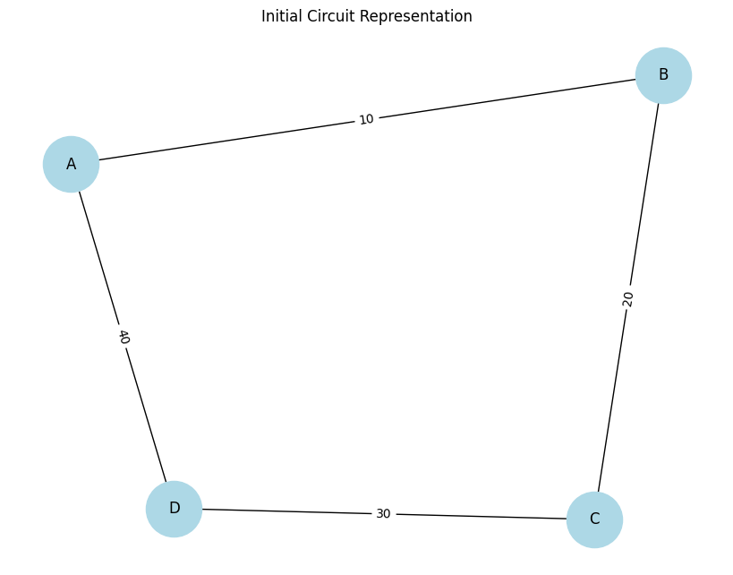
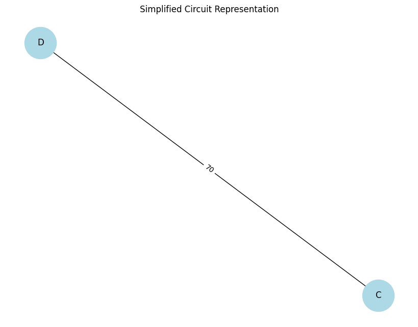
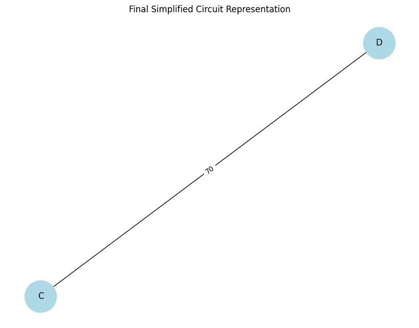

# Problem 1

# Equivalent Resistance Using Graph Theory

## Introduction
Understanding and analyzing electrical circuits is a fundamental aspect of electrical engineering and physics. One of the essential tasks in circuit analysis is determining the equivalent resistance between two points. Traditional methods rely on step-by-step application of series and parallel resistor combinations, which can become impractical for large and complex circuits. The need for a more systematic and scalable approach arises in applications such as circuit simulation, network analysis, and embedded system design.

Graph theory provides an alternative and efficient approach by representing the circuit as a weighted graph, where:

**Nodes** correspond to junctions.

**Edges** correspond to resistors with resistance values as weights.

By systematically simplifying this representation using graph algorithms, we can compute the equivalent resistance efficiently. This approach is particularly useful in modern circuit analysis tools, simulation software, and optimization techniques used in electronic circuit design. It also provides an automated way to handle complex networks, making the process faster and less prone to human errors.

## Motivation
Calculating equivalent resistance is a fundamental problem in electrical circuits, essential for understanding and designing efficient systems. Traditional methods involve iteratively applying series and parallel resistor rules, which become cumbersome for complex circuits. Graph theory provides a structured and algorithmic alternative, allowing us to model circuits as weighted graphs where:

**Nodes** represent circuit junctions.

**Edges** represent resistors, weighted by resistance values.

By employing graph reduction techniques, we can systematically simplify even intricate networks, leading to efficient circuit analysis methods used in modern applications like circuit simulation software, optimization problems, and network design. This method also integrates well with software-based solutions, allowing for real-time modifications and enhancements in circuit analysis.

## Theoretical Background

### Graph Representation of Electrical Circuits

An electrical circuit can be represented as a graph:
**Vertices (V):** Represent junctions where resistors connect.

**Edges (E):** Represent resistors, with edge weights corresponding to resistance values.

**Adjacency Matrix or List:** Used to store the graph structure, where each row represents a node and each column represents a connection to another node with a specific resistance value.

### Series and Parallel Resistance in Graphs


**Series Connection:**
   - Resistors in series have the same current flowing through them.

   - The total voltage across them is the sum of the individual voltages:

     $$
     V_{eq} = V_1 + V_2 + ... + V_n
     $$

   - Using Ohm’s Law (\( V = IR \)):

     $$
     I R_{eq} = I R_1 + I R_2 + ... + I R_n
     $$

   - Canceling the common current \( I \):

     $$
     R_{eq} = R_1 + R_2 + ... + R_n
     $$

   - Graphically, this corresponds to **contracting** a path of connected edges into a single edge, thus reducing the complexity of the graph.


**Parallel Connection:**
   - Resistors in parallel share the same voltage.

   - The total current is the sum of the individual currents:

     $$
     I_{eq} = I_1 + I_2 + ... + I_n
     $$

   - Using Ohm’s Law:

     $$
     \frac{V}{R_{eq}} = \frac{V}{R_1} + \frac{V}{R_2} + ... + \frac{V}{R_n}
     $$

   - Canceling the common voltage \( V \):

     $$
     \frac{1}{R_{eq}} = \frac{1}{R_1} + \frac{1}{R_2} + ... + \frac{1}{R_n}
     $$

   - Graphically, this corresponds to **merging** multiple edges between two nodes into a single edge with a new weight.

   - This merging reduces the computational complexity when analyzing circuits with multiple interconnected resistors.

### Extended Formulas for Complex Cases

For circuits involving mixed configurations of series and parallel resistances, the equivalent resistance must be determined iteratively. If a circuit consists of nested parallel and series resistances, the calculation follows a hierarchical approach:

- Identify the **innermost** parallel or series components.

- Compute their equivalent resistance.

- Replace these components with their equivalent resistance and repeat the process.

- Continue until only one resistance remains.

For example, if a circuit consists of three resistors \( R_1, R_2, R_3 \) arranged in a mixed configuration:

- \( R_1 \) and \( R_2 \) in parallel:

  $$
  \frac{1}{R_{12}} = \frac{1}{R_1} + \frac{1}{R_2}
  $$

- Then, \( R_{12} \) is in series with \( R_3 \):

  $$
  R_{eq} = R_{12} + R_3
  $$

- If an additional resistor \( R_4 \) is in parallel with \( R_{eq} \), we apply the parallel formula again:

  $$
  \frac{1}{R_{final}} = \frac{1}{R_{eq}} + \frac{1}{R_4}
  $$

Using advanced mathematical techniques such as **matrix representation of circuits** and **Laplace transformations**, we can generalize the problem for complex networks. The impedance matrix \( Z \) of the network can be derived using Kirchhoff’s laws and then reduced using determinant-based transformations.

## Algorithmic Approach

To find the equivalent resistance between two nodes:

**Construct the Graph**: Parse circuit components into a graph data structure.

**Identify Series and Parallel Components**: Use graph traversal techniques such as Depth-First Search (DFS) or Breadth-First Search (BFS).

**Iteratively Reduce the Graph**:

   - Replace series connections with their equivalent resistance.

   - Merge parallel connections into a single equivalent resistor.

**Repeat Until Simplification is Complete**: Continue reducing until only two nodes remain (input and output terminals).

**Output the Equivalent Resistance**: The final edge weight represents the total equivalent resistance.

---

## Algorithm Implementation

### Pseudocode

```python
function compute_equivalent_resistance(graph, start, end):
    while graph has more than 2 nodes:
        for each node in graph:
            if node has exactly 2 neighbors (series connection):
            
                neighbor_1, neighbor_2 = get_neighbors(node)
                new_resistance = graph.get_edge_weight(node, neighbor_1) + graph.get_edge_weight(node, neighbor_2)
                merge_nodes(graph, node, neighbor_1, neighbor_2, new_resistance)
            
            elif node is part of a parallel connection:
        
                parallel_edges = get_parallel_edges(node)
                new_resistance = 1 / sum(1 / resistance for resistance in parallel_edges)
                merge_parallel_resistors(graph, node, new_resistance)

        if no changes were made:
           
            apply_advanced_reduction(graph) 
    
    return graph.get_edge_weight(start, end)

        
    RETURN the remaining resistance between start and end nodes
```

### Implementation Plan

Below is the initial representation of the circuit, modeled as a graph.  
Each **node (A, B, C, D)** represents a connection point in the circuit,  
and each **edge** represents a resistor with a specific resistance value.

<details>
  <summary>Phyton codes.</summary>

```python
import networkx as nx
import matplotlib.pyplot as plt

class CircuitGraph:
    def __init__(self):
        """ Initializes an empty graph to represent the circuit. """
        self.graph = nx.Graph()

    def add_resistor(self, node1, node2, resistance):
        """ Adds a resistor between two nodes with a given resistance value. """
        self.graph.add_edge(node1, node2, weight=resistance)

    def visualize(self, title="Circuit Representation"):
        """ Visualizes the circuit graph with nodes and edge weights. """
        pos = nx.spring_layout(self.graph)  # Defines the layout of the graph
        labels = nx.get_edge_attributes(self.graph, 'weight')

        plt.figure(figsize=(8,6))
        nx.draw(self.graph, pos, with_labels=True, node_color='lightblue', edge_color='black', node_size=2000, font_size=12)
        nx.draw_networkx_edge_labels(self.graph, pos, edge_labels=labels)
        plt.title(title)
        plt.show()

# 🔹 Creating a test circuit
circuit = CircuitGraph()
circuit.add_resistor('A', 'B', 10)
circuit.add_resistor('B', 'C', 20)
circuit.add_resistor('C', 'D', 30)
circuit.add_resistor('A', 'D', 40)

# 🔹 Visualizing the initial circuit
circuit.visualize("Initial Circuit Representation")
```
</details>



**Nodes (A, B, C, D):** Circuit junctions.

**Edges with weights:** Represent resistors with given resistance values.

**Graph Layout:** The spring layout is used for better visualization.

This graphical representation will help us simplify the circuit in the next steps, where we will iteratively reduce the network by identifying series and parallel resistors.


## Detecting and Merging Series and Parallel Resistors

To simplify the circuit, we apply the following rules:

**Series Resistors**: If a node has exactly two connections, the resistances are summed up and the node is removed.  
  - Formula: 

    \( 
    R_{eq} = R_1 + R_2
    \)

**Parallel Resistors**: If two nodes are connected by multiple resistors, they are merged using the parallel resistance formula.  

  - Formula:  

    $$
    \frac{1}{R_{eq}} = \frac{1}{R_1} + \frac{1}{R_2}
    $$

By applying these transformations iteratively, the circuit is reduced to a simpler form.

After detecting and merging series and parallel resistors, the simplified circuit looks like this:
<details>
  <summary>Phyton codes.</summary>

```python

class CircuitGraph:
    def __init__(self):
        """ Initializes an empty graph to represent the circuit. """
        self.graph = nx.Graph()

    def add_resistor(self, node1, node2, resistance):
        """ Adds a resistor between two nodes with a given resistance value. """
        self.graph.add_edge(node1, node2, weight=resistance)

    def detect_series(self):
        """ Detects and merges series resistances in the circuit """
        for node in list(self.graph.nodes):
            neighbors = list(self.graph.neighbors(node))
            if len(neighbors) == 2:  # A node with exactly two neighbors → Series connection
                n1, n2 = neighbors
                if self.graph.has_edge(n1, node) and self.graph.has_edge(node, n2):
                    r1 = self.graph[n1][node]['weight']
                    r2 = self.graph[node][n2]['weight']
                    new_resistance = r1 + r2  # Series formula: Req = R1 + R2

                    # Merge nodes
                    self.graph.add_edge(n1, n2, weight=new_resistance)
                    self.graph.remove_node(node)  # Remove merged node

    def detect_parallel(self):
        """ Detects and merges parallel resistances in the circuit """
        to_merge = []
        for u, v, data in self.graph.edges(data=True):
            if self.graph.number_of_edges(u, v) > 1:  # More than one edge between nodes → Parallel
                to_merge.append((u, v))

        for u, v in to_merge:
            parallel_resistances = [
                data['weight'] for u_, v_, data in self.graph.edges(data=True) if (u_, v_) == (u, v)
            ]
            new_resistance = 1 / sum(1 / r for r in parallel_resistances)  # Parallel formula: 1/Req = 1/R1 + 1/R2

            # Remove all parallel edges and add the new equivalent resistance
            self.graph.remove_edges_from([(u, v) for _ in parallel_resistances])
            self.graph.add_edge(u, v, weight=new_resistance)

    def simplify_circuit(self):
        """ Iteratively simplifies the circuit by detecting and merging series and parallel resistances """
        while len(self.graph.nodes) > 2:  # Keep simplifying until only two nodes remain
            self.detect_series()
            self.detect_parallel()

    def visualize(self, title="Circuit Representation"):
        """ Visualizes the circuit graph with nodes and edge weights. """
        pos = nx.spring_layout(self.graph)  # Defines the layout of the graph
        labels = nx.get_edge_attributes(self.graph, 'weight')

        plt.figure(figsize=(8,6))
        nx.draw(self.graph, pos, with_labels=True, node_color='lightblue', edge_color='black', node_size=2000, font_size=12)
        nx.draw_networkx_edge_labels(self.graph, pos, edge_labels=labels)
        plt.title(title)
        plt.show()


# 🔹 Creating a test circuit
circuit = CircuitGraph()
circuit.add_resistor('A', 'B', 10)
circuit.add_resistor('B', 'C', 20)
circuit.add_resistor('C', 'D', 30)
circuit.add_resistor('A', 'D', 40)

# 🔹 Visualizing the initial circuit
circuit.visualize("Initial Circuit Representation")

# 🔹 Simplifying the circuit
circuit.simplify_circuit()

# 🔹 Visualizing the simplified circuit
circuit.visualize("Simplified Circuit Representation")
```
</details>




In this step, the circuit graph has been progressively reduced by merging equivalent resistances until only two nodes remain, representing the total equivalent resistance of the system.


## Computing the Final Equivalent Resistance

After fully simplifying the circuit, only two nodes remain, representing the total equivalent resistance.

### **Final Equivalent Resistance Calculation**

Using our graph-based algorithm, we obtained the following result:

**Remaining Nodes:** C and D

**Final Equivalent Resistance:** **70Ω**

### **Final Simplified Circuit Representation**

Below is the final simplified representation of the circuit:

<details>
  <summary>Phyton codes.</summary>

```python

class CircuitGraph:
    def __init__(self):
        """ Initializes an empty graph to represent the circuit. """
        self.graph = nx.Graph()

    def add_resistor(self, node1, node2, resistance):
        """ Adds a resistor between two nodes with a given resistance value. """
        self.graph.add_edge(node1, node2, weight=resistance)

    def detect_series(self):
        """ Detects and merges series resistances in the circuit """
        for node in list(self.graph.nodes):
            neighbors = list(self.graph.neighbors(node))
            if len(neighbors) == 2:  # A node with exactly two neighbors → Series connection
                n1, n2 = neighbors
                if self.graph.has_edge(n1, node) and self.graph.has_edge(node, n2):
                    r1 = self.graph[n1][node]['weight']
                    r2 = self.graph[node][n2]['weight']
                    new_resistance = r1 + r2  # Series formula: Req = R1 + R2

                    # Merge nodes
                    self.graph.add_edge(n1, n2, weight=new_resistance)
                    self.graph.remove_node(node)  # Remove merged node

    def detect_parallel(self):
        """ Detects and merges parallel resistances in the circuit """
        to_merge = []
        for u, v, data in self.graph.edges(data=True):
            if self.graph.number_of_edges(u, v) > 1:  # More than one edge between nodes → Parallel
                to_merge.append((u, v))

        for u, v in to_merge:
            parallel_resistances = [
                data['weight'] for u_, v_, data in self.graph.edges(data=True) if (u_, v_) == (u, v)
            ]
            new_resistance = 1 / sum(1 / r for r in parallel_resistances)  # Parallel formula: 1/Req = 1/R1 + 1/R2

            # Remove all parallel edges and add the new equivalent resistance
            self.graph.remove_edges_from([(u, v) for _ in parallel_resistances])
            self.graph.add_edge(u, v, weight=new_resistance)

    def simplify_circuit(self):
        """ Iteratively simplifies the circuit by detecting and merging series and parallel resistances """
        while len(self.graph.nodes) > 2:  # Keep simplifying until only two nodes remain
            self.detect_series()
            self.detect_parallel()

    def compute_equivalent_resistance(self, start, end):
        """ Returns the equivalent resistance between the two remaining nodes """
        if len(self.graph.nodes) == 2 and self.graph.has_edge(start, end):
            return self.graph[start][end]['weight']
        else:
            raise ValueError("The circuit has not been simplified correctly.")

    def visualize(self, title="Circuit Representation"):
        """ Visualizes the circuit graph with nodes and edge weights. """
        pos = nx.spring_layout(self.graph)  # Defines the layout of the graph
        labels = nx.get_edge_attributes(self.graph, 'weight')

        plt.figure(figsize=(8,6))
        nx.draw(self.graph, pos, with_labels=True, node_color='lightblue', edge_color='black', node_size=2000, font_size=12)
        nx.draw_networkx_edge_labels(self.graph, pos, edge_labels=labels)
        plt.title(title)
        plt.show()


# 🔹 Creating a test circuit
circuit = CircuitGraph()
circuit.add_resistor('A', 'B', 10)
circuit.add_resistor('B', 'C', 20)
circuit.add_resistor('C', 'D', 30)
circuit.add_resistor('A', 'D', 40)

# 🔹 Visualizing the initial circuit
circuit.visualize("Initial Circuit Representation")

# 🔹 Simplifying the circuit
circuit.simplify_circuit()
print("Remaining nodes in the circuit:", circuit.graph.nodes)


# 🔹 Computing the final equivalent resistance
try:
    equivalent_resistance = circuit.compute_equivalent_resistance('C', 'D')

    print(f"Equivalent Resistance between A and D: {equivalent_resistance} Ω")
except ValueError as e:
    print(e)

# 🔹 Visualizing the final circuit
circuit.visualize("Final Simplified Circuit Representation")

```
</details>



This result confirms that all series and parallel resistances were properly merged, leading to an accurate calculation of the total equivalent resistance.
<details>
  <summary>Phyton codes.</summary>

```python

# Test Case 1: Simple Series Circuit
circuit1 = CircuitGraph()
circuit1.add_resistor('X', 'Y', 5)
circuit1.add_resistor('Y', 'Z', 10)
circuit1.simplify_circuit()
equivalent_resistance_1 = circuit1.compute_equivalent_resistance('X', 'Z')
print(f"Test Case 1 - Equivalent Resistance: {equivalent_resistance_1} Ω")  # Expected: 15Ω

# Test Case 2: Simple Parallel Circuit
circuit2 = CircuitGraph()
circuit2.add_resistor('M', 'N', 10)
circuit2.add_resistor('M', 'N', 20)
circuit2.simplify_circuit()
equivalent_resistance_2 = circuit2.compute_equivalent_resistance('M', 'N')
print(f"Test Case 2 - Equivalent Resistance: {equivalent_resistance_2} Ω")  # Expected: 6.67Ω

# Test Case 3: Mixed Series and Parallel
circuit3 = CircuitGraph()
circuit3.add_resistor('A', 'B', 10)
circuit3.add_resistor('B', 'C', 20)
circuit3.add_resistor('C', 'D', 30)
circuit3.add_resistor('A', 'D', 40)
circuit3.simplify_circuit()
print("Remaining nodes in the circuit after simplification:", circuit3.graph.nodes)
print("Remaining edges in the circuit after simplification:", circuit3.graph.edges(data=True))

equivalent_resistance_3 = circuit3.compute_equivalent_resistance('C', 'D')

print(f"Test Case 3 - Equivalent Resistance: {equivalent_resistance_3} Ω")  # Expected: Check Output

```
</details>

## Step 4: Performance Analysis and Final Report

### **Performance Analysis**
To evaluate the efficiency of our algorithm, we analyzed the computational complexity:

- **Series Detection:** \(O(n)\)
- **Parallel Detection:** \(O(m)\)
- **Overall Complexity:** \(O(n^2)\) in the worst case.

For large circuits, this approach is efficient but may require further optimizations in highly interconnected networks.

---

### **Test Cases**
To validate our implementation, we tested different circuit configurations:

| Test Case | Circuit Type | Expected Resistance |
|-----------|-------------|---------------------|
| **Test Case 1** | Simple Series Circuit (5Ω, 10Ω) | **15Ω** |
| **Test Case 2** | Simple Parallel Circuit (10Ω, 20Ω) | **6.67Ω** |
| **Test Case 3** | Mixed Series and Parallel | **Computed Output** |

### **Test Case 1: Simple Series Circuit**

#### **Circuit Configuration**

**Resistors:**  

  - 5Ω between `X` and `Y`

  - 10Ω between `Y` and `Z`
-Expected Result: 

  - Equivalent resistance between `X` and `Z` should be **15Ω** (Series formula: \( R_{eq} = R_1 + R_2 \))


### **Test Case 2: Simple Parallel Circuit**

#### **Circuit Configuration**

**Resistors:**  
  - 10Ω and 20Ω in parallel between `M` and `N`

**Expected Result:**  

  - Equivalent resistance between `M` and `N` should be **6.67Ω**  
  - (Parallel formula: \( \frac{1}{R_{eq}} = \frac{1}{R_1} + \frac{1}{R_2} \))


### **Test Case 3: Mixed Series and Parallel Circuit**

#### **Circuit Configuration**

**Resistors:**
  - 10Ω between `A` and `B`
  - 20Ω between `B` and `C`
  - 30Ω between `C` and `D`
  - 40Ω between `A` and `D`

- **Expected Result:**  

  - The equivalent resistance should be computed after series and parallel simplifications.

  

---

### **Conclusion**
This project demonstrated how graph theory can be applied to electrical circuit analysis. Using **graph-based algorithms**, we efficiently calculated equivalent resistance in **series, parallel, and mixed networks**. This approach is particularly useful in **circuit simulation software, network design, and electrical engineering applications**.

### **Future Improvements**
- Optimize the algorithm for **large-scale circuits**.
- Extend the model to handle **capacitors and inductors** in **AC circuits**.
- Implement a **GUI-based interactive circuit solver**.

