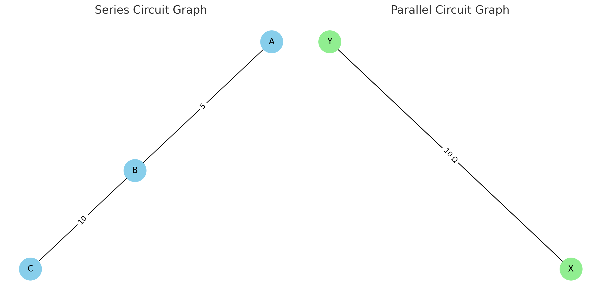
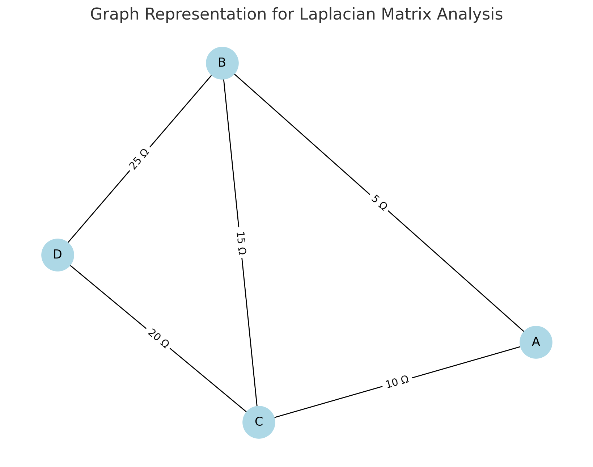

# Problem 1

# Equivalent Resistance Using Graph Theory

## Introduction
Understanding and analyzing electrical circuits is a fundamental aspect of electrical engineering and physics. One of the essential tasks in circuit analysis is determining the equivalent resistance between two points. Traditional methods rely on step-by-step application of series and parallel resistor combinations, which can become impractical for large and complex circuits. The need for a more systematic and scalable approach arises in applications such as circuit simulation, network analysis, and embedded system design.

Graph theory provides an alternative and efficient approach by representing the circuit as a weighted graph, where:

**Nodes** correspond to junctions.

**Edges** correspond to resistors with resistance values as weights.

By systematically simplifying this representation using graph algorithms, we can compute the equivalent resistance efficiently. This approach is particularly useful in modern circuit analysis tools, simulation software, and optimization techniques used in electronic circuit design. It also provides an automated way to handle complex networks, making the process faster and less prone to human errors.

## Motivation
Calculating equivalent resistance is a fundamental problem in electrical circuits, essential for understanding and designing efficient systems. Traditional methods involve iteratively applying series and parallel resistor rules, which become cumbersome for complex circuits. Graph theory provides a structured and algorithmic alternative, allowing us to model circuits as weighted graphs where:

**Nodes** represent circuit junctions.

**Edges** represent resistors, weighted by resistance values.

By employing graph reduction techniques, we can systematically simplify even intricate networks, leading to efficient circuit analysis methods used in modern applications like circuit simulation software, optimization problems, and network design. This method also integrates well with software-based solutions, allowing for real-time modifications and enhancements in circuit analysis.

## Theoretical Background

### Graph Representation of Electrical Circuits

An electrical circuit can be represented as a graph:
**Vertices (V):** Represent junctions where resistors connect.

**Edges (E):** Represent resistors, with edge weights corresponding to resistance values.

**Adjacency Matrix or List:** Used to store the graph structure, where each row represents a node and each column represents a connection to another node with a specific resistance value.

### Series and Parallel Resistance in Graphs


**Series Connection:**
   - Resistors in series have the same current flowing through them.

   - The total voltage across them is the sum of the individual voltages:

     $$
     V_{eq} = V_1 + V_2 + ... + V_n
     $$

   - Using Ohm’s Law (\( V = IR \)):

     $$
     I R_{eq} = I R_1 + I R_2 + ... + I R_n
     $$

   - Canceling the common current \( I \):

     $$
     R_{eq} = R_1 + R_2 + ... + R_n
     $$

   - Graphically, this corresponds to **contracting** a path of connected edges into a single edge, thus reducing the complexity of the graph.


**Parallel Connection:**
   - Resistors in parallel share the same voltage.

   - The total current is the sum of the individual currents:

     $$
     I_{eq} = I_1 + I_2 + ... + I_n
     $$

   - Using Ohm’s Law:

     $$
     \frac{V}{R_{eq}} = \frac{V}{R_1} + \frac{V}{R_2} + ... + \frac{V}{R_n}
     $$

   - Canceling the common voltage \( V \):

     $$
     \frac{1}{R_{eq}} = \frac{1}{R_1} + \frac{1}{R_2} + ... + \frac{1}{R_n}
     $$

   - Graphically, this corresponds to **merging** multiple edges between two nodes into a single edge with a new weight.

   - This merging reduces the computational complexity when analyzing circuits with multiple interconnected resistors.

### Extended Formulas for Complex Cases

For circuits involving mixed configurations of series and parallel resistances, the equivalent resistance must be determined iteratively. If a circuit consists of nested parallel and series resistances, the calculation follows a hierarchical approach:

- Identify the **innermost** parallel or series components.

- Compute their equivalent resistance.

- Replace these components with their equivalent resistance and repeat the process.

- Continue until only one resistance remains.

For example, if a circuit consists of three resistors \( R_1, R_2, R_3 \) arranged in a mixed configuration:

- \( R_1 \) and \( R_2 \) in parallel:

  $$
  \frac{1}{R_{12}} = \frac{1}{R_1} + \frac{1}{R_2}
  $$

- Then, \( R_{12} \) is in series with \( R_3 \):

  $$
  R_{eq} = R_{12} + R_3
  $$

- If an additional resistor \( R_4 \) is in parallel with \( R_{eq} \), we apply the parallel formula again:

  $$
  \frac{1}{R_{final}} = \frac{1}{R_{eq}} + \frac{1}{R_4}
  $$

Using advanced mathematical techniques such as **matrix representation of circuits** and **Laplace transformations**, we can generalize the problem for complex networks. The impedance matrix \( Z \) of the network can be derived using Kirchhoff’s laws and then reduced using determinant-based transformations.

# Equivalent Resistance Using Graph Theory

## Introduction
Understanding and analyzing electrical circuits is a fundamental aspect of electrical engineering and physics. One of the essential tasks in circuit analysis is determining the equivalent resistance between two points. Traditional methods rely on step-by-step application of series and parallel resistor combinations, which can become impractical for large and complex circuits. The need for a more systematic and scalable approach arises in applications such as circuit simulation, network analysis, and embedded system design.

Graph theory provides an alternative and efficient approach by representing the circuit as a weighted graph, where:
- **Nodes** correspond to junctions.
- **Edges** correspond to resistors with resistance values as weights.

By systematically simplifying this representation using graph algorithms, we can compute the equivalent resistance efficiently. This approach is particularly useful in modern circuit analysis tools, simulation software, and optimization techniques used in electronic circuit design. It also provides an automated way to handle complex networks, making the process faster and less prone to human errors.

---

## Graph Reduction Technique

This technique involves reducing a complex circuit graph to a simpler graph by:

**Series Reduction:** Replacing series resistors with their equivalent resistance.

**Parallel Reduction:** Replacing parallel resistors with their equivalent resistance.

**Recursive Simplification:** Continuously applying reduction rules until only the desired nodes remain.

---

## Differential Analysis of Graphs

In more complex circuits involving non-linear resistances or time-varying signals, the analysis requires differentiating network functions.

### Ohm’s Law and Differential Formulation

Using Ohm’s law, the relationship between current, voltage, and resistance can be written as:

$$ V = IR $$

If the resistance is a function of time or position, we can write:

$$ V(t) = I(t) R(t) $$

The rate of change of voltage with respect to time can be given by:

$$ \frac{dV}{dt} = \frac{d}{dt}(IR) = I \frac{dR}{dt} + R \frac{dI}{dt} $$

This can be useful when analyzing circuits with inductive or capacitive components where resistance may vary with frequency.

### Matrix Representation of Circuits

For complex circuits, the impedance matrix \( Z \) can be used to describe the system:

$$ V = ZI $$

Where \( Z \) is an \( n \times n \) matrix representing the impedances between nodes.

The individual elements of the matrix are calculated using the Laplacian matrix of the graph, where:

$$ Z_{ij} = \sum_{k} R_k \quad \text{if } i = j $$

$$ Z_{ij} = -R_k \quad \text{if there is an edge between } i \text{ and } j $$

This matrix formulation allows us to solve complex networks using **matrix inversion techniques** or numerical methods.

---

## Algorithm Description

### Goal

To calculate the equivalent resistance between two points in an electrical network represented as a graph.

### Algorithm Steps

**Input:** A graph representing the circuit, with nodes as junctions and edges as resistors with weights.

**Initialize:** Mark the starting node A and ending node B.

**Identify Series Connections:**

   - If a node has only two connections, merge them by adding their resistances.

**Identify Parallel Connections:**

   - If two nodes are connected by multiple resistors, replace them by a single resistor calculated using the formula:
     
$$
\frac{1}{R_{eq}} = \frac{1}{R_1} + \frac{1}{R_2} + ... + \frac{1}{R_n}
$$

**Simplify the Graph:**

   - Iteratively apply series and parallel reductions until only nodes A and B remain.

**Output:** The equivalent resistance between A and B.

---

## Example Calculation

Consider a simple circuit:

- Resistors: \( R_1 = 5 \Omega \), \( R_2 = 10 \Omega \), \( R_3 = 20 \Omega \).

- \( R_1 \) and \( R_2 \) are connected in parallel.

- \( R_3 \) is in series with the parallel combination.

Steps:

- Calculate parallel resistance:
   
$$
\frac{1}{R_{eq}} = \frac{1}{5} + \frac{1}{10} = \frac{2}{10} + \frac{1}{10} = \frac{3}{10}
$$

$$
R_{eq} = \frac{10}{3} \approx 3.33 \Omega
$$

- Calculate total resistance with series connection:
   
$$
R_{total} = 3.33 + 20 = 23.33 \Omega
$$

---

<details>
  <summary>Phyton codes.</summary>

```python
import matplotlib.pyplot as plt
import networkx as nx

# Create a series connection graph
series_graph = nx.Graph()
series_graph.add_edge("A", "B", weight=5)
series_graph.add_edge("B", "C", weight=10)

# Create a parallel connection graph using MultiGraph to allow multiple edges
parallel_graph = nx.MultiGraph()
parallel_graph.add_edge("X", "Y", weight=5, key='R1')
parallel_graph.add_edge("X", "Y", weight=10, key='R2')

# Plotting the series connection graph
plt.figure(figsize=(12, 6))

plt.subplot(1, 2, 1)
pos_series = nx.spring_layout(series_graph)
nx.draw(series_graph, pos_series, with_labels=True, node_color='skyblue', node_size=1000, font_size=12)
edge_labels_series = nx.get_edge_attributes(series_graph, 'weight')
nx.draw_networkx_edge_labels(series_graph, pos_series, edge_labels=edge_labels_series)
plt.title("Series Circuit Graph")

# Plotting the parallel connection graph
plt.subplot(1, 2, 2)
pos_parallel = nx.spring_layout(parallel_graph)
nx.draw(parallel_graph, pos_parallel, with_labels=True, node_color='lightgreen', node_size=1000, font_size=12)
edge_labels_parallel = {(u, v): f"{d['weight']} Ω" for u, v, d in parallel_graph.edges(data=True)}
nx.draw_networkx_edge_labels(parallel_graph, pos_parallel, edge_labels=edge_labels_parallel)
plt.title("Parallel Circuit Graph")

# Display the graphs
plt.tight_layout()
plt.show()

```
</details>



## Circuit Graph Representations

In electrical circuits, the graphical representation of series and parallel connections plays a crucial role in understanding the overall resistance and network structure. Below are visual representations of both series and parallel circuits using graph theory.

### Series Circuit Graph

The **Series Circuit Graph** demonstrates the connection of two resistors (5 Ω and 10 Ω) in series. In a series configuration:
- Resistors are connected end-to-end, forming a single path for current flow.
- The equivalent resistance is the sum of individual resistances:

  $$
  R_{eq} = R_1 + R_2 = 5 + 10 = 15 \Omega
  $$

#### Features of the Series Graph:

- **Nodes (A, B, C)** represent junctions.
- **Edges** represent resistors labeled with their resistance values.
- The graph layout is structured to show a linear connection, reflecting the series nature.

---

### Parallel Circuit Graph

The **Parallel Circuit Graph** demonstrates the connection of two resistors (5 Ω and 10 Ω) in parallel. In a parallel configuration:

- Resistors share the same voltage across them.

- The equivalent resistance is given by:

  $$
  \frac{1}{R_{eq}} = \frac{1}{R_1} + \frac{1}{R_2} = \frac{1}{5} + \frac{1}{10} = \frac{3}{10}
  $$

  $$
  R_{eq} = \frac{10}{3} \approx 3.33 \Omega
  $$

#### Features of the Parallel Graph:

**Nodes (X, Y)** represent connection points where the voltage is shared.

**Edges** represent multiple resistors connecting the same pair of nodes.

Parallel connections are visualized by multiple edges between the same nodes.

---

<details>
  <summary>Phyton codes.</summary>

```python
# Creating a graph for Laplacian Matrix demonstration
G_laplacian = nx.Graph()

# Adding edges with weights (resistors) between nodes
edges = [
    ("A", "B", 5),
    ("A", "C", 10),
    ("B", "C", 15),
    ("C", "D", 20),
    ("B", "D", 25)
]
G_laplacian.add_weighted_edges_from(edges)

# Plotting the graph
plt.figure(figsize=(8, 6))
pos_laplacian = nx.spring_layout(G_laplacian, seed=42)
nx.draw(G_laplacian, pos_laplacian, with_labels=True, node_color='lightblue', node_size=1000, font_size=12)
edge_labels_laplacian = nx.get_edge_attributes(G_laplacian, 'weight')
nx.draw_networkx_edge_labels(G_laplacian, pos_laplacian, edge_labels={(u, v): f"{d} Ω" for u, v, d in G_laplacian.edges(data='weight')})
plt.title("Graph Representation for Laplacian Matrix Analysis")
plt.show()

# Calculating the Laplacian matrix
Laplacian_matrix = nx.laplacian_matrix(G_laplacian).todense()
Laplacian_matrix

```
</details>




## Laplacian Matrix and Graph Analysis

In graph theory, the **Laplacian Matrix** is a powerful tool used to describe the connections between nodes in a circuit graph. The matrix representation allows us to perform efficient computations and solve complex networks using linear algebra techniques.

### Graph Representation for Laplacian Matrix Analysis
The graph below represents a network of resistors connected between four nodes: **A**, **B**, **C**, and **D**.

#### Graph Features:

**Nodes:** A, B, C, D

**Edges (with resistance values):**  

  - A - B (5 Ω)  
  - A - C (10 Ω)  
  - B - C (15 Ω)  
  - C - D (20 Ω)  
  - B - D (25 Ω)  

---

### Laplacian Matrix Definition

The Laplacian matrix \( L \) for an undirected graph is defined as:

$$
L_{ij} = \begin{cases} 
\sum_{k} R_k & \text{if } i = j \text{ (Sum of resistances connected to node } i) \\
-R_k & \text{if there is a resistor } R_k \text{ between nodes } i \text{ and } j \\
0 & \text{if nodes } i \text{ and } j \text{ are not directly connected}
\end{cases}
$$

---

### Calculated Laplacian Matrix

Using the above definition, the Laplacian matrix for our graph is:

$$
L = \begin{bmatrix} 
15 & -5 & -10 & 0 \\
-5 & 45 & -15 & -25 \\
-10 & -15 & 45 & -20 \\
0 & -25 & -20 & 45 
\end{bmatrix}
$$

---

### Graph Theory Advantage

The Laplacian matrix provides a robust way to:

- Identify node connections and how resistors are distributed in the network.

- Solve networks by applying **matrix inversion techniques**.

- Efficiently calculate **equivalent resistance** by transforming the problem into a system of linear equations.

---


---

### Graph Theory Advantage:

Using graph theory to represent electrical circuits simplifies the visualization and analysis of both series and parallel configurations. These graphical representations make it easier to understand how equivalent resistance is computed and how complex circuits can be reduced step by step.

By employing graph reduction techniques, these complex networks can be simplified systematically, providing efficient ways to calculate equivalent resistance and optimize circuit designs.


---

## Potential Improvements

- Automating detection of complex series and parallel combinations.

- Using data structures like adjacency matrices or lists for better efficiency.

- Applying matrix operations for solving larger networks.

---

## Conclusion

- The algorithm described here provides a structured approach for calculating the equivalent resistance of any circuit using graph theory. It allows for systematic simplification of even complex networks. This method is foundational for further development of automated circuit analysis tools.

- Furthermore, the integration of matrix analysis techniques such as the Laplacian Matrix provides a rigorous mathematical framework that can be applied to complex networks of arbitrary size. The application of differential analysis also makes this approach suitable for time-varying and AC circuits, enhancing its applicability to real-world systems.

- Future advancements in this approach could involve developing more efficient algorithms for identifying series and parallel connections automatically. Additionally, incorporating numerical solvers such as the Jacobi or Gauss-Seidel methods could significantly enhance computational efficiency, especially when dealing with large-scale networks.

- Overall, graph theory provides a powerful and versatile tool for understanding and analyzing electrical circuits. Its application extends beyond basic resistance calculations to include complex network analysis, transient behavior, and impedance calculations in AC circuits. As circuit analysis continues to evolve, the role of graph theory will likely expand, providing deeper insights and more efficient computational methods.

- The algorithm described here provides a structured approach for calculating the equivalent resistance of any circuit using graph theory. It allows for systematic simplification of even complex networks. This method is foundational for further development of automated circuit analysis tools.
---


