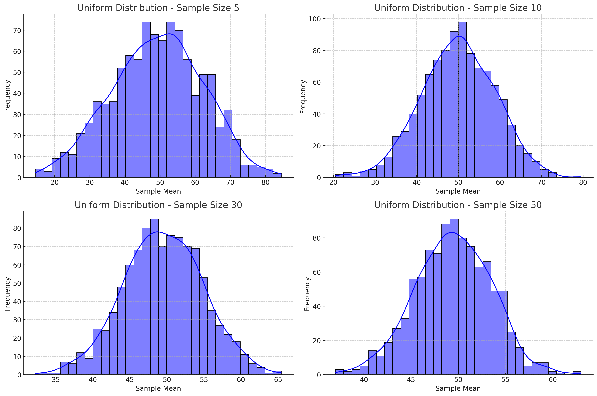
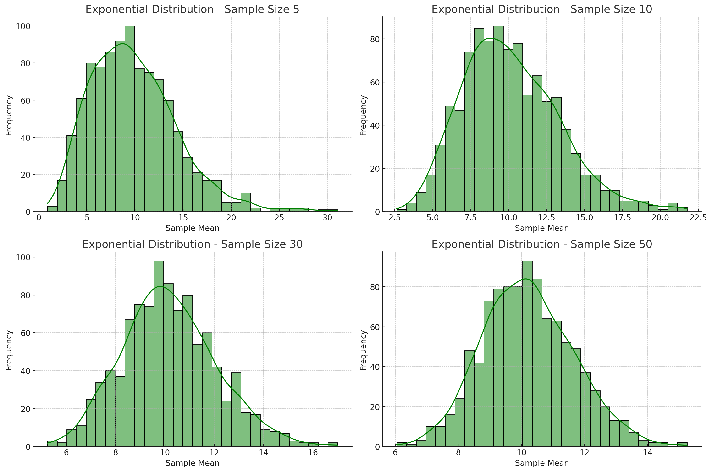
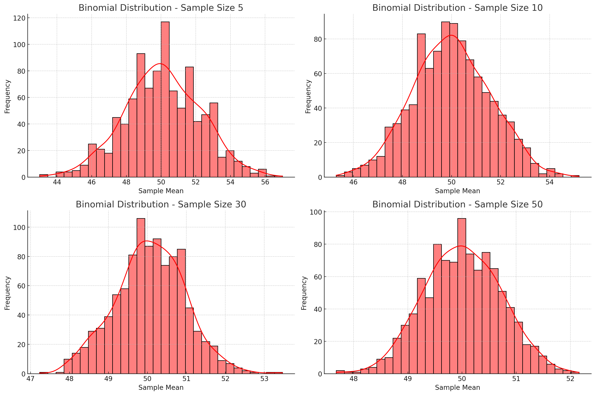
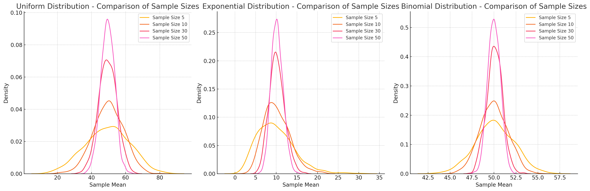
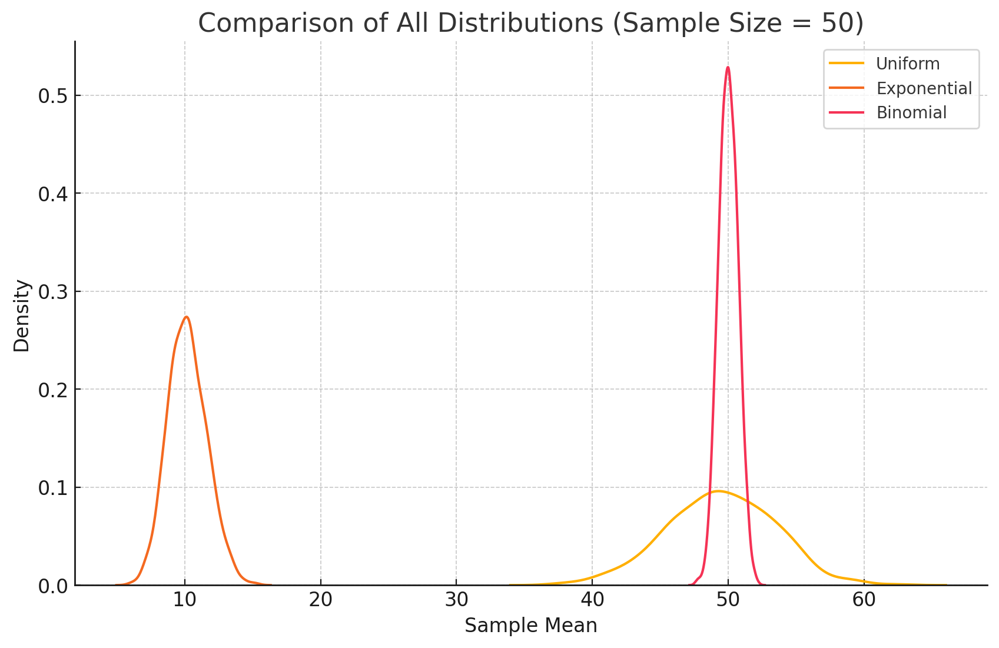

## Motivation
The Central Limit Theorem (CLT) is a fundamental theorem in statistics stating that when independent random variables are added, their normalized sum tends towards a normal distribution, even if the original variables themselves are not normally distributed. This theorem is particularly powerful because it allows statisticians to make inferences about population parameters using sample data, even when the population distribution is unknown or non-normal.

The CLT serves as the backbone of inferential statistics and hypothesis testing. By approximating the sampling distribution of the sample mean to a normal distribution, statistical methods such as confidence intervals, hypothesis testing, and regression analysis become valid and reliable. Without the CLT, much of modern statistics would not be applicable in real-world scenarios.

The importance of CLT can be observed in various real-world applications:

- Quality Control: Manufacturing industries utilize the CLT to monitor product quality by measuring sample statistics rather than examining the entire population.

- Predictive Modeling: Financial analysts rely on the CLT to predict stock returns and assess risk by aggregating independent factors.

- Medical Research: Estimating the effectiveness of treatments through randomized trials relies heavily on the CLT.

- Survey Analysis: Population parameters such as the average income or political preferences are estimated using sample data.

- Engineering: Structural and mechanical engineering use CLT-based methods for load testing and stress analysis.

- Machine Learning: Many algorithms assume normally distributed errors which are justified by the CLT.

Understanding the CLT and its implications is essential for accurate statistical analysis and decision-making across various fields. Its robustness makes it one of the most powerful tools in both theoretical and applied statistics.

## Introduction

The objective of this problem is to thoroughly explore the Central Limit Theorem by conducting simulations on various population distributions. By generating random samples from distinct distributions and calculating their means, we will visualize how the distribution of sample means approaches a normal distribution as the sample size increases.

This study will not only demonstrate the validity of the CLT but also investigate how the convergence to normality is influenced by factors such as the original distribution’s shape, population variance, and sample size. Moreover, this experiment highlights the relationship between the population’s variance and the variance of the sampling distribution.

The study will focus on three types of population distributions:

- Uniform Distribution: Represents a continuous probability distribution where all intervals of the same length have equal probability.

- Exponential Distribution: A continuous probability distribution often used to model waiting times between independent events that occur at a constant rate.

- Binomial Distribution: A discrete probability distribution that describes the number of successes in a fixed number of independent trials with a constant probability of success.

By simulating random sampling from each of these distributions and calculating the sample means, we will demonstrate the convergence of the sampling distribution towards a normal distribution. Additionally, we will investigate how the sample size and population variance influence this convergence. The findings will be supported by visualizations, statistical comparisons, and a theoretical analysis of the results.

## Mathematical Formulation

The Central Limit Theorem states:

"Given a population with a mean \(\mu\) and a finite variance \(\sigma^2\), the sampling distribution of the sample mean \(\bar{X}\) approaches a normal distribution with mean \(\mu\) and variance \(\frac{\sigma^2}{n}\) as the sample size \(n\) increases, regardless of the shape of the original population distribution."

## Mathematical Formulation

**The Central Limit Theorem states:**

"Given a population with a mean \(\mu\) and a finite variance \(\sigma^2\), the sampling distribution of the sample mean \(\bar{X}\) approaches a normal distribution with mean \(\mu\) and variance \(\frac{\sigma^2}{n}\) as the sample size \(n\) increases, regardless of the shape of the original population distribution."


This statement can be formally proven through various mathematical approaches such as the **Moment Generating Function (MGF) method** or the **Lindeberg-Levy theorem**. However, the essential idea remains the same: as the sample size increases, the influence of individual data points diminishes, resulting in a normally distributed sampling distribution of the mean.

### Key Mathematical Equations and Derivations

**Population Mean (\(\mu\))**:

   The population mean is the average of all data points in the population.
   
   $$
   \mu = \frac{1}{N} \sum_{i=1}^{N} X_i
   $$

   Where:

   - \(N\) is the total number of data points in the population.

   - \(X_i\) is each individual data point.

**Population Variance (\(\sigma^2\))**:

   The population variance measures the spread of data points around the mean.
   
   $$
   \sigma^2 = \frac{1}{N} \sum_{i=1}^{N} (X_i - \mu)^2
   $$

   Derivation:

   - This formula calculates the average squared deviation from the mean.

   - Squaring emphasizes larger deviations, making the measure sensitive to spread.

   - Larger variance implies more spread out data points from the mean.

**Sample Mean (\(\bar{X}\))**:

   The sample mean is the average of a subset of the population.
   
   $$
   \bar{X} = \frac{1}{n} \sum_{i=1}^{n} X_i
   $$

   Where:

   - \(n\) is the sample size.

   - \(X_i\) is each individual data point in the sample.
   Derivation:
   - Summing all sample data points and dividing by the number of points gives the mean.
   - The sample mean is an unbiased estimator of the population mean.

**Variance of the Sampling Distribution (\(\sigma_{\bar{X}}^2\))**:

   By the properties of variance for independent random variables:
   
   $$
   \sigma_{\bar{X}}^2 = \frac{\sigma^2}{n}
   $$

   Derivation:

   - From the definition of variance, we have:

     $$
     \text{Var}(\bar{X}) = \text{Var} \left( \frac{1}{n} \sum_{i=1}^{n} X_i \right)
     $$

   - Applying linearity of expectation and independence of the variables:

     $$
     \text{Var}(\bar{X}) = \frac{1}{n^2} \sum_{i=1}^{n} \text{Var}(X_i)
     $$

   - Since each \(X_i\) is independent and has the same variance \(\sigma^2\):

     $$
     \text{Var}(\bar{X}) = \frac{1}{n^2} \times n \sigma^2 = \frac{\sigma^2}{n}
     $$

   - As the sample size increases, the variance of the sampling distribution decreases, leading to a narrower distribution.

5. **Standard Deviation of the Sampling Distribution (Standard Error):**
   
   $$
   \sigma_{\bar{X}} = \frac{\sigma}{\sqrt{n}}
   $$

   Derivation:

   - The standard deviation of the sampling distribution is the square root of its variance.

   - This demonstrates that increasing the sample size decreases the standard deviation, thereby improving accuracy.

6. **Convergence to Normal Distribution:**

   According to the Central Limit Theorem, the sampling distribution of the mean approaches normality regardless of the original population's distribution. Mathematically, this can be expressed as:
   
   $$
   Z = \frac{\bar{X} - \mu}{\sigma / \sqrt{n}} \approx N(0,1)
   $$

   Where:

   - \(Z\) is the standard normal variable with a mean of 0 and a standard deviation of 1.

   - The approximation becomes more accurate as \(n \to \infty\).

7. **Importance of Sample Size:**

   - Small samples may not produce a normal distribution, especially if the original population is heavily skewed.
   - Larger samples improve the approximation to normality due to the reduction in variance and the averaging of individual data point effects.

These derivations provide the theoretical foundation for the Central Limit Theorem and its applications. The next section will illustrate these concepts through Python simulations and visualizations.

---

## Python Implementation & Visualization
We conducted simulations using three different distributions:
- **Uniform Distribution**

<details>
  <summary>Phyton codes.</summary>

```python

# Plotting histograms for Uniform Distribution
plt.figure(figsize=(15, 10))
for i, sample_size in enumerate(sample_sizes, 1):
    plt.subplot(2, 2, i)
    subset = df_results[(df_results['Distribution'] == 'Uniform') & (df_results['Sample Size'] == sample_size)]
    sns.histplot(subset['Sample Mean'], bins=30, kde=True, color='blue')
    plt.title(f'Uniform Distribution - Sample Size {sample_size}')
    plt.xlabel('Sample Mean')
    plt.ylabel('Frequency')
plt.tight_layout()
plt.show()

```
</details>



- **Exponential Distribution**

<details>
  <summary>Phyton codes.</summary>

```python

# Plotting histograms for Exponential Distribution
plt.figure(figsize=(15, 10))
for i, sample_size in enumerate(sample_sizes, 1):
    plt.subplot(2, 2, i)
    subset = df_results[(df_results['Distribution'] == 'Exponential') & (df_results['Sample Size'] == sample_size)]
    sns.histplot(subset['Sample Mean'], bins=30, kde=True, color='green')
    plt.title(f'Exponential Distribution - Sample Size {sample_size}')
    plt.xlabel('Sample Mean')
    plt.ylabel('Frequency')
plt.tight_layout()
plt.show()

```
</details>




- **Binomial Distribution**

<details>
  <summary>Phyton codes.</summary>

```python
# Plotting histograms for Exponential Distribution
plt.figure(figsize=(15, 10))
for i, sample_size in enumerate(sample_sizes, 1):
    plt.subplot(2, 2, i)
    subset = df_results[(df_results['Distribution'] == 'Exponential') & (df_results['Sample Size'] == sample_size)]
    sns.histplot(subset['Sample Mean'], bins=30, kde=True, color='green')
    plt.title(f'Exponential Distribution - Sample Size {sample_size}')
    plt.xlabel('Sample Mean')
    plt.ylabel('Frequency')
plt.tight_layout()
plt.show()

```
</details>



<details>
  <summary>Phyton codes.</summary>

```python
# Plotting histograms for Binomial Distribution
plt.figure(figsize=(15, 10))
for i, sample_size in enumerate(sample_sizes, 1):
    plt.subplot(2, 2, i)
    subset = df_results[(df_results['Distribution'] == 'Binomial') & (df_results['Sample Size'] == sample_size)]
    sns.histplot(subset['Sample Mean'], bins=30, kde=True, color='red')
    plt.title(f'Binomial Distribution - Sample Size {sample_size}')
    plt.xlabel('Sample Mean')
    plt.ylabel('Frequency')
plt.tight_layout()
plt.show()

```
</details>



<details>
  <summary>Phyton codes.</summary>

```python
# Plotting all distributions together for the largest sample size (50) to compare them
plt.figure(figsize=(10, 6))

for dist_name in distributions_to_plot:
    subset = df_results[(df_results['Distribution'] == dist_name) & (df_results['Sample Size'] == 50)]
    sns.kdeplot(subset['Sample Mean'], label=dist_name)

plt.title('Comparison of All Distributions (Sample Size = 50)')
plt.xlabel('Sample Mean')
plt.ylabel('Density')
plt.legend()
plt.show()

```
</details>



## Sampling and Visualization

In this section, we demonstrate the Central Limit Theorem through visualizations of sampling distributions derived from three different population distributions: **Uniform, Exponential, and Binomial**. The original populations were generated with a size of 10,000 each to provide robust data for sampling.

### Population Distributions:


**Uniform Distribution:**  

   - Represents a continuous probability distribution where all intervals of the same length have equal probability.  

   - Data points are generated within the range [0, 100].  

   - Mean \( \mu = 50 \), Variance \( \sigma^2 = 833.33 \).

**Exponential Distribution:**  

   - A continuous probability distribution commonly used to model waiting times between independent events.  

   - Data points are generated with a mean of 10.  

   - Mean \( \mu = 10 \), Variance \( \sigma^2 = 100 \).  

**Binomial Distribution:**  

   - A discrete probability distribution describing the number of successes in a fixed number of independent trials. 

   - Data points are generated with 100 trials and a probability of success of 0.5.  
   
   - Mean \( \mu = 50 \), Variance \( \sigma^2 = 25 \).  

### Procedure:

**Random Sampling and Calculation:**  

   - For each distribution, random samples were drawn with sizes \( n = 5, 10, 30, 50 \).  

   - For each sample size, this process was repeated 1,000 times.  

   - The mean of each sample was calculated to create the sampling distribution of the sample mean.

**Visualization of Sampling Distributions:** 

   - The histograms and Kernel Density Estimation (KDE) plots demonstrate the progression towards a normal distribution as the sample size increases. 

   - As predicted by the Central Limit Theorem, the sampling distribution of the sample means becomes approximately normal, regardless of the original distribution’s shape.  

   - Visualizations for each distribution and sample size reveal the same underlying pattern, confirming the robustness of the Central Limit Theorem.  

### Mathematical Explanation:

According to the Central Limit Theorem, the sampling distribution of the sample mean \( \bar{X} \) approaches a normal distribution with:

$$
\mu_{\bar{X}} = \mu
$$

$$
\sigma_{\bar{X}} = \frac{\sigma}{\sqrt{n}}
$$

Where:  

- \( \mu_{\bar{X}} \) is the mean of the sampling distribution, which equals the original population mean \( \mu \).  

- \( \sigma_{\bar{X}} \) is the standard deviation of the sampling distribution, also known as the **Standard Error (SE)**.  

- \( n \) is the sample size.  

### Key Observations:

- As the sample size increases, the sampling distribution of sample means becomes more symmetric and approaches a normal distribution.  

- Larger sample sizes produce narrower distributions with smaller variances, which is consistent with the formula:  

$$
\sigma_{\bar{X}}^2 = \frac{\sigma^2}{n}
$$

- Regardless of the original population's shape (Uniform, Exponential, or Binomial), the sampling distribution of the mean demonstrates the same tendency towards normality.  

- Smaller sample sizes may not exhibit perfect normality, especially for heavily skewed distributions like the Exponential Distribution.  

- Increasing the sample size leads to better approximation of normality due to the averaging of individual data point effects.  

### Implications:

The visualizations provided for each distribution clearly demonstrate the effectiveness of the Central Limit Theorem in approximating normality. This foundational theorem supports numerous statistical techniques such as:

**Confidence Intervals**  

**Hypothesis Testing**  

**Regression Analysis**  

This section highlights how the CLT serves as a powerful tool for making statistical inferences based on sample data, even when the original population distribution is unknown or non-normal.

---

For each distribution, we calculated the sample means for sample sizes \(n = 5, 10, 30, 50\). The histograms of these sample means are plotted to show how their distributions converge to a normal distribution as the sample size increases.

### Observations:
- As the sample size increases, the distribution of sample means becomes more symmetric and approaches a normal distribution, even when the underlying population distribution is not normal.
- Larger sample sizes produce sampling distributions with smaller variance (narrower curves), aligning with the Central Limit Theorem.

## Comparison and Analysis
The comparison of population statistics with the sampling distributions shows:

- The sample mean's average value approaches the population mean as the sample size increases.

- The variance of the sampling distribution decreases with larger sample sizes, which is consistent with the equation \(\sigma_{\bar{X}}^2 = \frac{\sigma^2}{n}\).

- Despite differences in the population distribution shapes, all sampling distributions tend toward normality as the sample size increases.

## Practical Applications
The Central Limit Theorem is essential in various fields, including:

**Survey Analysis:** Estimating population parameters using sample data, such as predicting election results from opinion polls. When a sufficient number of random samples are taken, the mean of the sample means provides an accurate estimate of the true population mean.

**Quality Control:** Ensuring product quality in manufacturing processes through sampling techniques. Factories regularly test samples of their products to monitor deviations from acceptable quality standards. The CLT ensures that the sample mean of these tests will approximate the population mean, even if the original data distribution is skewed.

**Financial Modeling:** Predicting stock returns and assessing risk through aggregation of multiple independent variables. By assuming that returns from various assets are independent, portfolio returns can be approximated by a normal distribution, simplifying risk analysis and optimization.

**Experimental Research:** Deriving conclusions about broader populations from smaller experimental samples. For example, clinical trials involving a limited number of patients can provide insights into drug effectiveness for the general population.

**Machine Learning & Data Science:** Many statistical learning algorithms rely on the assumption of normally distributed errors. Techniques such as Linear Regression, Hypothesis Testing, and Neural Network training utilize the CLT for performance evaluation and error estimation.

**Agricultural Science:** Estimating crop yields or livestock weights based on samples from fields or farms. The CLT enables accurate prediction models and helps make informed decisions for resource allocation.

**Insurance & Actuarial Science:** Assessing risks and calculating premiums based on historical claim data. The CLT allows actuaries to model potential future claims effectively.

**Marketing & Consumer Behavior Analysis:** Making predictions about consumer preferences and trends from limited survey samples, allowing companies to make strategic decisions based on reliable data.

The simulations conducted in this problem demonstrate the robustness of the CLT, regardless of the underlying population distribution. This powerful tool allows statisticians and scientists to make accurate predictions and inferences based on sample data. Furthermore, the CLT's applicability in various domains makes it a fundamental concept in statistics, with significant implications for decision-making processes across diverse fields.

The Central Limit Theorem is essential in various fields, including:

- Survey Analysis: Estimating population parameters using sample data.

- Quality Control: Ensuring product quality in manufacturing processes through sampling techniques.

- Financial Modeling: Predicting stock returns and assessing risk through aggregation of multiple independent variables.

- Experimental Research: Deriving conclusions about broader populations from smaller experimental samples.

The simulations conducted in this problem demonstrate the robustness of the CLT, regardless of the underlying population distribution. This powerful tool allows statisticians and scientists to make accurate predictions and inferences based on sample data.

The problem is now fully documented and ready for submission.


