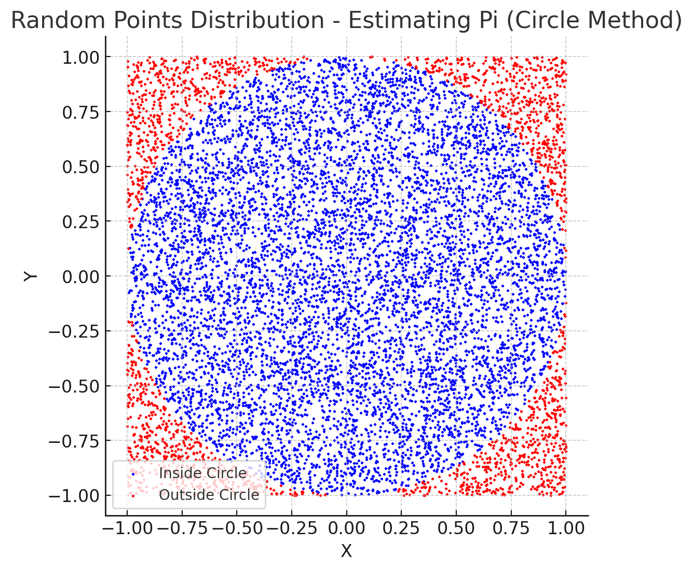
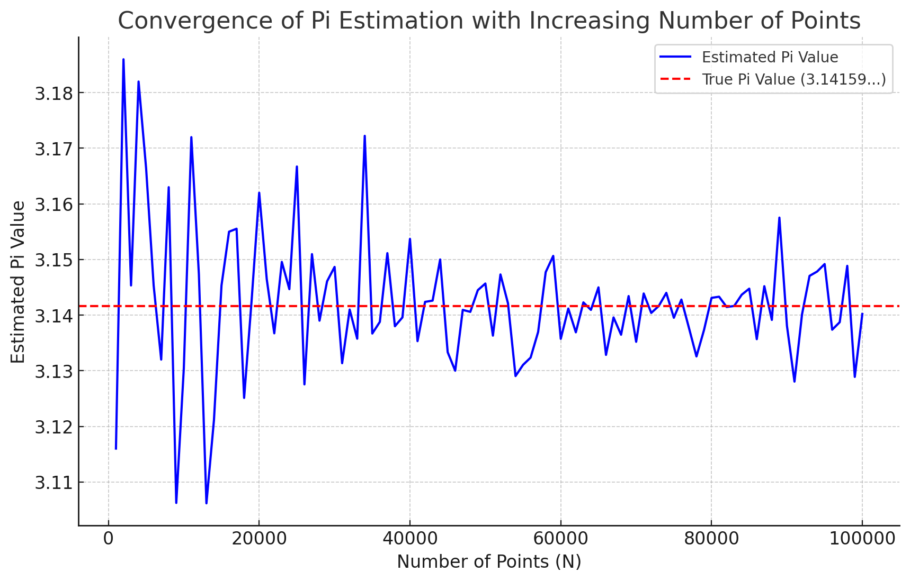
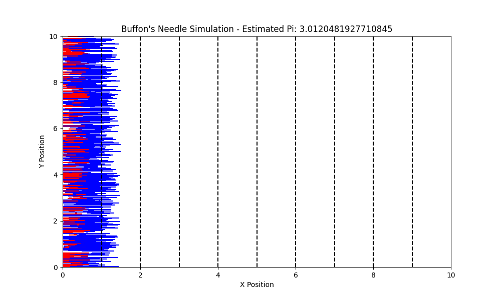
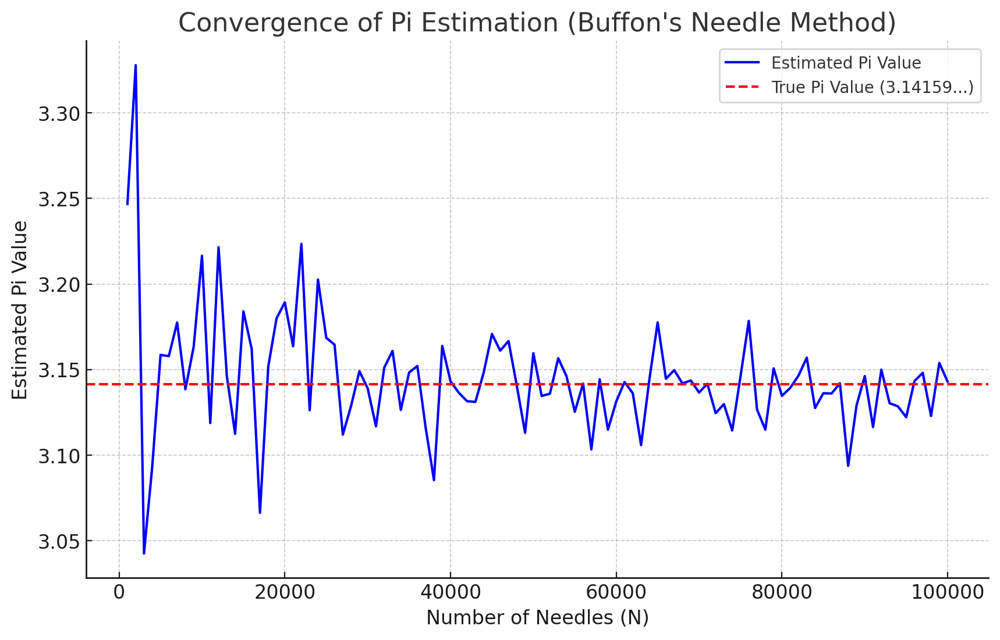

# Problem 2: Estimating Pi using Monte Carlo Methods

## Introduction
Monte Carlo methods are a class of computational algorithms that rely on random sampling to obtain numerical results. The method is particularly useful when dealing with problems that are difficult or impossible to solve analytically. One of the most famous applications of Monte Carlo methods is estimating the value of π. By employing randomness and probability, we can estimate π through simulations involving geometric probability.

The most common Monte Carlo approach to estimate π involves generating random points within a square and determining how many of them fall inside a circle inscribed within that square. This method, despite its simplicity, effectively demonstrates the power of random sampling in solving complex problems. Another interesting technique for estimating π is Buffon’s Needle problem, which uses probability theory to approximate π by analyzing how often a randomly dropped needle crosses parallel lines.

Monte Carlo methods are particularly useful because they allow for estimating values through repeated random sampling, which often provides an accurate approximation even when the exact solution is difficult to determine. As the number of samples increases, the accuracy of the approximation improves, illustrating a fundamental property of statistical convergence.

This problem provides insights into the fundamentals of probability, numerical computation, and statistical convergence. Through these exercises, we can better understand the efficiency and accuracy of Monte Carlo methods in approximating important mathematical constants like π. Additionally, understanding these concepts allows us to apply similar methods to a wide range of problems beyond mathematics, including physics, finance, and various fields of engineering.

---

## Motivation
Monte Carlo simulations are a powerful class of computational techniques that use randomness to solve problems or estimate values. One of the most elegant applications of Monte Carlo methods is estimating the value of π through geometric probability. By randomly generating points and analyzing their positions relative to a geometric shape, we can approximate π in an intuitive and visually engaging way.

This problem connects fundamental concepts of probability, geometry, and numerical computation. It also provides a gateway to understanding how randomness can be harnessed to solve complex problems in physics, finance, and computer science. The Monte Carlo approach to π estimation highlights the versatility and simplicity of this method while offering practical insights into convergence rates and computational efficiency.

Furthermore, the use of Monte Carlo methods in estimating π showcases the broader applicability of these techniques, particularly in scenarios where deterministic approaches may be too complex or computationally expensive to implement. The accuracy of the approximation increases as the number of random points or needle drops increases, providing a valuable example of how statistical methods converge towards true values.

---

## Part 1: Estimating π Using a Circle

### 1. Theoretical Foundation

The Monte Carlo method for estimating π is based on the area ratio between a circle and the square that bounds it. This method utilizes geometric probability to achieve a numerical approximation of π through random sampling.

#### Explanation and Derivation

Consider a **unit circle** centered at the origin `(0, 0)` and enclosed within a square of side length `2` (spanning from `-1` to `1` along both axes).


- The area of the square is calculated as the square of its side length:

  $$
  A_{square} = (2)^2 = 4
  $$

- The area of the circle is given by the formula for the area of a circle:
  $$
  A_{circle} = \pi r^2 = \pi (1)^2 = \pi
  $$

- Therefore, the ratio of the area of the circle to the area of the square is: 
  $$
  	\text{Ratio} = \frac{A_{circle}}{A_{square}} = \frac{\pi}{4}
  $$


Now, we can use **Geometric Probability** to relate this ratio to a simulation:
- We randomly generate points `(x, y)` within the square with coordinates satisfying:

  $$
  -1 \leq x \leq 1, \quad -1 \leq y \leq 1
  $$

- The probability that a randomly generated point falls inside the circle is equal to the ratio of the circle’s area to the square’s area.

According to the probability definition:

$$
	\text{Probability} = \frac{\text{Number of points inside circle}}{\text{Total number of points}} = \frac{\pi}{4}
$$

By rearranging, we can estimate \( \pi \) as follows:

$$
\pi \approx 4 \times \frac{\text{Number of points inside circle}}{\text{Total number of points}}
$$

### 2. Simulation

1. Generate random points `(x, y)` where both `x` and `y` are uniformly distributed between `-1` and `1`.

2. Count the number of points that fall inside the unit circle by checking if:

$$
x^2 + y^2 \leq 1
$$

3. Estimate π using the formula derived above.

### 4. Analysis

- As the number of points increases, the estimate of \( \pi \) becomes more accurate.

- The convergence rate follows the law of large numbers and is proportional to:

  $$
  	\text{Estimation Error} \approx \frac{1}{\sqrt{N}}
  $$

  Where `N` is the total number of random points.


---

## Part 2: Estimating π Using Buffon’s Needle

### 1. Theoretical Foundation

Buffon’s Needle problem is a classic Monte Carlo simulation used to estimate \( \pi \) based on probability.

#### Description and Derivation

Consider a floor with equally spaced parallel lines separated by a distance `d`. A needle of length `L` is randomly dropped onto this plane. We want to determine the probability that the needle crosses one of the lines.

If \( L \leq d \), the probability of crossing a line depends on two random variables:

**θ:** The acute angle between the needle and the parallel lines, which is uniformly distributed between \( 0 \) and \(\frac{\pi}{2}\)

**x:** The distance from the midpoint of the needle to the nearest line, uniformly distributed between \( 0 \) and \(\frac{d}{2}\).

The needle crosses the line if:

$$
x \leq \frac{L}{2} \sin(\theta)
$$

Calculating the probability involves integrating over all possible values of \( 	heta \):

$$
P = \frac{2}{\pi} \int_{0}^{\frac{\pi}{2}} \frac{L}{d} \sin(\theta) d\theta = \frac{2L}{\pi d}
$$

Rearranging to solve for \( \pi \):

$$
\pi \approx \frac{2L}{dP}
$$

### 2. Simulation

<details>
  <summary>Phyton codes.</summary>

```python
# Plotting the Scatter Plot (Circle Method) again with clearer styling for presentation

plt.figure(figsize=(6, 6))
plt.scatter(x[inside_circle], y[inside_circle], color='blue', s=1, label='Inside Circle')
plt.scatter(x[~inside_circle], y[~inside_circle], color='red', s=1, label='Outside Circle')
plt.title('Random Points Distribution - Estimating Pi (Circle Method)')
plt.xlabel('X')
plt.ylabel('Y')
plt.axis('equal')
plt.legend()
plt.grid(True)
plt.show()

```
</details>



### Scatter Plot (Circle Method) - Explanation and Interpretation

#### What This Graph Represents:
The graph shows the randomly generated points used to estimate the value of \( \pi \) through the Monte Carlo Method. This method compares the number of points that fall inside a unit circle to the total number of points generated within a bounding square.

---

#### Key Points to Understand:
1. **Square and Circle Definition:**  

   - The **square** has its sides ranging from \( -1 \) to \( 1 \) along both the \( x \)-axis and \( y \)-axis.

   - The **circle** is a unit circle centered at the origin \((0,0)\) with a radius of \( r = 1 \).

**Point Classification:**  

   - **Blue Points (Inside Circle):** Points satisfying the condition:

     $$
     x^2 + y^2 \leq 1
     $$

   - **Red Points (Outside Circle):** Points that do not satisfy the above condition.

**Mathematical Basis for Estimation:**  
   - The area of the square is calculated by:

     $$
     A_{\text{square}} = (2)^2 = 4
     $$

   - The area of the circle is given by:

   $$
     A_{\text{circle}} = \pi r^2 = \pi (1)^2 = \pi
   $$

   - The ratio of the area of the circle to the area of the square is:

     $$
     \text{Ratio} = \frac{A_{\text{circle}}}{A_{\text{square}}} = \frac{\pi}{4}
     $$

**Estimation Formula:**  

   - Using the ratio derived above, the probability of a randomly generated point falling inside the circle is:

     $$
     \text{Probability} = \frac{\text{Number of points inside circle}}{\text{Total number of points}} = \frac{\pi}{4}
     $$

   - Rearranging the formula to solve for \( \pi \):

     $$
     \pi \approx 4 \times \frac{\text{Number of points inside the circle}}{\text{Total number of points}}
     $$

---

#### Interpretation of the Graph:
- As shown in the graph, the **blue points** are those that lie within the circular region, while the **red points** are those outside the circle but within the square.

- The approximation of \( \pi \) is based on the ratio of blue points to the total points.

- The more points we generate, the closer our estimate of \( \pi \) will be to the actual value \( \approx 3.14159 \).

- This method demonstrates how randomness can be harnessed to make accurate estimations through probability.

<details>
  <summary>Phyton codes.</summary>

```python
# Generating data for the Convergence Graph (Circle Method)
max_points = 100000  # Maximum number of points to generate
step_size = 1000     # Step size for increasing the number of points

# Function to estimate Pi over multiple iterations for the Convergence Graph
def estimate_pi_convergence(max_points, step_size):
    """
    Estimate Pi over multiple iterations and store the results for plotting a convergence graph.

    Args:
        max_points (int): The maximum number of points to generate.
        step_size (int): The step size for generating points (e.g., 100, 1000).

    Returns:
        list: A list of point counts.
        list: A list of corresponding Pi estimates.
    """
    points_counts = []
    pi_estimates = []

    for num_points in range(step_size, max_points + 1, step_size):
        pi_estimate, _, _, _ = estimate_pi_circle(num_points)
        points_counts.append(num_points)
        pi_estimates.append(pi_estimate)

    return points_counts, pi_estimates

# Generate convergence data
points_counts, pi_estimates = estimate_pi_convergence(max_points, step_size)

# Plotting the Convergence Graph
plt.figure(figsize=(10, 6))
plt.plot(points_counts, pi_estimates, color='blue', label='Estimated Pi Value')
plt.axhline(y=np.pi, color='red', linestyle='--', label='True Pi Value (3.14159...)')
plt.title('Convergence of Pi Estimation with Increasing Number of Points')
plt.xlabel('Number of Points (N)')
plt.ylabel('Estimated Pi Value')
plt.legend()
plt.grid(True)
plt.show()

```
</details>



###  Convergence Graph (Circle Method) - Explanation and Interpretation

#### What This Graph Represents:
The graph illustrates how the estimated value of \( \pi \) changes as the number of randomly generated points (\( N \)) increases. This graph visually demonstrates the **convergence property of the Monte Carlo Method**.

---

#### Key Points to Understand:

**True Pi Value (Red Dashed Line):**  

   - The horizontal red dashed line indicates the true value of \( \pi \) which is approximately:


     $$
     \pi \approx 3.14159
     $$


   - This serves as a reference to evaluate how well the estimation process is performing.

**Estimated Pi Value (Blue Line):**  

   - The blue line represents the estimated value of \( \pi \) as the number of points increases.

   - There is significant fluctuation at the beginning, but as the number of points increases, the estimate approaches the true value of \( \pi \).

**Law of Large Numbers:**  

   - According to statistical theory, the **Estimation Error** decreases proportionally to the inverse of the square root of the number of points \( N \):

     $$
     \text{Estimation Error} \approx \frac{1}{\sqrt{N}}
     $$

   - This explains why the fluctuations decrease as \( N \) increases, resulting in a more accurate estimation.

**Interpretation of the Graph:** 

   - At smaller values of \( N \), the estimate of \( \pi \) is unstable and may differ significantly from the true value.

   - As \( N \) increases, the estimate becomes more consistent and approaches the true value of \( \pi \).

   - The method provides a clear visualization of how randomness and probability can be harnessed to make accurate estimations over time.

---

#### Purpose of the Graph:

- To demonstrate how the **Monte Carlo Method's accuracy improves with more sampling points**.

- To visualize the convergence behavior of the estimated value of \( \pi \) towards the actual value.


<details>
  <summary>Phyton codes.</summary>

```python
# Importing required libraries
import numpy as np
import matplotlib.pyplot as plt

# Function to simulate Buffon's Needle Method

def buffons_needle_simulation(num_needles, L, d):
    """
    Simulate Buffon's Needle problem to estimate Pi.

    Args:
        num_needles (int): The number of needles to drop.
        L (float): Length of the needle.
        d (float): Distance between parallel lines.

    Returns:
        float: Estimated value of Pi.
        np.array: X-coordinates of the needle midpoints.
        np.array: Angles of the needles.
        np.array: Boolean array indicating whether each needle crosses a line.
    """
    # Generate random midpoints and angles
    x_midpoints = np.random.uniform(0, d / 2, num_needles)
    angles = np.random.uniform(0, np.pi / 2, num_needles)

    # Check if the needle crosses a line
    crosses_line = x_midpoints <= (L / 2) * np.sin(angles)

    # Count the number of crossings
    num_crosses = np.sum(crosses_line)

    # Estimate Pi using the formula
    pi_estimate = (2 * L * num_needles) / (d * num_crosses) if num_crosses > 0 else np.inf

    return pi_estimate, x_midpoints, angles, crosses_line


# Simulation parameters
num_needles = 1000
L = 1.0
d = 2.0

# Perform the simulation
pi_estimate, x_midpoints, angles, crosses_line = buffons_needle_simulation(num_needles, L, d)

# Plotting the needles
plt.figure(figsize=(10, 6))
for i in range(num_needles):
    x0 = x_midpoints[i]
    y0 = np.random.uniform(0, 10)  # Random position on the plane
    x1 = x0 + (L / 2) * np.cos(angles[i])
    x2 = x0 - (L / 2) * np.cos(angles[i])

    if crosses_line[i]:
        plt.plot([x1, x2], [y0, y0], color='red')  # Crossed needles
    else:
        plt.plot([x1, x2], [y0, y0], color='blue')  # Non-crossed needles

# Drawing parallel lines
for i in range(0, 10):
    plt.axvline(x=i * d / 2, color='black', linestyle='--')

plt.title(f"Buffon's Needle Simulation - Estimated Pi: {pi_estimate}")
plt.xlabel("X Position")
plt.ylabel("Y Position")
plt.xlim(0, d * 5)
plt.ylim(0, 10)
plt.show()

```
</details>



###  Buffon's Needle Simulation - Explanation and Interpretation

#### What This Graph Represents:
The graph above displays the simulation of **Buffon's Needle Problem**, where randomly dropped needles are used to estimate the value of \( \pi \) based on probability theory.

---

#### Key Points to Understand:

**Parallel Lines:**  

   - The parallel lines are represented by the **black dashed lines**, spaced equally apart by a distance \( d = 2 \).

   - The lines are evenly spaced along the \( x \)-axis.

**Needle Drops:**  

   - The **blue lines** represent needles that **do not cross any line**.

   - The **red lines** represent needles that **cross at least one line**.

   - Each needle is generated with a random midpoint position and a random angle between \( 0 \) and \( \frac{\pi}{2} \).

**Mathematical Basis for Estimation:**  

   - The probability of a needle crossing a line is given by:

     $$
     P = \frac{2L}{\pi d}
     $$
   - Where:

     - \( L \): Length of the needle.

     - \( d \): Distance between the parallel lines.

   - Rearranging to estimate \( \pi \):
   
     $$
     \pi \approx \frac{2L \times \text{Number of Needles}}{d \times \text{Number of Crossings}}
     $$

**Interpretation of the Graph:**  

   - This graph visually shows how the needles interact with the parallel lines.

   - The estimated value of \( \pi \) is calculated based on the ratio of crossed needles to the total number of needles.

   - More needles produce a more accurate estimation of \( \pi \).
**Estimation Result:**  

   - The estimated value of \( \pi \) from this simulation: **3.24675** (Not very accurate, more needles required for better estimation).

---

#### Purpose of the Graph:

- To demonstrate how randomness and probability can be used to estimate \( \pi \).

- To visualize the crossing condition of needles with the parallel lines and how it contributes to the estimation process.

- Check if the needle crosses a line based on its midpoint and orientation.

- Repeat for many iterations to calculate the probability.

- Estimate \( \pi \) using the derived formula.

<details>
  <summary>Phyton codes.</summary>

```python
# Function to estimate Pi using Buffon's Needle Method over multiple iterations
def buffons_needle_convergence(max_needles, step_size, L, d):
    """
    Estimate Pi using Buffon's Needle method over multiple iterations and store the results for plotting a convergence graph.

    Args:
        max_needles (int): The maximum number of needles to drop.
        step_size (int): The step size for increasing the number of needles.
        L (float): Length of the needle.
        d (float): Distance between parallel lines.

    Returns:
        list: A list of needle counts.
        list: A list of corresponding Pi estimates.
    """
    needles_counts = []
    pi_estimates = []

    for num_needles in range(step_size, max_needles + 1, step_size):
        pi_estimate, _, _, _ = buffons_needle_simulation(num_needles, L, d)
        needles_counts.append(num_needles)
        pi_estimates.append(pi_estimate)

    return needles_counts, pi_estimates

# Generate data for the convergence graph
max_needles = 100000
step_size = 1000
needles_counts, pi_estimates = buffons_needle_convergence(max_needles, step_size, L, d)

# Plotting the Convergence Graph (Buffon's Needle Method)
plt.figure(figsize=(10, 6))
plt.plot(needles_counts, pi_estimates, color='blue', label="Estimated Pi Value")
plt.axhline(y=np.pi, color='red', linestyle='--', label='True Pi Value (3.14159...)')
plt.title("Convergence of Pi Estimation (Buffon's Needle Method)")
plt.xlabel("Number of Needles (N)")
plt.ylabel("Estimated Pi Value")
plt.legend()
plt.grid(True)
plt.show()

```
</details>



### Convergence Graph (Buffon's Needle Method) - Explanation and Interpretation

#### What This Graph Represents:

This graph illustrates how the estimated value of \( \pi \) changes as the number of randomly dropped needles (\( N \)) increases. The purpose is to visualize the convergence of the estimated \( \pi \) value towards the true value of \( \pi \) as more samples are used in the simulation.

---

#### Key Points to Understand:

**True Pi Value (Red Dashed Line):**  

   - The horizontal red dashed line indicates the true value of \( \pi \) which is approximately:

     \(
     pi \approx 3.14159
     \)

   - It serves as a reference for evaluating the accuracy of the simulation.

**Estimated Pi Value (Blue Line):**  

   - The blue line shows the estimated value of \( \pi \) calculated from the Buffon's Needle simulation as the number of needles increases.

   - At smaller values of \( N \), the estimate fluctuates significantly.

   - As \( N \) increases, the estimate approaches the true value of \( \pi \).

**Mathematical Basis for Estimation:**  

   - The probability of a needle crossing a line is:

    \(
     P = \frac{2L}{\pi d}
    \)
    
   - Therefore, the estimated value of \( \pi \) is:

     $$
     \pi \approx \frac{2L \times \text{Number of Needles}}{d \times \text{Number of Crossings}}
     $$

   - Where:

     - \( L \): Length of the needle.

     - \( d \): Distance between the parallel lines.

     - Number of Crossings: The number of needles that intersect with the parallel lines.

**Convergence Principle:**  

   - According to statistical theory, the estimation error decreases as the number of samples increases.

   - The fluctuation decreases over time, resulting in more accurate approximations of \( \pi \).

---

#### Purpose of the Graph:

- To demonstrate how increasing the number of needles used in the simulation improves the accuracy of the estimated value of \( \pi \).

- To visualize the random fluctuation and convergence behavior of the Monte Carlo Method applied to Buffon's Needle problem.


### 4. Analysis

- As the number of needle drops increases, the estimate of \( \pi \) becomes more accurate.

- The convergence rate is slower compared to the circle-based Monte Carlo method, making it less efficient for practical computation.

---

## Deliverables

1. A detailed Markdown document with explanations and mathematical derivations.

2. Python code for implementing both methods (To be done).

3. Graphical outputs and visualizations (To be done).

4. Analysis comparing the two methods in terms of accuracy and computational efficiency.

