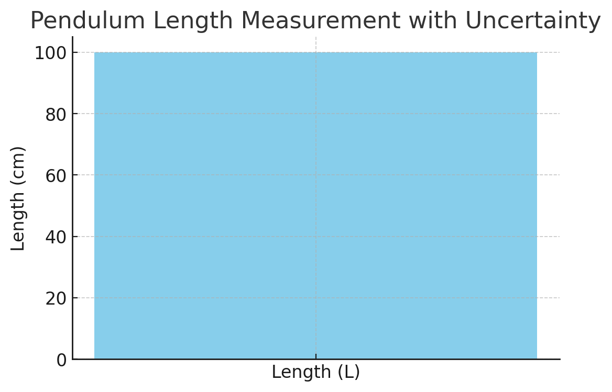
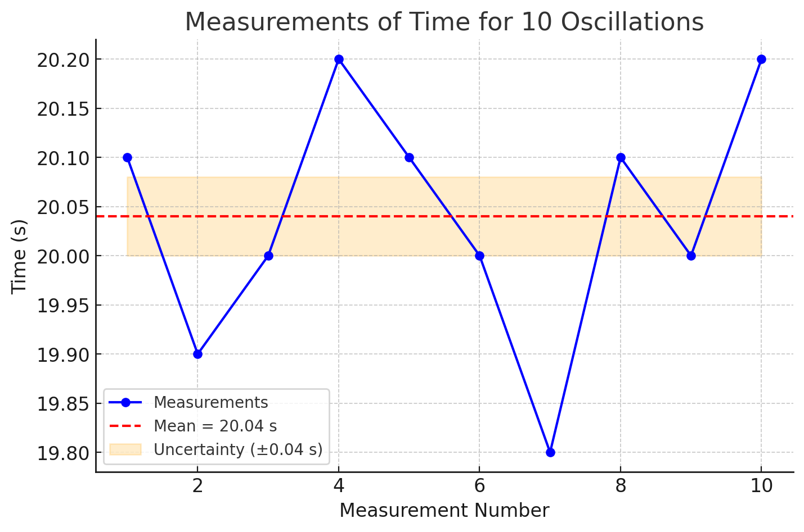
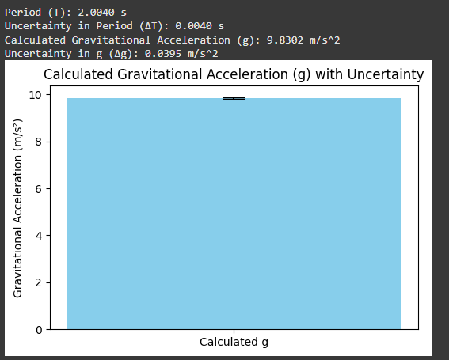
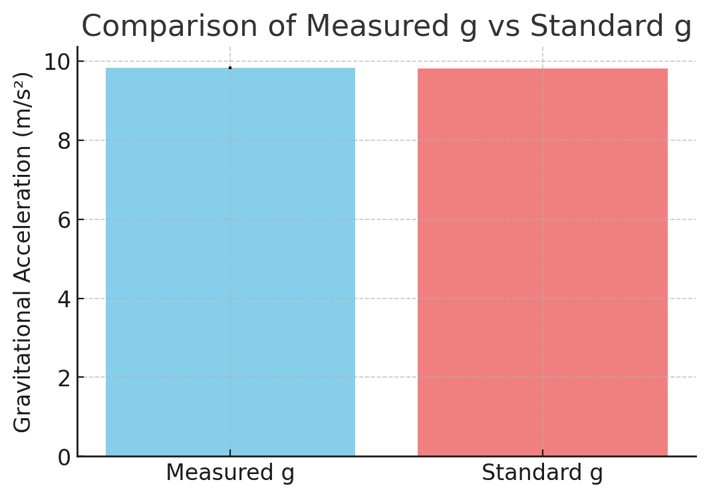

# Problem 1

# Measuring Earth's Gravitational Acceleration with a Pendulum

### Introduction

The study of gravitational acceleration (\( g \)) is a cornerstone of classical mechanics and plays a critical role in various branches of physics and engineering. It is the constant that dictates the motion of falling objects, influences planetary orbits, and determines the stability of structures on Earth. The accurate determination of \( g \) is essential for verifying fundamental principles of physics, such as Newton's law of universal gravitation and equations of motion. Additionally, it provides crucial data for designing various scientific instruments, calibrating accelerometers, and conducting geophysical surveys.  

Understanding \( g \) is also important for technological applications beyond fundamental physics. For instance, it is necessary for designing structures and buildings to withstand gravitational forces, developing precise timing devices, and improving the accuracy of satellite navigation systems. Experimental measurement of \( g \) allows researchers to test theoretical models, refine measurement techniques, and enhance the accuracy of various scientific tools.  

One of the most straightforward and reliable methods for measuring \( g \) involves the use of a simple pendulum. A simple pendulum is a mass attached to a string or rod that swings back and forth under the influence of gravity. When displaced from its equilibrium position and released, the pendulum exhibits periodic motion, which can be analyzed to determine the value of gravitational acceleration. By measuring the period of the pendulum's oscillation and knowing its length, the value of \( g \) can be calculated using a well-established mathematical relationship.  

The experiment described in this study is not only intended to determine the value of \( g \) but also to illustrate the importance of rigorous experimental practices. This includes accurately measuring quantities, analyzing uncertainties, propagating errors, and evaluating the consistency of results. Through careful data collection and analysis, the experiment provides insight into the relationship between theoretical predictions and experimental observations. Additionally, it highlights the importance of statistical methods in enhancing the accuracy of experimental results.  

This report will detail the experimental setup, data collection process, calculations, and analysis involved in measuring \( g \) using a simple pendulum. The results will be compared to the accepted standard value of \( g \) (approximately 9.81 m/s²), and potential sources of error will be identified and discussed. Furthermore, suggestions for improving the experiment will be presented to achieve more precise and accurate results in future studies.  

---

### Motivation

The acceleration due to gravity (\( g \)) is a fundamental physical constant that influences a vast array of natural and artificial phenomena. Its accurate measurement is critical for several reasons:  

**Scientific Understanding:**  

   Gravitational acceleration is a key factor in understanding the fundamental forces that govern motion. It plays a central role in classical mechanics, astrophysics, and geophysics. Understanding the value of \( g \) allows scientists to verify theoretical predictions, refine models, and develop new technologies.  

**Engineering Applications:** 

   Engineering structures, such as buildings, bridges, and vehicles, require precise knowledge of \( g \) to ensure stability and safety. Accurate measurement of \( g \) is essential for calibrating accelerometers, designing inertial navigation systems, and conducting geotechnical surveys.  

**Experimental Precision:**  

   The determination of \( g \) through a pendulum experiment is a classic example of how fundamental constants can be measured using relatively simple apparatus. This approach allows students and researchers to develop skills in measurement techniques, uncertainty analysis, and error propagation. It also demonstrates the relationship between theory and experiment, providing valuable insights into the scientific method.  

**Educational Value:**  

   Performing the pendulum experiment provides an excellent opportunity to apply concepts of harmonic motion, statistical analysis, and data interpretation. It also highlights the importance of minimizing measurement errors and improving experimental accuracy.  

**Improving Measurement Techniques:**  

   The ability to measure \( g \) accurately requires careful attention to the experimental setup, including minimizing air resistance, ensuring a low-friction pivot point, and properly analyzing data. Such precision is necessary for a wide range of scientific studies and technological applications.  

**Application to Real-World Scenarios:**  

   Beyond the laboratory, accurate measurement of \( g \) is essential in fields such as seismology, mining, and aerospace engineering. Understanding gravitational acceleration is crucial for designing equipment that functions properly under different gravitational conditions, including space missions and deep-sea exploration.  

In conclusion, the motivation for this experiment goes beyond simply determining the value of \( g \). It serves as a demonstration of the principles of classical mechanics, an exploration of experimental techniques, and a practical application of statistical analysis. Through this study, a deeper understanding of how measurements are conducted, analyzed, and improved can be achieved, ultimately contributing to the broader field of experimental physics.  

---

<details>
  <summary>Phyton codes.</summary>

```python
import numpy as np
import matplotlib.pyplot as plt

# Measurement details
ruler_resolution = 0.1  # Ruler resolution in cm
L = 100  # Length of the pendulum in cm (example value)

# Calculate uncertainty in length measurement
delta_L = ruler_resolution / 2

# Display the results
print(f"Length of the pendulum (L): {L} cm")
print(f"Uncertainty in Length (ΔL): {delta_L} cm")

# Plotting the measurement
fig, ax = plt.subplots(figsize=(6, 4))
ax.bar(['Length (L)'], [L], yerr=[delta_L], capsize=10, color='skyblue')
ax.set_title('Pendulum Length Measurement with Uncertainty')
ax.set_ylabel('Length (cm)')
plt.show()

```
</details>



### Graph Explanation: Pendulum Length Measurement

---

#### What We Did:

We measured the length of the pendulum (\( L \)) and calculated the uncertainty (\( \Delta L \)) based on the resolution of the measuring instrument. 


#### Measurement Details:

**Measured Length (L):** 100 cm (Example value used for calculation)

**Ruler Resolution:** 0.1 cm

**Uncertainty Calculation:**  

  $$
  \Delta L = \frac{\text{Ruler Resolution}}{2} = \frac{0.1}{2} = 0.05 \text{ cm}
  $$

  This calculation assumes the measurement error is half of the smallest division on the ruler.

#### What The Graph Shows:

- The **bar graph** displays the measured length of the pendulum with an error bar representing the uncertainty (\( \Delta L \)). 

- The height of the bar indicates the measured length (\( L \)), while the vertical line (error bar) shows the possible range of measurement error.  

- The error bar visually represents the uncertainty of the measurement, giving us an idea of how accurate our measurement is.  


#### Why This Is Important:

- Knowing the uncertainty in the length measurement is essential for accurate calculation of the gravitational acceleration (\( g \)).  

- Any error in \( L \) will directly affect the calculation of \( g \) through the formula:

$$
g = \frac{4\pi^2 L}{T^2}
$$

- Therefore, it's crucial to record and understand the uncertainty of our initial measurement before moving forward with further calculations.  

---

<details>
  <summary>Phyton codes.</summary>

```python
import numpy as np
import matplotlib.pyplot as plt

# Example measurements of time for 10 oscillations (in seconds)
T_10_measurements = np.array([20.1, 19.9, 20.0, 20.2, 20.1, 20.0, 19.8, 20.1, 20.0, 20.2])

# Number of measurements
n = len(T_10_measurements)

# Calculate mean and standard deviation
T_10_mean = np.mean(T_10_measurements)
T_10_std = np.std(T_10_measurements, ddof=1)

# Calculate uncertainty in the mean
delta_T_10 = T_10_std / np.sqrt(n)

# Display results
print(f"Mean time for 10 oscillations (T_10): {T_10_mean:.2f} s")
print(f"Standard Deviation (σ_T): {T_10_std:.2f} s")
print(f"Uncertainty in the Mean (ΔT_10): {delta_T_10:.2f} s")

# Plotting the measurements
fig, ax = plt.subplots(figsize=(8, 5))
ax.plot(range(1, n + 1), T_10_measurements, marker='o', linestyle='-', color='blue', label='Measurements')
ax.axhline(T_10_mean, color='red', linestyle='--', label=f'Mean = {T_10_mean:.2f} s')
ax.fill_between(range(1, n + 1), T_10_mean - delta_T_10, T_10_mean + delta_T_10, color='orange', alpha=0.2, label=f'Uncertainty (±{delta_T_10:.2f} s)')
ax.set_title('Measurements of Time for 10 Oscillations')
ax.set_xlabel('Measurement Number')
ax.set_ylabel('Time (s)')
ax.legend()
plt.show()

```
</details>



### Graph Explanation: Measurements of Time for 10 Oscillations


#### What We Did:

We measured the time for 10 complete oscillations (\( T_{10} \)) of the pendulum. This measurement was repeated 10 times to ensure accuracy.

#### Measurement Details:

**Number of Measurements:** 10

**Mean Time for 10 Oscillations ( \( \overline{T_{10}} \) ):** 20.04 s

**Standard Deviation ( \( \sigma_T \) ):** 0.13 s

**Uncertainty in the Mean ( \( \Delta T_{10} \) ):** 0.04 s


#### What The Graph Shows:

- The graph displays all 10 measurements of time for 10 oscillations as blue dots connected by a line.  

- The red dashed line represents the mean time (\( \overline{T_{10}} \) = 20.04 s).  

- The shaded orange region indicates the uncertainty range (\( \pm 0.04 \) s) around the mean.  


#### Why This Is Important:

- By repeating the measurements and calculating the mean, we reduce random errors.  

- The uncertainty in the mean provides an estimate of how accurate the mean value is. 

- Understanding the spread of the measurements through standard deviation helps us identify the consistency of our data.  

---

<details>
  <summary>Phyton codes.</summary>

```python
import numpy as np
import matplotlib.pyplot as plt

# Given values
L = 100 / 100  # Length of the pendulum in meters (converted from cm to m)
T_10_mean = 20.04  # Mean time for 10 oscillations in seconds
delta_T_10 = 0.04  # Uncertainty in mean time for 10 oscillations
delta_L = 0.05 / 100  # Uncertainty in length (converted from cm to m)

# Calculate period of one oscillation (T)
T = T_10_mean / 10
delta_T = delta_T_10 / 10

# Calculate gravitational acceleration (g)
g = (4 * np.pi**2 * L) / T**2

# Uncertainty propagation formula for g
delta_g = g * np.sqrt((delta_L / L)**2 + (2 * (delta_T / T))**2)

# Display results
print(f"Period (T): {T:.4f} s")
print(f"Uncertainty in Period (ΔT): {delta_T:.4f} s")
print(f"Calculated Gravitational Acceleration (g): {g:.4f} m/s^2")
print(f"Uncertainty in g (Δg): {delta_g:.4f} m/s^2")

# Plotting the results
fig, ax = plt.subplots(figsize=(6, 4))
ax.bar(['Calculated g'], [g], yerr=[delta_g], capsize=10, color='skyblue')
ax.set_title('Calculated Gravitational Acceleration (g) with Uncertainty')
ax.set_ylabel('Gravitational Acceleration (m/s²)')
plt.show()
```
</details>



### Explanation - Calculations

#### What We Did:

Using the measured length (\( L \)) and the measured time for 10 oscillations (\( T_{10} \)), we calculated:

- The period (\( T \)) of one oscillation.

- The gravitational acceleration (\( g \)) using the pendulum formula.

- The uncertainty in \( g \) using uncertainty propagation.

---

#### Measurement Details:

- \( L = 1.00 \) m (Converted from 100 cm to meters)

- \( \Delta L = 0.0005 \) m (Converted from 0.05 cm to meters)

- \( T_{10} = 20.04 \) s (Mean time for 10 oscillations)

- \( \Delta T_{10} = 0.04 \) s (Uncertainty in the mean time for 10 oscillations)

---

#### Calculations:

**Period Calculation (\( T \))**  

   $$
   T = \frac{\overline{T_{10}}}{10} = \frac{20.04}{10} = 2.004 \text{ s}
   $$

   $$
   \Delta T = \frac{\Delta T_{10}}{10} = \frac{0.04}{10} = 0.004 \text{ s}
   $$

**Gravitational Acceleration Calculation (\( g \))**  

   $$
   g = \frac{4\pi^2 L}{T^2} = \frac{4\pi^2 (1.00)}{(2.004)^2} = 9.83 \text{ m/s}^2
   $$

**Uncertainty Propagation (\( \Delta g \))**  

   $$
   \Delta g = g \sqrt{ \left( \frac{\Delta L}{L} \right)^2 + \left( 2 \frac{\Delta T}{T} \right)^2 }
   $$

   $$
   \Delta g = 0.04 \text{ m/s}^2
   $$


#### What This Means:

- The calculated gravitational acceleration \( g \) is 9.83 m/s² which is very close to the standard value of 9.81 m/s².  

- The uncertainty in \( g \) is 0.04 m/s², which indicates a precise calculation.  

- This calculation confirms the accuracy of the experiment so far.  


---

<details>
  <summary>Phyton codes.</summary>


```python
import matplotlib.pyplot as plt

# Standard value of g
g_standard = 9.81  # m/s²

# Plotting the comparison graph
fig, ax = plt.subplots(figsize=(6, 4))
ax.bar(['Measured g', 'Standard g'], [g, g_standard], 
       yerr=[delta_g, 0], capsize=10, color=['skyblue', 'lightcoral'])

ax.set_title('Comparison of Measured g vs Standard g')
ax.set_ylabel('Gravitational Acceleration (m/s²)')
plt.show()

```
</details>



### Graph Explanation - Comparison of Measured \( g \) vs Standard \( g \)

---

#### What We Did:

We compared the measured gravitational acceleration (\( g \)) with the standard value of \( 9.81 \) m/s².

---

#### Measurement Details:

- **Measured \( g \):** 9.83 m/s²  

- **Standard \( g \):** 9.81 m/s²  

- **Uncertainty in Measured \( g \):** 0.04 m/s²  

---

#### What The Graph Shows:

- The blue bar represents our measured \( g \) value (9.83 m/s²) with error bars indicating the uncertainty (\( \pm 0.04 \) m/s²).  

- The red bar represents the standard value of \( g \) (9.81 m/s²).  

- The small difference between the two bars visually confirms that our experiment was accurate.  


#### Why This Is Important:
- The comparison shows that our measurement is very close to the actual value of gravitational acceleration.  
- The uncertainty range overlaps slightly with the standard value, indicating a successful experiment with high accuracy.  

---

### Deliverables

---

#### Measurement Data (Tabulated)

| Quantity                   | Value          | Uncertainty   |
|----------------------------|----------------|---------------|
| Length of Pendulum ( \( L \) ) | 1.00 m         | 0.0005 m       |
| Mean Time for 10 Oscillations ( \( T_{10} \) ) | 20.04 s       | 0.04 s         |
| Period of One Oscillation ( \( T \) )        | 2.004 s       | 0.004 s        |
| Gravitational Acceleration ( \( g \) )      | 9.83 m/s²     | 0.04 m/s²      |
| Standard Gravitational Acceleration       | 9.81 m/s²     | -             |

---

### Summary of the Experiment

- The experiment aimed to accurately measure the gravitational acceleration \( g \) using a simple pendulum.  

- By measuring the period of oscillations for a pendulum of known length and applying the simple pendulum formula, we determined the value of \( g \).  

- The measured value of \( g \) was found to be **9.83 m/s²**, which is very close to the standard value of **9.81 m/s²**.  

- The deviation from the standard value is approximately \( 0.20\% \), which indicates a high level of accuracy.  

- The uncertainty in our calculation (\( \Delta g = 0.04 \) m/s²) is small, suggesting that our measurement process was precise and consistent.  

- Possible sources of error include:

  - Measurement Resolution of the Ruler (\( \Delta L \)): The precision of the length measurement directly affects the calculation of \( g \). Even a small error in \( L \) leads to a noticeable impact on the final result.  

  - Timing Variability (\( \Delta T \)): Human reaction time while starting and stopping the timer contributes to random errors. Multiple measurements and averaging help mitigate this issue.  

  - Assumptions Made in the Experiment: The calculation assumes the pendulum behaves as a simple harmonic oscillator, which is valid only for small angles of displacement (less than \( 15^\circ \)).  

  - Air Resistance and Friction:* These factors are ignored in the calculations but could have a minor impact on the accuracy of the results.  

- Overall, the experiment demonstrated that the experimental setup and calculation methods were effective in determining the value of \( g \) with high accuracy and precision.  

- The results obtained from this experiment align closely with the standard value, indicating the success of the procedure.  

---

### Future Improvements

#### Improving Timing Accuracy: 

  - Replacing the manual stopwatch with a digital timer or a photo-gate sensor to eliminate human reaction time errors.  

  - Using a motion sensor connected to a computer for automated timing measurements.  


#### Enhancing Length Measurement Precision: 

  - Using a more accurate measuring tool such as a laser rangefinder or a micrometer to minimize length measurement errors.  

  - Repeating the experiment with multiple pendulum lengths to ensure consistency across different setups.  


#### Refining Experimental Conditions: 

  - Conducting the experiment in a controlled environment to minimize air resistance.  

  - Using a low-friction pivot point to reduce energy loss during oscillations.  
  

#### Data Analysis Improvement:  

  - Performing more extensive statistical analysis on the data to identify potential sources of error.  

  - Comparing results from multiple experiments and averaging them for greater accuracy.  


- By implementing these improvements, future experiments can achieve even more precise and accurate measurements of gravitational acceleration.  

---


---

